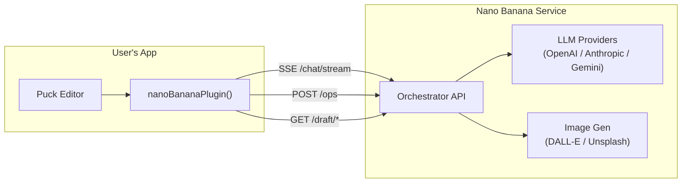
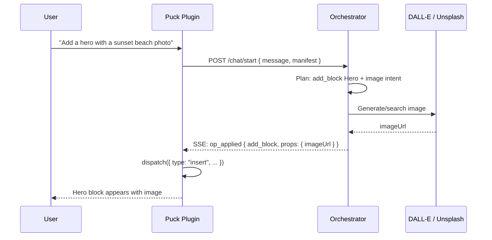

# Nano Banana — MVP Launch Plan

> AI-powered editing as a native Puck plugin.
> Codename: **Nano Banana** (smaller sibling of Avocado)

## Vision

Ship the orchestrator's AI planning + image generation capabilities as a
**native Puck editor plugin**. Users `npm install` one package, add it to their
`<Puck plugins={[...]} />` config, and get an AI chat sidebar + image
generation — indistinguishable from a first-party Puck feature.

```tsx
import { nanoBananaPlugin } from "@nano-banana/puck-ai"

<Puck
  config={myConfig}
  data={myData}
  plugins={[
    nanoBananaPlugin({
      orchestratorUrl: "https://api.nanobanana.dev",
      apiKey: "nb_...",
    }),
    blocksPlugin(),
    outlinePlugin(),
    fieldsPlugin({ desktopSideBar: "right" }),
  ]}
/>
```

---

## Architecture



### What ships

| Deliverable | Description |
|---|---|
| **`@nano-banana/puck-ai`** | npm package — Puck plugin + chat UI + image picker + SSE transport |
| **Orchestrator API** | Hosted service — LLM planning, ops engine, image gen, session state |
| **Block manifest adapter** | Reads user's Puck config, generates manifest for the orchestrator |

### What does NOT ship (deferred from Avocado)

- Custom editor app (`apps/editor`)
- Next.js site renderer (`apps/site`)
- Sites agent / migration tool
- Publishing pipeline
- Version history panel
- Jira / Google Drive integrations
- Audio transcription

---

## Puck Plugin Architecture

Nano Banana follows Puck's official extension points — no hacks, no wrapping:

| Puck API | How we use it |
|---|---|
| `plugins` prop | `{ name, label, icon, render }` — AI chat panel as a sidebar tab |
| `overrides.iframe` | Inject preview CSS, manage scroll behavior |
| `overrides.headerActions` | Undo/redo buttons, page selector |
| `type: "custom"` fields | Image picker integrated into block field inspector |
| `useGetPuck()` / `createUsePuck()` | Read selection context for chat-aware block editing |
| `getPuck().dispatch()` | Apply AI-generated edits back into Puck state |

### Plugin factory

```tsx
export function nanoBananaPlugin(config: NanoBananaConfig): PuckPlugin {
  return {
    name: "nano-banana-ai",
    label: "AI",
    icon: <BotMessageSquare size={24} />,
    render: () => (
      <NanoBananaProvider config={config}>
        <AIChatPanel />
      </NanoBananaProvider>
    ),
  }
}

type NanoBananaConfig = {
  orchestratorUrl: string
  apiKey?: string                 // Nano Banana API key (hosted mode)
  llmApiKey?: string              // User's own OpenAI/Anthropic key (BYOK mode)
  llmProvider?: "openai" | "anthropic" | "gemini"
  modelTier?: "fast" | "balanced" | "reasoning"
  locale?: string                 // UI + AI response language
  imageGeneration?: boolean       // Enable DALL-E / Unsplash (default: true)
  onApplied?: (ops: Operation[]) => void  // Callback after AI edits
}
```

---

## Scope — What to build

### Phase 1: Prove it (target: 2-3 weeks)

#### Plugin package (`@nano-banana/puck-ai`)

- [ ] Extract `PuckChatPluginPanel` from `packages/editor-puck` into standalone
- [ ] Bundle chat SSE transport (from `apps/editor/src/chat/chat-transports.ts`)
      — remove Zustand dependency, use plugin-local React state
- [ ] Bundle lightweight chat composer (text input + send button + cancel)
      — strip media input (audio, image paste) for v1
- [ ] Bundle image picker modal (Unsplash search + DALL-E generate)
      — simplified version of `ImagePickerModal`
- [ ] Auto-generate block manifest from Puck config at runtime
      — `createPuckConfig()` adapter already exists, needs reverse direction
- [ ] Plugin config factory: `nanoBananaPlugin({ orchestratorUrl, apiKey })`
- [ ] Apply AI ops to Puck state via dispatch bridge
      — existing `PuckDispatchBridge` + `applyLiveDraftToPuckData()`

#### Orchestrator changes

- [ ] Auth middleware: validate `Authorization: Bearer nb_...` API keys
- [ ] BYOK forwarding: accept `x-llm-api-key` header, use as provider key
- [ ] CORS: allow any origin with valid API key (not just whitelisted origins)
- [ ] Manifest-from-client: accept block manifest in `/chat/start` body
      (already supported — `componentsManifest` field exists)

#### Example app

- [ ] Standalone Vite + React + Puck app demonstrating the plugin
- [ ] 5-10 sample block components with Puck config
- [ ] README with setup instructions

### Phase 2: Productize (3-4 weeks after validation)

- [ ] Usage dashboard + API key management
- [ ] Rate limiting per API key (not just per IP)
- [ ] Model tier selection in plugin UI (fast / balanced / reasoning)
- [ ] Streaming op application (show changes as they arrive)
- [ ] Undo/redo via orchestrator history
- [ ] Image picker: Google Drive integration (for brand assets)
- [ ] Persistent session state (Redis/DB — not just in-memory)

### Phase 3: Scale (if market validates)

- [ ] Multi-tenant session isolation
- [ ] Custom block type learning (LLM adapts to user's components)
- [ ] Billing integration
- [ ] Self-hosted orchestrator option (Docker image)
- [ ] Version history panel as second plugin

---

## Extraction Map

What comes from where:

| Target module | Source | Changes needed |
|---|---|---|
| Chat panel UI | `packages/editor-puck/src/components/puck/PuckChatPluginPanel.tsx` | Remove `hostApi` dependency, bundle markdown renderer |
| Selection bridge | `packages/editor-puck/src/components/puck/selection.ts` | None — already clean |
| Dispatch bridge | `packages/editor-puck/src/components/puck/PuckDispatchBridge.tsx` | None — 17 lines, self-contained |
| SSE transport | `apps/editor/src/chat/chat-transports.ts` | Remove Zustand imports, use plain callbacks |
| Draft API | `packages/editor-puck/src/components/puck/draft-api.ts` | Replace `getPuckHostApi()` with config parameter |
| Block manifest adapter | `packages/editor-puck/src/components/puck/createPuckConfig.tsx` | None — already clean |
| Puck data ↔ PageDoc | `packages/editor-puck/src/components/puck/adapters.ts` | None — already clean |
| Image picker | `apps/editor/src/components/ImagePickerModal.tsx` | Simplify — Unsplash + DALL-E only |
| Auth middleware | New | ~100 lines in orchestrator |
| BYOK forwarding | New | ~50 lines in orchestrator |

---

## Block Manifest Strategy

### Problem

Puck users define their own components. The orchestrator needs a manifest
(block schemas, field types, defaults) to plan edits. Today the manifest
comes from `@ai-site-editor/shared` — but Nano Banana users won't use our
block library.

### Solution: Runtime manifest inference

```tsx
// User passes their Puck config as normal:
const config = {
  components: {
    Hero: {
      fields: {
        heading: { type: "text" },
        imageUrl: { type: "custom", ... },
        items: { type: "array", arrayFields: { title: { type: "text" } } },
      },
      defaultProps: { heading: "Welcome", imageUrl: "" },
      render: ({ heading }) => <h1>{heading}</h1>,
    },
  },
}

// Plugin infers manifest automatically:
// → { blocks: [{ type: "Hero", propsSchema: {...}, defaultProps: {...} }] }
```

The plugin reads `config.components`, extracts field types and defaults,
and sends the manifest to the orchestrator with each `/chat/start` request.
This is already how the orchestrator works — `componentsManifest` is an
accepted field on `ChatRequestBody`.

### Fallback

If the user's Puck config doesn't have enough field metadata for the LLM
to plan well, we can:
1. Use a curated default manifest (our 10 essential blocks)
2. Let users provide an explicit manifest via plugin config

---

## Image Generation

### MVP scope

| Provider | Include | Notes |
|---|---|---|
| Unsplash | Yes | Free stock photos, no API key needed from user |
| DALL-E (OpenAI) | Yes | Core differentiator, uses our hosted key or BYOK |
| Gemini image gen | Defer | Second provider adds complexity |
| Google Drive | Defer | Enterprise feature |
| Image interpretation | Defer | Cool but not core |

### Flow in plugin



---

## Distribution Model

### Hosted (default)

- User installs `@nano-banana/puck-ai` from npm
- Plugin connects to `https://api.nanobanana.dev` (our hosted orchestrator)
- We provide API key, we pay for LLM tokens
- Pricing: freemium (N free edits/month) → paid tiers

### BYOK (Bring Your Own Key)

- Same npm package, same hosted orchestrator
- User passes `llmApiKey` in plugin config
- Orchestrator forwards to OpenAI/Anthropic with user's key
- We charge less (infra cost only, no LLM markup)

### Self-hosted (Phase 3)

- Orchestrator as Docker image
- User runs their own instance, brings their own keys
- Plugin points to `orchestratorUrl: "http://localhost:4200"`
- Open-core model: free orchestrator, paid features (analytics, team seats)

---

## Risks & Mitigations

| Risk | Impact | Mitigation |
|---|---|---|
| Puck breaking changes (v0.22+) | Plugin breaks | Pin `@puckeditor/core` as peer dep with semver range, CI test matrix |
| LLM can't understand user's custom blocks | Bad edit quality | Manifest inference + explicit field annotations + fallback to generic `update_props` |
| Token cost per request (large manifests) | Expensive | Adaptive schema context (only send relevant blocks), `fast` model default |
| Puck ships their own AI feature | Competitive | Move fast, establish ecosystem presence, offer superior image gen |
| In-memory session state doesn't scale | Lost state on restart | Acceptable for Phase 1; Redis adapter in Phase 2 |

---

## Success Metrics (Phase 1)

- 5-10 Puck developers install and try the plugin
- >50% complete at least one AI edit successfully
- Average time from install to first edit < 10 minutes
- Image generation works end-to-end in > 80% of attempts
- No orchestrator crashes under concurrent usage (3-5 users)

---

## Open Questions

1. **Package naming**: `@nano-banana/puck-ai` vs `puck-plugin-ai` vs `@puckeditor/ai`?
   Consider whether to align with Puck's namespace or our own brand.

2. **Manifest fidelity**: How much can we infer from Puck's field types alone?
   Puck's `type: "text"` doesn't tell us if it's a heading, paragraph, or URL.
   May need optional field annotations: `{ type: "text", label: "Heading", _ai: { semantic: "heading" } }`.

3. **Op application strategy**: Apply via Puck dispatch (granular, animated) or
   full data replacement (simpler, may flicker)? Current code does full replacement
   via `applyLiveDraftToPuckData()` — may need to move to dispatch for better UX.

4. **Undo model**: Use Puck's built-in undo or orchestrator's server-side history?
   Plugin users expect Ctrl+Z to work — need to decide who owns undo state.

5. **Preview rendering**: Puck renders blocks in its own iframe. Our blocks use
   `SharedBlockRenderer`. For Nano Banana, the user provides their own renderers
   via Puck config — so we don't need our block library at all. Confirm this.
