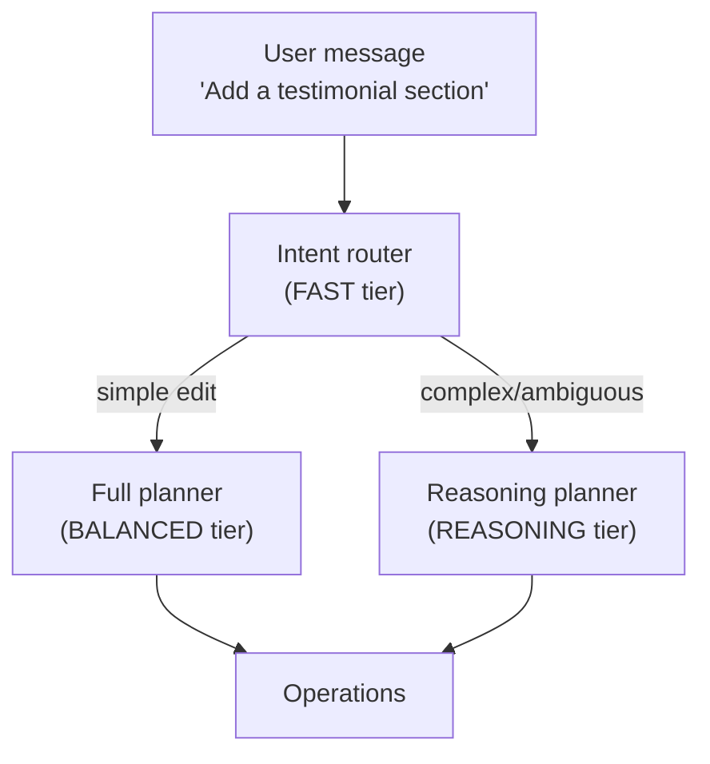

Avocado Studio is **provider-agnostic**. The planner runs the same prompts and emits the same operations whether you wire it to Anthropic Claude, OpenAI GPT, or Google Gemini. You bring the API keys; no per-seat pricing, no vendor lock-in.

You can also **mix providers**: use a fast Anthropic model for intent detection, a balanced OpenAI model for the heavy planning, and Gemini for image generation. Each tier is configured independently.

## Supported providers

| Provider | Status | Notes |
|---|---|---|
| **Anthropic Claude** | Recommended | Most battle-tested. Required for [extended thinking](#extended-thinking-anthropic-only). Haiku / Sonnet / Opus all supported. |
| **OpenAI** | Supported | Also powers `gpt-image-2` / `gpt-image-1` image generation. |
| **Google Gemini** | Supported | Often the cheapest option. Default backend for AI image generation. Required for conversational image editing. |

At least **one** provider key is required. The planner picks providers per request based on session config; the editor's model selector lets you switch on the fly.

## Bring your own keys

Set whichever you have in `.env`:

```bash
ANTHROPIC_API_KEY=sk-ant-...
OPENAI_API_KEY=sk-...
GOOGLE_GENAI_API_KEY=...
```

The Content Studio reads `/status/planner` on boot to figure out which providers have keys, then surfaces them in the model picker. Providers without keys are hidden.

Keys never leave your orchestrator. The editor and your site talk to the orchestrator over HTTP; the orchestrator is the only process that holds API credentials.

## Model tiers

Every provider has four tiers. Each tier is a separate env var so you can pick a different model per role without rewriting code:

| Tier | When the planner uses it |
|---|---|
| `FAST` | Intent detection — figuring out whether a user message is a real edit, a question, or small talk. Cheap models win here. |
| `BALANCED` | Normal edits — rewriting copy, updating block props, simple structural changes. The workhorse tier. |
| `REASONING` | Complex / ambiguous edits — multi-step plans, restructures, "rewrite the whole page in this tone." Auto-selected by `CHAT_AUTO_REASONING`. |
| `CODEX` | Agent mode (URL migration, repo integration). Long-running coding tasks. |

### Defaults

```bash
# Anthropic (defaults baked into the orchestrator)
ANTHROPIC_MODEL_FAST=claude-haiku-4-5-20251001
ANTHROPIC_MODEL_BALANCED=claude-sonnet-4-6
ANTHROPIC_MODEL_REASONING=claude-sonnet-4-6
ANTHROPIC_MODEL_CODEX=claude-opus-4-6

# OpenAI
OPENAI_MODEL_FAST=gpt-4o-mini
OPENAI_MODEL_BALANCED=gpt-4o
OPENAI_MODEL_REASONING=o1
OPENAI_MODEL_CODEX=o3

# Gemini
GOOGLE_GENAI_MODEL_FAST=gemini-2.5-flash
GOOGLE_GENAI_MODEL_BALANCED=gemini-2.5-flash
GOOGLE_GENAI_MODEL_REASONING=gemini-2.5-pro
GOOGLE_GENAI_MODEL_CODEX=gemini-2.5-pro
```

Override any of them in `.env` — the planner reads env on every request, so changes take effect without a restart.

## Tiered routing in action

When a user types in the Content Studio:



1. **Intent router** runs on the `FAST` tier — usually finishes in <500 ms. Decides: is this a chat-only message ("what does Hero do?"), a real edit, or ambiguous?
2. **Full planner** runs on `BALANCED` for routine edits. The router and planner can race in parallel (`CHAT_PARALLEL_PLANNER=1`) so the planner gets a head-start.
3. **Reasoning planner** is auto-enabled for complex prompts by `CHAT_AUTO_REASONING=1`. Signals: multi-step asks, conditional language ("if there's already a CTA, ..."), structural verbs ("restructure," "rewrite tone of"), long prompts.

This means a "fix typo in hero" request typically costs one cheap Haiku call, while a "restructure the homepage to be more conversion-focused" request automatically escalates to Sonnet + extended thinking. You don't have to think about it; the cost / latency curve handles itself.

## Extended thinking (Anthropic only)

When `CHAT_AUTO_REASONING=1` is on (default), the planner enables Anthropic's [extended thinking](https://docs.anthropic.com/claude/docs/extended-thinking) for ambiguous prompts. SSE events stream the thinking tokens back to the editor:

- `thinking_start` — model begins reasoning
- `thinking_token` — incremental text deltas
- `thinking_end` — reasoning complete

The Content Studio renders these as a collapsible "Thinking…" block above the change log.

```bash
CHAT_AUTO_REASONING=1                # default on
CHAT_AUTO_REASONING_BUDGET=2048      # tokens for the thinking phase (min 1024)
```

OpenAI's `o1` / `o3` reasoning models do their own internal thinking but don't stream tokens — Avocado treats them as opaque reasoning calls. Gemini 2.5 Pro reasoning works similarly.

## Image generation routing

Image generation is decoupled from the planner. Two env vars control it:

```bash
VARIATION_DEFAULT_IMAGE_SOURCE=unsplash   # or "ai" / "gemini" / "openai"
IMAGE_GEN_PROVIDER=gemini                 # or "openai" — which backend handles AI gen
```

| Setting | Result |
|---|---|
| `VARIATION_DEFAULT_IMAGE_SOURCE=unsplash` | Stock photos by default; AI generation only on explicit mention |
| `VARIATION_DEFAULT_IMAGE_SOURCE=ai` + `IMAGE_GEN_PROVIDER=gemini` | AI by default, Gemini backend |
| Explicit keyword in chat (`"generate via openai"`, `"unsplash"`) | Overrides any default |

If the configured provider has no API key, the orchestrator falls back to the other backend rather than failing.

## Switching providers from the editor

Every chat message includes a `planner` field. The Content Studio's model selector (top-right of the chat panel) lets you pick provider + tier per message. The choice persists across messages in a session, but the orchestrator re-reads it on every request so you can A/B mid-conversation.

If you want to lock providers down on a deployment — e.g. demo mode running on your shared key — set `PLANNER_PROVIDER_LOCK=anthropic` (or `openai` / `gemini`) on the orchestrator. The editor's selector then becomes informational only.

## See also

- [How It Works](/how-it-works) — the planner → ops → preview pipeline end-to-end
- [Chat troubleshooting](/observability/chat-troubleshooting) — debugging planner output
- [Token usage tracking](/observability/token-usage-tracking) — measuring per-provider spend
- [MCP server](/integration/mcp-server) — drive the same planner from Claude Desktop / Cursor
