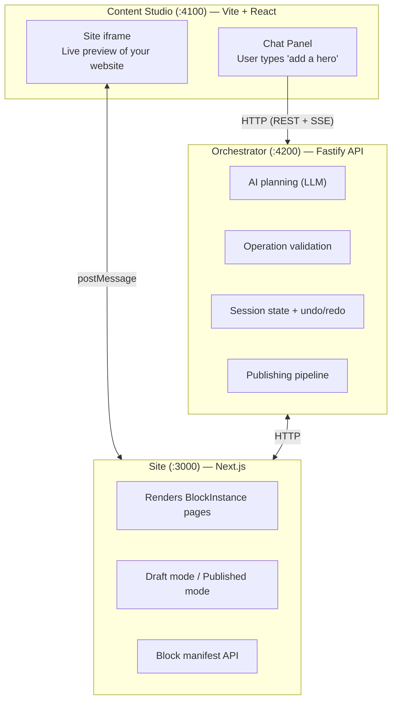
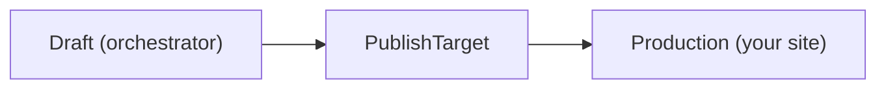

## System Overview

Avocado Studio is a pnpm monorepo with four apps and eight packages:



## Data Flow: From Chat to Preview

When a user sends a message in the Content Studio, here's what happens:

```
1. Content Studio → Orchestrator  POST /chat/start (user message + page context)
                                   → returns streamId
2. Content Studio → Orchestrator  GET /chat/stream?streamId=… (SSE subscribe)
3. Orchestrator → LLM             Sends prompt with block schemas + page state
4. LLM → Orchestrator             Returns structured edit plan (JSON)
5. Orchestrator                   Validates operations against Zod schemas
6. Orchestrator → Content Studio  Streams plan + results via SSE
7. Orchestrator → Site            Bumps draft version
8. Site                           Re-fetches draft, re-renders blocks
9. Site → Content Studio          postMessage confirms preview updated
```

## Packages

The monorepo includes eight shared packages:

| Package | Purpose |
|---------|---------|
| `@ai-site-editor/shared` | Zod schemas for PageDoc, BlockInstance, Operation, EditPlan. Block registry. Shared types across all apps. |
| `@ai-site-editor/blocks` | 20 built-in block renderers (Hero, CTA, FAQ, Gallery, etc.). Each block is a React component with a typed Zod schema. |
| `@ai-site-editor/preview-adapter` | PreviewBridge component that runs inside the site iframe. Handles postMessage communication with the Content Studio, block selection overlays, and CSS highlights. |
| `@ai-site-editor/site-sdk` | SDK for integrating AI editing into any Next.js 15+ site. Provides route handlers, draft mode utilities, and content resolution for the Content Studio. |
| `@ai-site-editor/editor-puck` | Puck-based visual drag-and-drop editor, including the chat sidebar prototype. Generates the same ops as chat mode and publishes via the orchestrator. |
| `create-ai-site-editor` | CLI scaffolder that generates a Next.js site wired to the orchestrator (editor API routes, block manifest, draft mode, optional CMS template). |
| `@ai-site-editor/migration-sdk` | Utilities for migrating existing content into the PageDoc / BlockInstance shape. |
| `@ai-site-editor/immersive-widget` | Embeddable widget used for immersive / full-bleed block experiences. |

## Communication Protocols

### Content Studio ↔ Orchestrator: HTTP + SSE

The Content Studio communicates with the orchestrator via REST API and Server-Sent Events:

- `POST /chat/start` — Start a streamed run, returns a `streamId`
- `GET /chat/stream?streamId=…` — Subscribe to the stream via SSE
- `POST /chat` — Non-streaming variant (immediate response)
- `GET /draft/pages` — Fetch current draft page state
- `POST /ops` — Apply hand-authored operations (bypassing the planner)
- `POST /history/undo`, `POST /history/redo` — Undo/redo operations
- `POST /publish` — Publish draft to production

### Content Studio ↔ Site: postMessage

The Content Studio embeds the site in an iframe. They communicate via the `site-editor/v1` postMessage protocol:

- **Content Studio → Site**: Request block highlight, navigate to page, refresh preview
- **Site → Content Studio**: Report selected block, confirm preview updated, send block manifest

### Orchestrator ↔ Site: HTTP

The site fetches draft content from the orchestrator when in draft mode:

- `GET /draft/pages` — All draft pages for the current session
- `GET /draft/slugs` — Available page slugs

## Session State

The orchestrator maintains **in-memory session state** for each editing session:

- **Draft pages** — Current page content with all pending edits
- **Operation history** — Full undo/redo stack
- **Edit plans** — Generated plans awaiting approval
- **Session config** — Selected AI provider, model tier, locale

Session state is scoped per session ID. Multiple users editing different sessions don't interfere with each other. State is persisted to disk (`.data/orchestrator-state.json`) for crash recovery.

<Note>
For production deployment, session state should be moved to durable storage (Redis, Postgres, etc.). The default file-based persistence is designed for local development.
</Note>

## Publishing Pipeline

Publishing promotes draft content to production:



The `PublishTarget` interface is pluggable. Three built-in targets ship in the box:

- **`site-contract`** — POSTs pages + assets to the remote site's `/api/editor/publish` endpoint. Selected when `siteOrigin` is supplied.
- **`git`** — Serializes draft pages to JSON, commits, and pushes to a Git branch. A Vercel deploy hook wired to that branch auto-builds.
- **`deploy-hook`** — Calls a raw `VERCEL_DEPLOY_HOOK_URL` and polls the Vercel API for deployment status.

Register your own via `registerPublishTarget()` to integrate with any workflow — S3, GitLab Pages, Netlify, a CMS API, a custom CI/CD pipeline. See [How it Works — Publishing](/how-it-works#publishing) for the full interface.
