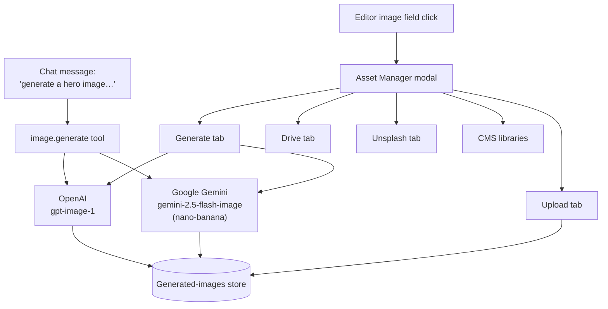

## Overview

Avocado Studio has two entry points for images: the **Asset Manager modal** in
the editor, and the **`image.generate` tool** that the chat planner can call
during natural-language edits. Both paths share the same providers and the
same on-disk storage.



The modal is defined in `apps/editor/src/components/ImagePickerModal.tsx`.
The multi-turn chat view in `apps/editor/src/components/ImageGenerateChat.tsx`
is an assistant-style chat that talks to `POST /image/generate/chat` when
Gemini is configured. The `image.generate` tool manifest lives in
`apps/orchestrator/src/tools/builtins/image-generate.ts`.

## Image sources (modal tabs)

Which tabs appear depends on orchestrator env vars and the CMS media config
the site passes to the editor. Tab selection is computed in
`ImagePickerModal.tsx` (`availableTabs`).

| Tab | Enabled when | Backing source |
|---|---|---|
| **Generate** | `OPENAI_API_KEY` or `GOOGLE_GENAI_API_KEY` set | AI image generation (OpenAI or Gemini) |
| **Drive** | `GOOGLE_DRIVE_FOLDER_ID` (or a Google service-account key) set | Google Drive folder listing |
| **Unsplash** | `UNSPLASH_ACCESS_KEY` set | Unsplash search API |
| **Contentful** | `CONTENTFUL_SPACE_ID` + `CONTENTFUL_DELIVERY_TOKEN` set, **or** site passes a matching `cmsMedia` config | CMS asset library |
| **Sanity / Strapi** | Site passes a matching `cmsMedia` config to the editor | CMS asset library |
| **Upload** | Always available | Local file → `POST /image/upload` |

<Tip>
**Fastest way to configure the env-var sources** (Generate / Drive / Unsplash / Contentful) is the first-time setup script. Running `pnpm dev:setup` walks you through each prompt, opens the provider's signup/console page in your browser, and validates the key before writing it to `.env`. Sanity and Strapi are configured per-site in the editor's Site Config drawer — there are no env vars for them.
</Tip>

The feature flags the editor reads (`imageGenerate`, `imageGenerateChat`,
`googleDrive`, `unsplash`, `contentful`) are published by the orchestrator at
`GET /status/planner` and are set purely from env vars — there is no
per-session toggle today.

### CMS asset libraries

Three CMS providers can appear as asset-picker tabs: **Contentful**,
**Sanity**, and **Strapi**. They have two different configuration
mechanisms, and the choice depends on the provider:

| Provider | Env-var path (orchestrator default) | Per-site path (editor Site Config) |
|---|---|---|
| Contentful | ✅ `CONTENTFUL_SPACE_ID` + `CONTENTFUL_DELIVERY_TOKEN` (+ optional `CONTENTFUL_ENVIRONMENT`) | ✅ `cmsMedia: { provider: "contentful", spaceId, deliveryToken, environment? }` |
| Sanity | ❌ not supported | ✅ `cmsMedia: { provider: "sanity", projectId, dataset? }` |
| Strapi | ❌ not supported | ✅ `cmsMedia: { provider: "strapi", url, token? }` |

**When to pick which for Contentful.** Use the env-var path for
single-space, single-tenant setups where every site in the orchestrator
should share the same Contentful space — it's a quick `.env` change.
Use the per-site `cmsMedia` path when different sites point at different
spaces, when end users need to supply their own credentials without
redeploying the orchestrator, or when you want the asset picker to switch
spaces as the active site switches.

**How the env-var path works.** When `CONTENTFUL_SPACE_ID` and
`CONTENTFUL_DELIVERY_TOKEN` are set, the orchestrator exposes
`GET /contentful/assets` (see `apps/orchestrator/src/routes/media.ts`) as
a proxy to the Contentful CDA. The editor's asset picker calls that
endpoint directly — no site-side code needed. Without those vars, the
endpoint returns `404 Contentful not configured`.

**How the per-site `cmsMedia` path works.** `CmsMediaConfig` (defined in
`apps/editor/src/lib/editor-types.ts`) is a discriminated union stored on
`SiteConfig.cmsMedia`. The editor calls the CMS API directly from the
browser using whatever credentials the site's `cmsMedia` entry carries —
there is no orchestrator proxy involved. Fetch logic lives in
`apps/editor/src/lib/cms-media.ts` (`fetchContentfulMedia`,
`fetchSanityMedia`, `fetchStrapiMedia`).

**Click path to configure a site's `cmsMedia`:**

1. Open the editor at `http://localhost:4100`.
2. Click the **gear icon** next to the site name in the chat header
   (aria-label *"Site settings"*), or open the Sites page and click
   **Configure** on a site card.
3. In the drawer that slides in, scroll to the **CMS media** section.
4. Pick a **Provider** (Contentful / Sanity / Strapi / none) and fill in
   the provider-specific fields:
   - **Contentful** — Space ID and Delivery token (environment defaults
     to `master`).
   - **Sanity** — Project ID and optional dataset (defaults to
     `production`). No token needed for public datasets.
   - **Strapi** — Base URL (e.g. `https://cms.example.com`) and optional
     API token. Public upload endpoints work without a token.
5. Close the drawer. The CMS tab appears in the asset picker on next open.

<Tip>
The CMS config is stored per-site in the orchestrator's site registry,
not in the browser — it persists across sessions and across machines,
and the AI planner sees it too.
</Tip>

{/* TODO: screenshot of the Site Config drawer with the CMS media section
    expanded (Contentful provider selected). Save to
    docs-site/images/site-config-cms-media.png and embed here. */}

### Unsplash: licensing & attribution

<Note>
**Why Unsplash is in the picker.** The Unsplash tab ships primarily as a
**demo / placeholder convenience** — it lets stakeholders, evaluators, and
new sites populate a site with real-looking imagery during a live session
without leaving the editor or wiring up a DAM. Production sites should
usually graduate to branded photography, generated imagery, or a CMS-backed
asset library. If you *do* ship Unsplash photos to end users, the rules
below apply — attribution and API compliance are the adopter's
responsibility, not the orchestrator's.
</Note>

Photos returned by the Unsplash tab (and by the `unsplash.search` tool) are
served under the [Unsplash License](https://unsplash.com/license). The
license is permissive — photos are free for commercial and non-commercial
use and no permission from the photographer is required — but the Unsplash
API Terms impose a few concrete obligations that adopters are responsible
for meeting:

- **Credit the photographer and Unsplash** wherever a selected photo is
  rendered. The `unsplash.search` response includes `author` (photographer
  name) and `sourceUrl` (photo page on unsplash.com) specifically so you can
  surface attribution in your UI — for example:
  *Photo by [Photographer Name](sourceUrl) on [Unsplash](https://unsplash.com).*
- **Do not resell, redistribute, or host** unmodified Unsplash photos as a
  stock-photo service, wallpaper pack, or competing search product.
- **Do not imply endorsement** by photographers or by Unsplash of your
  product, brand, or customers.
- **Track downloads** when building your own Unsplash-powered integration.
  The API requires a `GET /photos/:id/download` trigger per selected photo;
  the `unsplash.search` tool in this repo does not do this automatically —
  adopters integrating Unsplash into a custom flow outside of the built-in
  tab should implement it to stay within Unsplash's API guidelines.

Generated images (OpenAI, Gemini) and assets returned from CMS tabs
(Contentful, Sanity, Strapi) have their own licensing and usage rules;
consult the relevant provider terms before shipping content publicly.

## AI providers

### OpenAI (default)

- Models: `OPENAI_IMAGE_MODEL` (default `gpt-image-1`) for `quality: "final"`,
  `OPENAI_IMAGE_MODEL_DRAFT` (default `gpt-image-1-mini`) for
  `quality: "draft"`.
- Sizes map from aspect ratio: `landscape → 1536x1024`, `square → 1024x1024`,
  `portrait → 1024x1536`.
- Native transparency via the `background` parameter (`transparent`,
  `opaque`, `auto`).
- Output formats: `png`, `webp`, `jpeg`.

### Google Gemini — "nano-banana"

Gemini 2.5 Flash Image is the model publicly nicknamed **"nano-banana"**.
Avocado calls it via the `@google/genai` SDK.

- Model: `GOOGLE_GENAI_IMAGE_MODEL`, defaulting to `gemini-2.5-flash-image`.
- Aspect ratios are mapped to Gemini's `imageConfig.aspectRatio` strings:
  `landscape → 3:2`, `square → 1:1`, `portrait → 2:3`. `16:9` and `9:16` can
  be triggered from prompt hints (e.g. "wide 16:9").
- Quality tiers map to Gemini's `imageSize`: `draft → 1K`, `final → 2K`.
- **No native transparency.** When `background: "transparent"` is requested,
  the orchestrator appends a prompt hint telling the model to render on a
  fully transparent background — results vary.
- Supports multi-turn chat and reference images (see next section).

### Provider selection

The `image.generate` tool (the one the AI planner calls) picks its backend
from `IMAGE_GEN_PROVIDER` — `openai` (default) or `gemini`. The editor's
Generate tab picks OpenAI for single-shot generation and routes to
`POST /image/generate/chat` when `imageGenerateChat` is enabled
(i.e. `GOOGLE_GENAI_API_KEY` is set).

## Multi-turn image chat (Gemini only)

When `GOOGLE_GENAI_API_KEY` is set, the Generate tab becomes a full assistant
chat built on `@assistant-ui/react`, streaming against
`POST /image/generate/chat` (`apps/orchestrator/src/routes/media.ts`).

### Request body

```jsonc
{
  "prompt": "...",                 // required
  "chatId": "…",                   // optional — resume an existing session
  "aspectRatio": "3:2",            // optional — "landscape" | "square" | "portrait" | explicit ratio
  "stream": true,                  // optional — SSE vs JSON response
  "referenceImageUrl": "https://…",// optional — primary reference
  "referenceImageUrls": ["…"]      // optional — up to 14 additional references, ≤5 MB each
}
```

### SSE event stream (`stream: true`)

```
event: chatId   → { chatId, aspectRatio }
event: status   → { stage: "Generating image…" }
event: text     → { text }        // streamed text tokens from Gemini
event: image    → { url, alt }    // generated image ready
event: error    → { error }
event: done     → {}
```

If `stream` is omitted, the endpoint returns a single JSON payload with
`{ chatId, url, alt, text, aspectRatio }`.

### UI modes

`ImageGenerateChat.tsx` switches between three modes depending on whether an
image already exists in the field:

- **`choose`** — current image exists; user picks "Edit this image" or
  "Generate a new one".
- **`edit`** — re-generate using the current image as reference context, so
  Gemini can honor existing composition, palette, or subjects.
- **`new`** — fresh generation from the prompt alone.

The modal also measures the current image's natural dimensions and snaps to
the closest Gemini-supported aspect ratio (1:1, 3:2, 2:3, 16:9, 9:16) so the
new image matches the slot it will fill.

### Session management

- Sessions are kept in an in-memory map on the orchestrator, capped at **200
  concurrent** sessions.
- Idle sessions are evicted after **30 minutes** (LRU).
- **Changing aspect ratio mid-session creates a new session.** Gemini's
  `imageConfig` is immutable once a chat is created, so the orchestrator
  detects the change, deletes the old session, and starts a new one.
- Sessions do not survive an orchestrator restart.

### Reference images

Up to **14 reference images** can be attached to the first message in a
session. Each is fetched server-side, validated against a **5 MB** size cap,
and forwarded to Gemini as base64 `inlineData` parts alongside the prompt.
Failed fetches are logged and skipped — the request does not fail if some
references are unreachable.

## `image.generate` tool (chat pipeline path)

When the user asks the chat to produce or replace an image, the planner can
call the `image.generate` tool. The full manifest is in
`apps/orchestrator/src/tools/builtins/image-generate.ts`.

```jsonc
{
  "name": "image.generate",
  "capability": "read",
  "timeoutMs": 90000,
  "retryPolicy": { "maxAttempts": 1 },
  "idempotent": false,
  "inputSchema": {
    "prompt":      "string (required)",
    "aspectRatio": "landscape | square | portrait",
    "quality":     "draft | final",
    "style":       "string (optional style guidance)",
    "background":  "transparent | opaque | auto",
    "outputFormat":"png | webp | jpeg",
    "blockType":   "Hero | Card | …",
    "blockId":     "string",
    "pageSlug":    "string"
  },
  "outputSchema": {
    "imageUrl": "string",
    "alt":      "string",
    "width":    "number",
    "height":   "number"
  }
}
```

### Prompt enrichment

When `blockType`, `blockId`, or `pageSlug` are provided, the tool enriches
the raw prompt with the block's composition hint, the page title, and the
block's existing `heading` / `subheading` / `title` props. It also appends
the default constraints: _no text overlays, no logos, no watermarks_. Known
composition hints include `Hero`, `Banner`, `CTA`, `Card`, `CardGrid`,
`FeatureGrid`, `Gallery`, `Carousel`, and `TwoColumn`.

### Progress streaming

The handler emits five progress stages via `context.onImageProgress`, and
those events surface on the chat SSE stream as `image_progress` events (see
[How It Works › Step 5](/how-it-works#step-5-stream-to-content-studio)):

```
 0%  Understanding prompt…
15%  Composing scene…
40%  Rendering image…
75%  Finalizing details…
95%  Almost there…
100% Done
```

### Deferred image resolution

With `CHAT_DEFER_IMAGE_RESOLUTION=1` (the default), the chat pipeline applies
text and structural ops **immediately** and resolves image tool calls in the
background. The editor receives the text updates at once and the image URLs
patch in via follow-up SSE events once generation completes.

## Other endpoints

All from `apps/orchestrator/src/routes/media.ts`.

| Endpoint | Purpose |
|---|---|
| `POST /image/generate` | Single-shot generation proxy. Uses `IMAGE_GEN_PROVIDER` (OpenAI fallback). Returns `{ url, alt }`. |
| `POST /image/generate/chat` | Multi-turn Gemini chat (documented above). Requires `GOOGLE_GENAI_API_KEY`. |
| `POST /image/upload` | Multipart form upload. Writes to `ORCHESTRATOR_GENERATED_IMAGE_DIR` and returns `{ url, bytes, mimeType }`. |
| `GET /unsplash/search?q=&page=&limit=` | Unsplash proxy used by the modal's Unsplash tab and by the `unsplash.search` tool. |
| `GET /gdrive/images` / `GET /gdrive/images/:fileId` | Google Drive browse/download with server-side resize, WebP conversion, and EXIF strip. |

## Environment variables

| Variable | Default | Purpose |
|---|---|---|
| `IMAGE_GEN_PROVIDER` | `openai` | `openai` or `gemini` — which backend `image.generate` uses. |
| `OPENAI_API_KEY` | — | Enables OpenAI generation and the `imageGenerate` feature flag. |
| `OPENAI_IMAGE_MODEL` | `gpt-image-1` | Final-quality OpenAI image model. |
| `OPENAI_IMAGE_MODEL_DRAFT` | `gpt-image-1-mini` | Draft-quality OpenAI image model. |
| `GOOGLE_GENAI_API_KEY` | — | Enables Gemini generation and the `imageGenerateChat` feature flag. |
| `GOOGLE_GENAI_IMAGE_MODEL` | `gemini-2.5-flash-image` | Gemini image model — the "nano-banana" model. |
| `UNSPLASH_ACCESS_KEY` | — | Enables the Unsplash tab and the `unsplash.search` tool. |
| `GOOGLE_DRIVE_FOLDER_ID` | — | Enables the Drive tab (alternatively `GOOGLE_SERVICE_ACCOUNT_KEY_JSON` or `GOOGLE_API_KEY`). |
| `CONTENTFUL_SPACE_ID` | — | Enables the Contentful tab as an orchestrator default (must be paired with `CONTENTFUL_DELIVERY_TOKEN`). Per-site `cmsMedia` overrides this. |
| `CONTENTFUL_DELIVERY_TOKEN` | — | Contentful Content Delivery API token. Required alongside `CONTENTFUL_SPACE_ID`. |
| `CONTENTFUL_ENVIRONMENT` | `master` | Contentful environment (branch) to read assets from. |
| `ORCHESTRATOR_GENERATED_IMAGE_DIR` | `.data/generated-images` | Filesystem target for uploaded and generated images. |
| `CHAT_DEFER_IMAGE_RESOLUTION` | `1` | Apply text/structural ops first and resolve images in the background. |

## Limits & constraints

- **Reference images**: ≤14 per message, ≤5 MB each. Must be reachable over
  HTTP(S) from the orchestrator, or uploaded first via `POST /image/upload`.
- **Gemini sessions**: in-memory only. Capped at 200 concurrent with 30-minute
  LRU eviction. An orchestrator restart wipes all sessions.
- **Gemini transparency**: no native support — `background: "transparent"`
  falls back to a prompt hint and the result is best-effort.
- **`image.generate` timeout**: 90 seconds, no automatic retry.
- **Image storage**: generated images are written to
  `ORCHESTRATOR_GENERATED_IMAGE_DIR`. For production, mount a persistent
  volume or upload to an external bucket as part of your
  [publish target](/how-it-works#the-publishtarget-interface).

## Related pages

- [How It Works › Step 5](/how-it-works#step-5-stream-to-content-studio) —
  where `image_progress` events fit in the chat SSE stream.
- [Tools MVP](/integration/tools-mvp) — the broader tool contract that
  `image.generate` and `unsplash.search` implement.
- [Custom Blocks › Image fields](/integration/custom-blocks) — how to declare
  image fields on your own blocks so the Asset Manager opens for them.
