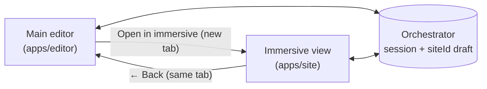

## Overview

Immersive mode renders the editing UI **directly on the site page** — no
iframe, no chrome around the content. The widget (chat FAB, add-block pill,
text-selection "Ask AI", inline field prompts, undo/redo) is portalled into
the site DOM. It is the intended mode for copy-heavy and single-page edits
where you want to see the real page at full width.

The main editor (`apps/editor`) and immersive mode share the same draft via
the orchestrator's `(session, siteId, slug)` — switching between them does
not move or duplicate state.



## Entering from the main editor

The editor header has a **Maximize icon button** (next to the more-options
menu, before the Publish button). Clicking it opens the current page in
immersive mode in a **new tab**, carrying over the active session, site, and
slug:

```
{siteOrigin}/{slug}?__editor=1&immersive=1&session=...&siteId=...&editorOrigin=...
```

The `editorOrigin` query param tells the widget where the main editor lives
so it can render the "Back" pill. The site's `__editor=1` middleware rewrites
the request to the `preview-draft` route internally; you do not link to
`/preview-draft/...` directly.

A new tab is used instead of replacing the current tab so the editor's chat
log, model selection, and iframe scroll state all stay alive. If you prefer
a single-tab mental model, close the immersive tab when done.

## Returning to the main editor

A small glass **"← Back" pill** sits in the top-left corner of the immersive
page. It:

- only renders when `config.editorOrigin` is present (so embedded / public
  widget uses stay clean),
- auto-hides when the chat panel is open (to stop it colliding with
  panel chrome),
- auto-hides on scroll-down and reappears on scroll-up or near the top
  (browser-chrome style),
- navigates **same-tab** to `{editorOrigin}?session=...&siteId=...&slug=...`.

The editor reads `?slug=` on bootstrap, so you land on the exact page you
were editing — no flash to the home route before the iframe catches up.

## What is available inside immersive mode

- **Chat FAB** (bottom right) with the full chat pipeline — text, structural,
  and image ops all route through the same orchestrator as the main editor.
- **Add-block pill** (bottom right, next to the chat FAB) opens the inline
  block picker above itself and inserts after the last block on the page.
- **Inline field prompt** — click any editable text field to get a tight
  prompt box anchored to the field.
- **Text selection "Ask AI"** — select a range of copy to get an inline
  toolbar. In text-only mode, selections route into the field prompt with
  the excerpt pre-filled.
- **Undo / redo** — `Cmd+Z` and `Cmd+Shift+Z` / `Cmd+Y`. Buttons also appear
  in the chat panel header. Proxies to the orchestrator's
  `/history/{undo,redo}` so draft history is shared with the main editor.

## Feature flags

| Flag | Default | Effect |
|------|---------|--------|
| `NEXT_PUBLIC_IMMERSIVE_TEXT_ONLY` | `0` | When `1`, restricts the block picker to `Hero`, `FeatureGrid`, `Testimonials`, `FAQAccordion`, `CTA`, `RichText` and routes text selections into the inline field prompt with the excerpt pre-filled. Used for the text-blocks MVP. |

## Key files

| Layer | File |
|-------|------|
| Widget root | `packages/immersive-widget/src/ImmersiveWidget.tsx` |
| Back-to-editor pill | `packages/immersive-widget/src/components/BackToEditorPill.tsx` |
| Add-block pill | `packages/immersive-widget/src/components/AddBlockFab.tsx` |
| Undo/redo hook | `packages/immersive-widget/src/hooks/useUndoHistory.ts` |
| Widget config type | `packages/immersive-widget/src/lib/widget-state.ts` |
| Site page rendering the widget | `apps/site/app/preview-draft/[[...slug]]/page.tsx` |
| Site wrapper | `apps/site/components/immersive-wrapper.tsx` |
| Editor "Open in immersive" button | `apps/editor/src/App.tsx` (chat-header-right) |
| Editor slug bootstrap | `apps/editor/src/store/editor-store.ts` — `readInitialSlug()` |
