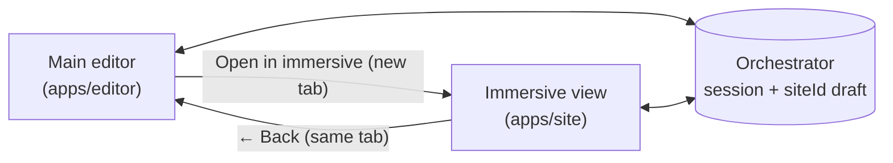

## Overview

Immersive mode renders the editing UI **directly on the site page** — no
iframe, no chrome around the content. The widget (chat FAB, add-block pill,
text-selection "Ask AI", inline field prompts, undo/redo) is portalled into
the site DOM. It is the intended mode for copy-heavy and single-page edits
where you want to see the real page at full width.

The main editor (`apps/editor`) and immersive mode share the same draft via
the orchestrator's `(session, siteId, slug)` — switching between them does
not move or duplicate state.



## Entering from the main editor

The editor header has a **Maximize icon button** (next to the more-options
menu, before the Publish button). Clicking it opens the current page in
immersive mode in a **new tab**, carrying over the active session, site, and
slug:

```
{siteOrigin}/{slug}?__editor=1&immersive=1&session=...&siteId=...&editorOrigin=...
```

The `editorOrigin` query param tells the widget where the main editor lives
so it can render the "Back" pill. The site's `__editor=1` middleware rewrites
the request to the `preview-draft` route internally; you do not link to
`/preview-draft/...` directly.

A new tab is used instead of replacing the current tab so the editor's chat
log, model selection, and iframe scroll state all stay alive. If you prefer
a single-tab mental model, close the immersive tab when done.

## Returning to the main editor

A small glass **"← Back" pill** sits in the top-left corner of the immersive
page. It:

- only renders when `config.editorOrigin` is present (so embedded / public
  widget uses stay clean),
- auto-hides when the chat panel is open (to stop it colliding with
  panel chrome),
- auto-hides on scroll-down and reappears on scroll-up or near the top
  (browser-chrome style),
- navigates **same-tab** to `{editorOrigin}?session=...&siteId=...&slug=...`.

The editor reads `?slug=` on bootstrap, so you land on the exact page you
were editing — no flash to the home route before the iframe catches up.

## What is available inside immersive mode

- **Chat FAB** (bottom right) with the full chat pipeline — text, structural,
  and image ops all route through the same orchestrator as the main editor.
- **Add-block pill** (bottom right, next to the chat FAB) opens the inline
  block picker above itself and inserts after the last block on the page.
- **Inline field prompt** — click any editable text field to get a tight
  prompt box anchored to the field.
- **Text selection "Ask AI"** — select a range of copy to get an inline
  toolbar. In text-only mode, selections route into the field prompt with
  the excerpt pre-filled.
- **Undo / redo** — `Cmd+Z` and `Cmd+Shift+Z` / `Cmd+Y`. Buttons also appear
  in the chat panel header. Proxies to the orchestrator's
  `/history/{undo,redo}` so draft history is shared with the main editor.

## Feature flags

| Flag | Default | Effect |
|------|---------|--------|
| `NEXT_PUBLIC_IMMERSIVE_TEXT_ONLY` | `0` | When `1`, restricts the block picker to `Hero`, `FeatureGrid`, `Testimonials`, `FAQAccordion`, `CTA`, `RichText` and routes text selections into the inline field prompt with the excerpt pre-filled. Used for the text-blocks MVP. |

## Key files

| Layer | File |
|-------|------|
| Widget root | `packages/immersive-widget/src/ImmersiveWidget.tsx` |
| Back-to-editor pill | `packages/immersive-widget/src/components/BackToEditorPill.tsx` |
| Add-block pill | `packages/immersive-widget/src/components/AddBlockFab.tsx` |
| Undo/redo hook | `packages/immersive-widget/src/hooks/useUndoHistory.ts` |
| Widget config type | `packages/immersive-widget/src/lib/widget-state.ts` |
| Site page rendering the widget | `apps/site/app/preview-draft/[[...slug]]/page.tsx` |
| Site wrapper | `apps/site/components/immersive-wrapper.tsx` |
| Editor "Open in immersive" button | `apps/editor/src/App.tsx` (chat-header-right) |
| Editor slug bootstrap | `apps/editor/src/store/editor-store.ts` — `readInitialSlug()` |

---

## Embedding on an external site

The widget ships as a standalone package — `@ai-site-editor/immersive-widget` — so you can mount it on any Next.js 15 (App Router) site that is already integrated with the orchestrator via the site-sdk. The monorepo's `apps/site` is just the first consumer; your own project can do the same thing.

### Prerequisites

- Next.js 15 App Router (React 19 peer dep)
- Site already registered with the orchestrator (`npx avocado-register`) — you need a valid `session` and `siteId`
- The orchestrator reachable at a known URL from the browser (it's called directly by the widget over SSE, not proxied through Next.js)

### Install

```bash
pnpm add @ai-site-editor/immersive-widget
# or: npm install @ai-site-editor/immersive-widget
```

### Import the CSS

Add the widget stylesheet once, in your root layout or a global CSS file:

```ts
// app/layout.tsx  (or globals.css @import)
import "@ai-site-editor/immersive-widget/styles.css"
```

The styles use `.iw-*` class names with a `--iw-*` CSS custom property API so they don't conflict with your site's own styles.

### Mount the widget

Create a `"use client"` wrapper — the widget needs browser APIs and the Next.js router:

```tsx
// components/ImmersiveEditingWidget.tsx
"use client"

import { useRouter, usePathname } from "next/navigation"
import { ImmersiveWidget } from "@ai-site-editor/immersive-widget"
import type { WidgetConfig } from "@ai-site-editor/immersive-widget"

const config: WidgetConfig = {
  orchestratorUrl: process.env.NEXT_PUBLIC_ORCHESTRATOR_URL ?? "http://localhost:4200",
  session: "my-session",   // replace with your session logic — see below
  siteId: process.env.NEXT_PUBLIC_DEFAULT_SITE_ID ?? "my-site",
  // Optional: if you want the "← Back" pill to appear
  editorOrigin: process.env.NEXT_PUBLIC_EDITOR_ORIGIN,
}

export function ImmersiveEditingWidget({ slug }: { slug: string }) {
  const router = useRouter()
  const pathname = usePathname()

  return (
    <ImmersiveWidget
      config={config}
      slug={slug}
      pathname={pathname}
      refresh={() => router.refresh()}
      navigate={(href) => router.push(href)}
    />
  )
}
```

Then render it from your page component (must be a Server Component that passes the slug down):

```tsx
// app/[[...slug]]/page.tsx
import { ImmersiveEditingWidget } from "@/components/ImmersiveEditingWidget"

export default async function Page({ params }: { params: { slug?: string[] } }) {
  const slug = params.slug?.join("/") ?? ""
  // ... your existing page rendering ...
  return (
    <>
      {/* your page content */}
      <ImmersiveEditingWidget slug={slug} />
    </>
  )
}
```

The widget portals itself to `document.body`, so its position in the tree doesn't matter for z-index or layout.

### Passing the block manifest (recommended)

Without a manifest the widget's block picker falls back to the SDK's built-in block list. To show only your site's actual blocks, fetch the manifest from your existing `/api/editor/blocks` route and pass it in:

```tsx
// Fetch once at page load (Server Component)
const manifestRes = await fetch(`${process.env.NEXT_PUBLIC_SITE_URL}/api/editor/blocks`)
const manifest = manifestRes.ok ? await manifestRes.json() : null

// Pass to the client wrapper
<ImmersiveEditingWidget slug={slug} manifest={manifest} />
```

Update the client wrapper's props signature to accept and forward `manifest`.

### Session management

`WidgetConfig.session` is the orchestrator session key that scopes the draft. You have a few options:

| Approach | When to use |
|---|---|
| Hard-coded string (e.g. `"dev"`) | Local dev / single editor |
| `NEXT_PUBLIC_*` env var | Staging deploys where one session serves all visitors |
| URL query param (`?session=...`) | Entering from the main editor — read it from `useSearchParams()` |
| Short-lived JWT / cookie | Production multi-user deploys (not yet shipped) |

The main editor passes `?session=...` in the URL when opening immersive mode — read it via `useSearchParams()` if you want the immersive view to share the editor's session automatically.

### Props reference

| Prop | Type | Required | Description |
|---|---|---|---|
| `config` | `WidgetConfig` | yes | `orchestratorUrl`, `session`, `siteId`, optional `editorOrigin` |
| `slug` | `string` | yes | Current page slug (without leading `/`) |
| `pathname` | `string` | yes | Full pathname — used by the block selection overlay |
| `refresh` | `() => void` | yes | Called after ops apply; use `router.refresh()` |
| `navigate` | `(href: string) => void` | yes | Called on undo/redo when slug changes; use `router.push()` |
| `manifest` | `BlockManifest \| null` | no | Block list for the picker and AI context |
| `siteContext` | `SiteContext` | no | `{ siteName?, purpose?, tone?, constraints? }` — enriches AI prompts |
| `accessToken` | `string` | no | Bearer token forwarded to the orchestrator on every request |
| `textOnly` | `boolean` | no | Restricts picker to `Hero`, `FeatureGrid`, `Testimonials`, `FAQAccordion`, `CTA`, `RichText` and routes text selections to the inline field prompt |

### Restricting access

The widget renders unconditionally if mounted. Gate it behind your existing auth check before rendering the component — for example, only mount it when a `?__editor=1` query param is present or when a Draft Mode cookie is set:

```tsx
import { draftMode } from "next/headers"

const { isEnabled } = await draftMode()
// Only mount the widget in draft/edit mode
{isEnabled && <ImmersiveEditingWidget slug={slug} />}
```
