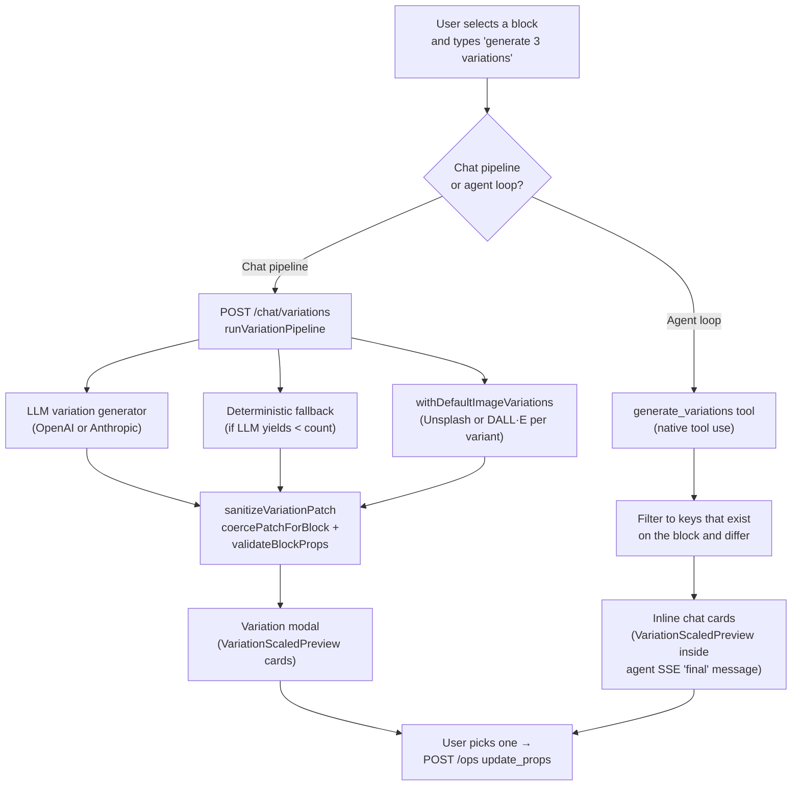

## Overview

**Variants** are AI-authored alternatives for a single, already-selected block.
A user picks a block, asks for "3 variations", and sees a set of scaled
previews side-by-side. Clicking one applies that patch to the draft through
the normal `update_props` op, so undo/redo and the version log behave as they
do for any other edit.

The feature has two independent code paths that both land in the same UI
component (`VariationScaledPreview`). Which path runs depends on whether the
user is in the legacy chat pipeline or in the newer agent loop:



Both paths ultimately validate each candidate patch against the block's Zod
schema via `validateBlockProps`, so variants can never produce a block that
the editor would reject.

## When to use which path

You don't choose directly — the routing is automatic — but it helps to know
which one is running when you're debugging.

| Path | Runs when | Where it lives | What it's good at |
|---|---|---|---|
| **REST variation pipeline** | Classic chat pipeline (`/chat` + intent detection) | `apps/orchestrator/src/chat/variation-pipeline.ts` | Dedicated LLM prompt, built-in image variation (Unsplash per-card + uniqueness enforcement), deterministic fallback when the LLM fails |
| **Agent tool (`generate_variations`)** | Site Agent / agent SDK loop | `apps/orchestrator/src/agent/agent-tools.ts` (lines ~699-768) | Claude authors the variants *inside* its reasoning loop — no separate LLM call. Fast, tool-use-native, no image variation |

Both surface to the user through the same React component, so end-user
experience is consistent.

## Triggering variants (REST pipeline)

### Detection

The chat pipeline calls `isVariationRequestMessage()` in
`apps/orchestrator/src/chat/chat-pipeline-shared.ts` to decide whether a
message is asking for variants. The rule is **verb + noun** in the same
message:

- **Verbs:** `generate`, `create`, `make`, `show`, `give`, `produce`, `draft`
- **Nouns:** `variations?`, `variants?`, `alternatives?`, `options`

If both match and a block is selected, the pipeline detours to
`runVariationPipeline` instead of the normal planner. If both match but no
block is selected, the pipeline returns a `needs_clarification` asking the
user to select a block first.

### Example messages

All of these trigger variants:

- "generate 3 variations"
- "show me 5 alternatives"
- "give 2 variants"
- "create four options for this hero"
- "make some variants with different copy"

The word "variants" is normalized to "variations" earlier in the translation
layer (`chat-pipeline-translation.ts`) to harden the detector against typos.

### Count parsing

`requestedVariationCount(message)` parses the count:

- Numeric: `\b(\d{1,2})\s+(variations?|variants?|alternatives?|options)\b`
- Word form: `one`..`twelve` followed by the same nouns
- Default: **3**
- Cap: **12** (anything higher is clamped silently)

### Constraints

The pipeline recognizes two inline constraints in the message:

| Constraint | Trigger (regex) | Effect |
|---|---|---|
| **Keep the same title** | `\bsame\s+title\b`, `\bkeep\s+(the\s+)?title\b`, `\btitle\s+(unchanged\|same)\b` | Strips `title` from every variation's patch |
| **Cards only (CardGrid)** | `\bcards?\s+only\b`, `\bonly\s+cards?\b` on a `CardGrid` block | Reduces each patch to only the `cards` key |

And for image-bearing blocks (`supportsImageVariation` = block has an
`imageUrl` prop):

| Image constraint | Trigger | Effect |
|---|---|---|
| **Same image across variants** | `same image`, `same photo`, `keep the same image`, `use one image`, `single image` | All variants reuse the block's current `imageUrl` |
| **No duplicates** | `no duplicates`, `do not reuse`, `unique images` | Retries Unsplash up to 8 times per variant to find a distinct photo (default cap is 5) |
| **Explicit URL** | A URL present anywhere in the message (`firstUrlFromText`) | That URL is used for every variant |

## Triggering variants (agent tool)

When the Site Agent is active, Claude calls the `generate_variations` tool
directly. The prompt tells Claude to call `get_page` first to read current
props, then author 2-4 materially different variations, each with a `title`,
`summary`, and `patch`.

The handler does **not** re-run the LLM. It only:

1. Loads the page + block.
2. Filters each patch to keys that exist on the block and differ from
   current values.
3. Caps the list at 6.
4. Serializes the result as a tool response.

This means the agent path is **cheaper and faster** than the REST pipeline
(no second LLM call, no image resolution), but it also has **no deterministic
fallback** — if Claude produces a bad shape the cards just don't render.

## How variants are generated (REST pipeline)

### 1. LLM generation

`generateVariationsWithOpenAI` and `generateVariationsWithAnthropic` both
send the same shape:

```jsonc
// system
buildVariationSystemPrompt({ count, keepTitle, cardsOnly, blockType, locale })

// user
{
  "request":           "generate 3 variations with a crisper tone",
  "blockId":           "b_hero",
  "blockType":         "Hero",
  "currentProps":      { "heading": "…", "subheading": "…", … },
  "allowedPatchKeys":  ["heading", "subheading", "ctaText", "imageUrl", …]
}
```

They expect the model to return:

```jsonc
{
  "variations": [
    {
      "title":   "Crisp & Direct",
      "summary": "Shorter and more action-oriented copy.",
      "patch":   { "heading": "Fresh avocados, daily", "ctaText": "Shop now" }
    },
    …
  ]
}
```

- OpenAI: called with `response_format: { type: "json_object" }`.
- Anthropic: system prompt goes through `anthropicSystemPromptWithCache()`
  for prompt caching; the response is parsed from the first `text` block via
  `extractJsonObject`.
- Both providers go through `resolveEffectiveProvider` / `resolveModelKey`
  for routing, so `/status/planner` availability applies.

If the provider throws (rate limit, timeout, invalid JSON), the pipeline
logs a `warn` with `{ err, provider, model, blockType }` and falls through
to the deterministic fallback.

### 2. Deterministic fallback

`deterministicVariations` always generates something, so the API rarely
returns zero variants:

- **CardGrid blocks** get three pre-written tones — *Crisp*, *Benefit-led*,
  *Action-driven* — that rewrite each card's `description` + `ctaText`.
- **Every other block type** with a string prop gets a suffix appended to
  the inferred primary text key (preference order: `heading`, `title`,
  `subheading`, `description`, `body`, `ctaText`, `imageAlt`, then the first
  non-empty string).

The fallback is also used to **top up** a short LLM response: if the model
only returns 2 valid variations out of 3 requested, the fallback fills the
third slot.

### 3. Image variation

`withDefaultImageVariations` runs after text is settled. For each variant,
in order:

1. If the message contains a URL, every variant uses that URL.
2. If `deriveVariationImageIntent` classifies the message as wanting AI-
   generated images, the pipeline dispatches to either Gemini
   (`generateVariationImageWithGemini`, default) or OpenAI
   (`generateVariationImageWithOpenAI`) based on `IMAGE_GEN_PROVIDER`. The
   per-variant prompt is built from the block type, heading, and subheading.
3. Otherwise it calls Unsplash via `resolveUnsplashImage`. With uniqueness
   enforced (the default), it uses `resolveDistinctUnsplashImage` which
   retries against a `usedImageUrls` set — up to 5 attempts, or 8 if the
   user explicitly asked for no duplicates.

**Picking the provider.** The message wins when it's explicit — `unsplash`
forces Unsplash; `gemini`, `openai`, `ai-generated`, `llm`, `gpt-image-2`,
`gpt-image-1`, or `nano-banana` force AI generation. When the message has
no hint, `VARIATION_DEFAULT_IMAGE_SOURCE` decides — set to `unsplash`
(default) or `ai` / `gemini` / `openai` / `llm` to route to AI gen. Once in
the AI branch, `IMAGE_GEN_PROVIDER` (default `gemini`) picks the actual
backend, and `OPENAI_IMAGE_MODEL` (e.g. `gpt-image-2`) selects the OpenAI
model when that backend is chosen.

Failed images don't kill the variant — the patch just keeps whatever image
it had (or none).

**LLMs don't author image URLs.** The system prompt forbids `imageUrl` in
patches; if an LLM sneaks one in anyway (they occasionally do), the pipeline
strips it before resolution. If image resolution then fails to produce a
real URL, any paired `imageAlt` is also dropped so the block keeps its
original image + alt rather than showing a broken `` with stray alt
text from the LLM.

### 4. Patch sanitization

Every variant flows through `sanitizeVariationPatch`:

```ts
const safePatch  = coercePatchForBlock(block, patch)      // type-coerce
const nextProps  = { ...block.props, ...safePatch }
const validated  = validateBlockProps(block.type, nextProps)
if (!validated.success) return null                       // drop invalid
if (deep-equal to current props) return null              // drop no-op
return safePatch
```

If sanitization drops a variant, the pipeline doesn't top it back up — the
caller receives fewer variants than requested. (This is why the LLM prompt
asks for patches keyed by `allowedPatchKeys` only.)

## Rendering

### Variation modal (REST pipeline)

The editor opens a modal with:

- A read-only reference panel showing the block's current props.
- A grid of variant cards. Each card has:
  - **Title + summary** from the variant.
  - **Live preview** — the real block renderer with the variant's patch
    applied, wrapped in `VariationScaledPreview`. The component uses a
    `ResizeObserver` to measure the shell and canvas, then applies a CSS
    `transform: scale(…)` to fit the preview into the card without
    re-flowing the block's internal layout.
  - **Apply button** — fires `POST /ops` with a single `update_props` op
    carrying `variationModal.pageSlug`, `variationModal.blockId`, and the
    variant's `patch`.

When a variant is applied the pipeline:

1. Sets `isApplyingVariation` on the editor store to prevent double-clicks.
2. Sends the op.
3. Moves block focus to `data.focusBlockId` (usually the same block).
4. Broadcasts the patch to the preview iframe — either via
   `postPatchToSite` (if `enablePatchTransport` is on and we got a
   `previewVersion`) or the coarser `draftUpdated` broadcast.
5. Closes the modal and pushes an `applied` assistant message with
   `canUndo: true`.

### Inline agent cards (agent tool)

When the agent tool returns variants, the editor renders them as inline
cards inside the chat message bubble. Same `VariationScaledPreview`
component, no modal — clicking a card applies the patch immediately. The
normal "suggested next actions" pills are suppressed while variation cards
are present, so the variants themselves serve as the next step.

## Data shape

### Request (REST)

`POST /chat/variations`

```ts
{
  session: string
  siteId?: string
  slug: string
  message: string                               // the user prompt
  modelKey?: "fast" | "balanced" | "reasoning" | "codex"
  provider?: "openai" | "anthropic" | "gemini"
  activeBlockId: string                         // required — the selected block
  activeBlockType: string
  activeEditablePath?: string
  locale?: string
  businessContext?: { purpose?, tone?, constraints? } | string
  siteContext?: { siteId?, siteName?, purpose?, hosting?, tone?, constraints? } | string
}
```

### Response (REST)

```ts
{
  status: "ok"
  summary: string                               // "Generated 3 variations for Hero."
  blockId: string
  blockType: BlockType
  pageSlug: string
  baseProps: Record<string, unknown>            // current block props, as reference
  variations: Array<{
    id: string                                  // "var_1713792134567_a3f2x"
    title: string                               // "Crisp & Direct"
    summary: string                             // "Shorter, more direct copy."
    patch: Record<string, unknown>              // only the keys that should change
    changedKeys: string[]
  }>
  plannerSource: "openai" | "anthropic" | "gemini" | "demo"
  modelUsed: string                             // e.g. "gpt-4o"
  modelKey: ModelKey
  usage?: {
    inputTokens: number
    outputTokens: number
    totalTokens: number
    cacheCreationInputTokens?: number
    cacheReadInputTokens?: number
    estimatedUsd: number | null
  }
}
```

Error responses:

| Code | When |
|---|---|
| `400` | `session` / `slug` / `message` missing; no `activeBlockId`; zero valid variants after sanitization |
| `404` | Page or selected block not found |

### Agent tool output

Same `variations` / `baseProps` shape, but wrapped as a tool result string
that the agent transport parses out of the final SSE message and hands to
the editor store as a `variations` payload on the assistant message.

## Persistence

Variants are **ephemeral** until applied:

- No variant list is ever persisted. Only the chosen patch, applied as a
  standard `update_props` op, lands in the draft.
- The applied variant participates in the normal session store history
  (undo/redo, version log, recent edits).
- If the user dismisses the modal, all generated variants are discarded
  client-side — nothing ever went to SQLite.

This is deliberate: there's no "saved variant" concept, no A/B state, and
no variant history to reason about on later requests.

## Demo mode

`DEMO_MODE=1` interacts with variants in two ways:

- **REST pipeline** — `plannerSource` resolves to `"demo"` for demo
  sessions. The pipeline currently only has LLM branches for `openai` and
  `anthropic`, so demo sessions skip the LLM and hit the **deterministic
  fallback directly**. Users still get three variants, just from the
  hand-written tones rather than the model.
- **Image variation** — `DEMO_DISABLE_IMAGE_GEN=1` short-circuits both
  Unsplash and DALL·E calls inside `detectImageOps`, so demo variants keep
  whatever image the block already has.

## Flags, caps, and defaults

All in `variation-pipeline.ts` unless noted:

| Constant | Default | Notes |
|---|---|---|
| `DEFAULT_VARIATION_COUNT` | `3` | Returned when the message has no count |
| `MAX_VARIATION_COUNT` | `12` | Any higher count is clamped silently |
| Agent tool cap | `6` | In `agent-tools.ts` — hard cap on items Claude can surface |
| Unsplash uniqueness retries (default) | `5` | Inside `resolveDistinctUnsplashImage` |
| Unsplash uniqueness retries (explicit "no duplicates") | `8` | Same function, when the message opts in |
| `validateBlockProps` | — | Hard gate — invalid patches are dropped, not fixed |

### Env vars

| Variable | Default | Values | Notes |
|---|---|---|---|
| `VARIATION_DEFAULT_IMAGE_SOURCE` | `unsplash` | `unsplash` \| `ai` (aliases: `llm`, `gemini`, `openai`) | Which branch runs in `withDefaultImageVariations` when the user's message has no image-provider hint. `ai` routes to AI generation; the actual backend is then chosen by `IMAGE_GEN_PROVIDER`. Explicit message keywords (e.g. `"unsplash"`, `"gemini"`, `"ai-generated"`) always override this. |
| `IMAGE_GEN_PROVIDER` | `gemini` | `gemini` \| `openai` | Which AI backend handles image gen once the AI branch is selected (for variations, the `image.generate` tool, and `/image/generate`). Falls back to the other provider if the chosen one has no API key. |
| `OPENAI_IMAGE_MODEL` | `gpt-image-1-mini` (variations), `gpt-image-1` (final-quality tool calls) | any OpenAI image model (e.g. `gpt-image-2`) | Model used when `IMAGE_GEN_PROVIDER=openai`. |
| `GOOGLE_GENAI_IMAGE_MODEL` | `gemini-2.5-flash-image` | any Gemini image model | Model used when `IMAGE_GEN_PROVIDER=gemini`. |

## Testing

Run the variation unit tests:

```bash
pnpm --filter @ai-site-editor/orchestrator test:chat
# or target the single file:
cd apps/orchestrator && npx tsx --test src/chat/variation-pipeline.test.ts
```

The test file covers:

- Unsplash uniqueness enforcement (retries, final URL set size).
- "Keep same image" opt-out path.
- `requestedVariationCount` across synonyms (`variations`, `variants`,
  `alternatives`, `options`), word forms, and the max-count clamp.

Agent tool coverage lives in `apps/orchestrator/src/agent/agent-tools.test.ts`.

## Key files

| Purpose | Path |
|---|---|
| REST pipeline entry | `apps/orchestrator/src/chat/variation-pipeline.ts` |
| Chat pipeline detour | `apps/orchestrator/src/chat/chat-pipeline.ts` (look for `isVariationRequestMessage`) |
| Intent detector | `apps/orchestrator/src/chat/chat-pipeline-shared.ts` |
| Route binding | `apps/orchestrator/src/routes/chat.ts` (`POST /chat/variations`) |
| System prompt | `apps/orchestrator/src/chat/prompts.ts` (`buildVariationSystemPrompt`) |
| Agent tool | `apps/orchestrator/src/agent/agent-tools.ts` (`generate_variations`) |
| Unsplash uniqueness helper | `apps/orchestrator/src/variation-images.ts` |
| Editor hook | `apps/editor/src/hooks/chat-engine/useVariations.ts` |
| Agent response handling | `apps/editor/src/hooks/chat-engine/agent-transport.ts` |
| Preview component | `apps/editor/src/components/VariationScaledPreview.tsx` |

## Related

- [How It Works](/how-it-works) — the chat pipeline the REST variation
  detour slots into.
- [Asset Manager & AI Images](/features/asset-picker) — the providers
  behind `withDefaultImageVariations` (Unsplash, OpenAI image models).
- [Custom Blocks](/integration/custom-blocks) — how `allowedPatchKeys`
  is derived from your block's Zod schema.
