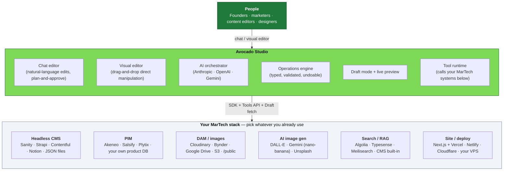

{/* Intro video — swap with the final cut when ready. */}

  <iframe
    className="w-full h-full"
    src="https://www.youtube.com/embed/lqw8kbaT1Xg"
    title="Avocado Studio intro"
    frameBorder="0"
    allow="accelerometer; autoplay; clipboard-write; encrypted-media; gyroscope; picture-in-picture; web-share"
    referrerPolicy="strict-origin-when-cross-origin"
    allowFullScreen
  />

## The vision: open, agentic, composable — for everyone

For the last decade, "real" content operations meant a Digital Experience Platform — **Adobe Experience Manager / Experience Cloud**, **Sitecore (XP, XM Cloud)**, **Contentstack**, **Optimizely**, **Bloomreach**, **Acquia**, **Coremedia**. These platforms defined the category, and they are now racing to reinvent it for the agentic AI era. The features are real and the direction is unmistakable:

- **Adobe** — [The Agentic Evolution of Adobe Experience Manager](https://blog.developer.adobe.com/en/publish/2026/02/the-agentic-evolution-of-adobe-experience-manager), the [Experience Cloud Agent Orchestrator](https://experienceleague.adobe.com/en/docs/experience-cloud-ai/experience-cloud-ai/agents/agent-orchestrator), and the [AI Assistant in AEM](https://experienceleague.adobe.com/en/docs/experience-manager-cloud-service/content/ai-in-aem/ai-assistant/ai-assistant-in-aem)
- **Sitecore** — [SitecoreAI](https://doc.sitecore.com/sai/en/users/sitecoreai/sitecoreai.html) (which replaced XM Cloud entirely as an AI-first platform), [Sitecore Stream](https://www.sitecore.com/platform/sitecore-stream) as the AI engine, and the [Agentic Studio](https://doc.sitecore.com/sai/en/users/sitecoreai/working-with-agentic-studio.html)
- **Optimizely** — [Opal](https://www.optimizely.com/ai/), positioned as "the agent orchestration platform for marketing," with [a library of out-of-the-box agents](https://www.optimizely.com/agents/) and [Opal University](https://www.optimizely.com/company/press/opal-university/)
- **Contentstack** — [Agent OS](https://www.contentstack.com/company/press/content-management-is-dead-contentstack-announces-agent-os-to-power-adaptive-experiences-in-the-context-economy), launched September 2025 under the tagline *"Content management is dead"*

The next era of content operations is agentic, AI-native, and the incumbents have validated the entire category direction by spending billions to retrofit their platforms for it. **But these new agentic features ship behind the same procurement model as the platforms they're built into.** Six-figure annual licenses, multi-month implementations, ongoing systems-integrator contracts, dedicated in-house MarTech teams to operate it all. The price of admission to "real" content operations hasn't gone down — it just got a smarter UI on top. The cost of entry still filters out everyone outside the Fortune-1000.

Meanwhile **everyone below the DXP line** falls into two distinct camps, and the existing tooling fails both of them.

**Camp 1: the legacy stack.** Solo founders, growing e-commerce shops, regional brands, B2B SaaS marketing teams operating on **WordPress with 30 plugins, Wix or Squarespace templates, page builders, freelance retainers, and a "we'll get to it next quarter" content backlog that never moves**. AI hasn't closed the gap for them — it's just made the WordPress plugin marketplace noisier. They want to do better but the upgrade path to "real" content operations has historically meant either staying where they are or jumping all the way to a DXP.

**Camp 2: the MACH crowd — and the one this project most identifies with.** Mid-market and enterprise teams that have already gone composable, headless, and API-first. They run **Contentful** / **Sanity** / **Strapi** / **Storyblok** for content, **commercetools** or **BigCommerce** for commerce, **Algolia** / **Typesense** / **Meilisearch** for search, **Cloudinary** / **Bynder** for assets, **Vercel** / **Netlify** / **Cloudflare** for delivery. They've assembled a modern stack one component at a time, deliberately, often at significant in-house engineering cost. **They are not "below" the DXPs technically — in many ways their architecture is better than what the legacy DXPs offer.** What they don't have is the agentic editing layer the incumbents are now racing to ship. And when they go looking for it, the answer they keep getting is *"sign a six- or seven-figure DXP contract that bundles agentic AI with the rest of the platform."* That's not a real choice — especially for a team that adopted MACH **precisely to avoid** monolithic vendor lock-in.

Both camps deserve a better answer than "rip out your stack and buy a DXP." That's the answer Avocado Studio is built to be.

**Avocado Studio is built for the gap.** The vision is concrete:

- **Open, self-hostable, "free"** — no per-seat license fees, no annual contracts, no minimum spend, no procurement cycles. Run the whole stack on a small VPS or your existing container host. Bring your own LLM keys. The total cost of running Avocado is what you pay your cloud provider, plus what you spend on LLM tokens.
- **Agentic and AI-native, not AI-bolted-on** — the editing experience is built around an AI agent from day one, not a chatbot panel sidecar grafted onto a 15-year-old CMS. Type *"add a testimonials section to /pricing"* or *"migrate https://my-old-site.com into Avocado"*, watch the agent reason about it, and review the proposed change before it ships. No prompt engineering, no copy-pasting between ChatGPT and your CMS.
- **Composable by design — bring your own stack** — Avocado is **not another CMS**. It's the AI orchestration and editing layer that sits *on top of* whatever content, asset, and product systems you already use (or will pick yourself). Keep your Sanity, your Strapi, your Contentful, your Cloudinary, your Notion, your hand-rolled JSON files. Avocado integrates with them via the [Site SDK](/integration/nextjs-integration) and the [Native Tools runtime](/integration/tools-mvp); it doesn't replace them.
- **Trust and review built in** — every AI edit is a structured operation you can preview, approve, undo, and roll back. Nothing ships without your sign-off. The person responsible for the website — founder, marketing lead, content owner — stays in control of what actually goes live.
- **No agency dependency** — adopting Avocado does not require hiring a systems integrator. The integration is two SDK helpers and a registration command (~30 minutes for a vanilla Next.js site). Your in-house developer, your existing freelancer, or your IDE coding agent can do it. Use it for client work without putting your clients on a six-figure license.

**The agentic content era is starting.** The category is racing toward it, and the legacy DXPs are spending billions to retrofit their platforms for it. The question isn't *whether* AI-native content operations will become standard — they will. The question is **who gets access**, and on what terms. If the only path is "buy a Fortune-1000-tier enterprise platform and sign a multi-year contract with a systems integrator," the answer is: the same Fortune-1000 buyers as before, just with a fancier UI on top. Everyone else — the legacy-stack teams who deserve a real upgrade path, and the MACH-native teams who already invested in composable architecture and now want the AI layer without buying the bundle — gets locked out by procurement, not technology.

Avocado Studio is what agentic content operations look like when you build them open, composable, and self-hostable from day one. The same kind of editing experience the enterprise platforms are racing to ship, **delivered as a layer on top of the composable stack you already have** (or one you'd happily assemble yourself), accessible to **everyone** — from solo founders modernizing off WordPress, to in-house engineering teams running Sanity + Vercel + Cloudinary at mid-market scale, to multi-client agencies, to large organizations that already chose MACH and don't want to be re-monolithized to get AI. Without inheriting the procurement, integration, or operational baggage that came with the legacy DXPs.

<Note>
**Honest scope today.** Avocado Studio is in early/active development. The Next.js integration path is rock-solid and tested in production; other frameworks are first-mover territory. The whole stack — orchestrator, Content Studio, site templates, and SDK — is open source (MIT) and lives in the [public repo](https://github.com/avocadostudio-ai/avocado). For self-hosting, you can run from source or use the prebuilt orchestrator Docker image (see [Docker Deployment](/operations/docker-deployment)). If you're a founder, an agency, an in-house marketing team, an in-house developer, or just someone who wants in early — welcome. File issues, contribute back, help shape what this becomes.
</Note>

## Where Avocado fits in your MarTech stack

Avocado is the **editing and AI orchestration layer** between the people producing content and the systems where that content actually lives. It sits in the middle:

The boxes on the bottom are the systems you already have (or will pick yourself). Avocado **does not replace any of them**. Instead it talks to them via two integration surfaces:

- **The [Site SDK](/integration/nextjs-integration)** — connects your CMS / database / file system as the source of truth for pages and blocks. The SDK ships with Next.js adapters out of the box, plus working examples for **JSON files, Contentful, Sanity, and Strapi**. Notion, Markdown, or your own database all work via the same `getPage` / `getSlugs` / `getSiteConfig` callbacks.
- **The [Native Tools runtime](/integration/tools-mvp)** — connects your PIM, DAM, search index, AI image generators, and any other external service so the AI editor can call them when reasoning about edits. *"Find a hero image from our Cloudinary library that matches this page"* or *"check the price for SKU-12345 in the PIM and update the product card"* are real use cases the tool runtime is designed for. Today the bundled tools are AI image generation (DALL-E + Gemini) and Unsplash search — the contract for adding your own PIM / DAM / vendor tools is documented and waiting for adopters.

This **BYO-stack** approach is the difference between Avocado and a traditional all-in-one CMS. Adobe Experience Manager and Sitecore aim to own every layer of that stack themselves (which is part of why they cost what they do). Avocado deliberately doesn't — it lets you assemble the stack from whatever you can afford, integrate the pieces, and put a unified AI-native editing experience on top.

## What is Avocado Studio?

Avocado Studio is an open content operations platform for websites. Describe content changes in natural language or use the visual drag-and-drop editor — the system generates schema-validated operations, lets you review the plan, and applies approved changes to draft content with live preview, undo/redo, and publishing controls.

### Two editing modes

  <CardGroup cols={2}>
  <Card title="Chat Editor" icon="message-bot">
    **The default mode.** Describe what you want in plain language (English, German, more on the way) — *"add a testimonials section to /pricing"* or *"change the hero CTA to Book a demo"* — and the AI plans the change, shows you the proposed operations, and waits for your approval before touching draft content. No menus, no field hunting, no copy-pasting between ChatGPT and your CMS.
  </Card>
  <Card title="Visual Editor" icon="hand-pointer" href="/integration/puck-mode">
    Drag-and-drop mode for direct manipulation. Click any block on the live preview to edit its props inline, reorder sections, or add new blocks from the library — with optional AI chat in the sidebar for natural-language edits alongside. Shares the same blocks, publishing pipeline, and orchestrator backend as the chat editor. Enabled per site in settings.
  </Card>
</CardGroup>

Both modes use the same block schemas, operation pipeline, and orchestrator backend. Editing mode is configured per site, so each site can opt into the visual editor independently.

**For founders, marketing leads, and content owners**: manage your website content through conversation — no code changes required. Review every AI suggestion before it ships. The same editing experience the largest enterprise DXP users get, without their license fees, agency contracts, or implementation timelines.

**For in-house dev teams and mid-market orgs**: get AI-native content operations on your existing Next.js + headless-CMS stack without ripping anything out and without committing to a multi-year DXP contract. Composable by design — Avocado integrates with whatever CMS, PIM, DAM, search, and deploy targets you already chose. Self-hosted on your own infrastructure, no data leaving your boundary.

**For developers and agencies**: integrate AI editing into any Next.js site with the Site SDK in ~30 minutes. Multi-model AI (Anthropic, OpenAI, Google Gemini for the per-edit chat), pluggable publishing pipeline, BYO content stack. Use it for client work without putting your clients on a six-figure license or signing them into a years-long platform commitment.

## Start here

<CardGroup cols={2}>
  <Card title="Core concepts" icon="lightbulb" href="/concepts">
    Pages, blocks, operations, draft mode — the mental model behind Avocado Studio.
  </Card>
  <Card title="How it works" icon="diagram-project" href="/how-it-works">
    Step-by-step walkthrough of the editing pipeline, from chat to live preview.
  </Card>
  <Card title="Architecture" icon="sitemap" href="/architecture">
    How the three services, packages, and data flow fit together.
  </Card>
  <Card title="Add a site" icon="plus" href="/sites">
    Bring an existing website into Avocado Studio — three modes (migrate / integrate / create) or wire it in by hand.
  </Card>
  <Card title="Next.js Integration" icon="react" href="/integration/nextjs-integration">
    The canonical walkthrough for connecting a Next.js 15 site to the editor in ~30 minutes.
  </Card>
  <Card title="Visual editor" icon="hand-pointer" href="/integration/puck-mode">
    Enable the drag-and-drop editor for a site (alternative to the chat editor).
  </Card>
</CardGroup>

## Key capabilities

- **Self-hostable, no license fees** — Run the entire stack on your own infrastructure. The smallest paid tier on any modern container host is enough for early use.
- **Natural-language editing** — Describe changes in plain English. The AI generates structured, schema-validated operations you can preview and approve.
- **Multi-model AI** — Anthropic, OpenAI, and Google Gemini for the per-edit chat. Most battle-tested with Claude (Haiku / Sonnet / Opus). The Site Assistant (full-site onboarding) is Claude-only today.
- **20 built-in block types** — Hero, CTA, FAQ, Testimonials, Gallery, Stats, Carousel, Table, and more. Bring your own React components via [Custom Blocks](/integration/custom-blocks).
- **Type-safe operations** — Zod schemas validate every edit. Malformed AI output is rejected before it touches your content.
- **Live preview + streaming** — See edits applied progressively as the AI generates the plan. No wait-and-pray.
- **Undo/redo + plan approval** — Full operation history. Review and approve every change. Nothing ships without your sign-off.
- **Pluggable publishing** — Ships with Git + Vercel deploy hooks. Implement the [`PublishTarget` interface](/how-it-works#the-publishtarget-interface) for your own workflow.
- **AI image generation built in** — DALL-E (`gpt-image-1`), Google Gemini (`gemini-2.5-flash-image`, "nano-banana"), and Unsplash search ship out of the box. See [Asset Manager & AI Images](/features/asset-picker).
- **Tool runtime for external systems** — Connect your PIM, DAM, search index, or any other vendor service to the AI planner via the [Native Tools](/integration/tools-mvp) contract.

## Suggested reading path

1. [Core concepts](/concepts) — pages, blocks, operations, draft mode
2. [How it works](/how-it-works) — the editing pipeline from chat to preview
3. [Architecture](/architecture) — services, packages, data flow
4. [Add a site](/sites) — bring an existing website into Avocado Studio (Site Assistant or by hand)
5. [Next.js Integration](/integration/nextjs-integration) — canonical onboarding path for Next.js sites
6. [Custom Blocks](/integration/custom-blocks) — register your own component types
7. [Native Tools](/integration/tools-mvp) — connect PIM, DAM, search, AI image generators
8. [Docker Deployment](/operations/docker-deployment) — self-host the orchestrator
