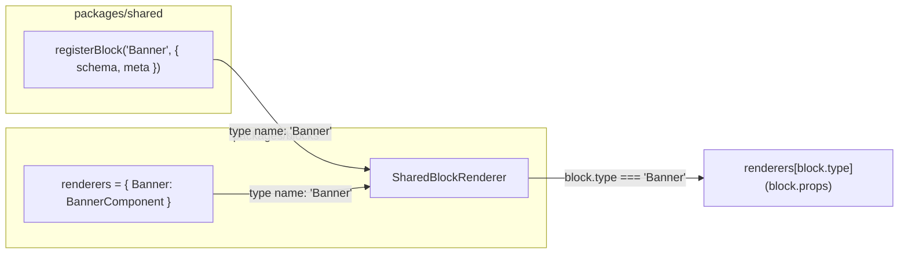
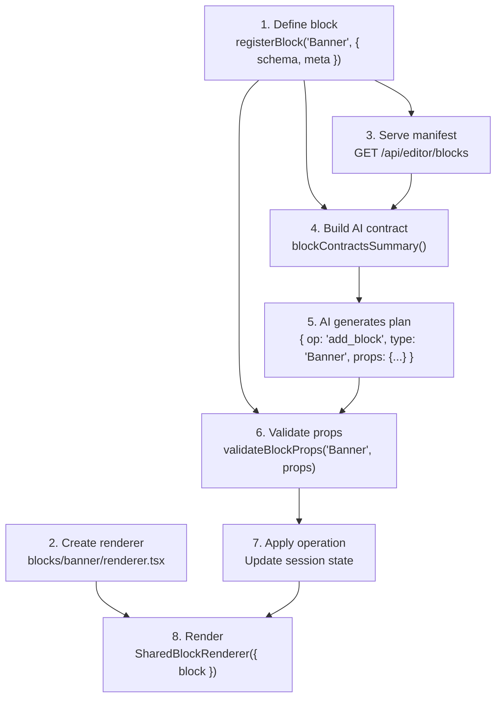

## Overview

The block system is split across two packages:

| Package | Contains | Used by |
|---------|----------|---------|
| `packages/shared/src/blocks/` | Zod schemas, field metadata, default props | Orchestrator, editor, site, Puck |
| `packages/blocks/src/blocks/` | React renderers, CSS, tests | Site (SSR), editor (preview), Puck canvas |

The split exists because the orchestrator (Node/Fastify) needs block schemas for validation and AI planning but has no React dependency. Renderers live in a separate package so React is only pulled in where it's needed.

## How a Block Is Defined

Every block has three parts, co-located in a single file in `packages/shared/src/blocks/`:

```ts
// packages/shared/src/blocks/banner.ts
import { z } from "zod"
import { registerBlock } from "./_registry.ts"
import { f } from "./_helpers.ts"

registerBlock("Banner", {
  schema: z.object({
    text: z.string().min(1),
    variant: z.enum(["info", "success", "warning"]).default("info"),
    ctaText: z.string().optional(),
    ctaHref: z.string().optional(),
    backgroundColor: z.string().optional(),
    textColor: z.string().optional(),
  }),
  meta: {
    displayName: "Banner",
    description: "Full-width announcement bar with optional CTA.",
    category: "content",
    fields: {
      text: f.text("Banner text"),
      variant: { kind: "enum", label: "Variant", options: ["info", "success", "warning"], inlineEditable: false },
      ctaText: f.text("Button label"),
      ctaHref: f.url("Button link"),
      backgroundColor: { kind: "color", label: "Background color", inlineEditable: false },
      textColor: { kind: "color", label: "Text color", inlineEditable: false },
    },
  }
})

export function bannerDefaultProps(): Record<string, unknown> {
  return {
    text: "We just launched something new — check it out!",
    variant: "info",
    ctaText: "Learn more",
    ctaHref: "/",
  }
}
```

### Schema

The Zod object defines the data shape — field types, enums with defaults, required vs optional, array constraints. This is the source of truth for validation. The orchestrator runs `validateBlockProps()` against this schema before applying any operation.

### Metadata (`meta`)

Rich metadata layered on top of the schema:

- **`fields`** — per-field `FieldMeta` with `kind`, `label`, `imageSpec`, `inlineEditable`
- **`listFields`** — describes array fields (like `cards` in CardGrid) with item-level field metadata
- **`displayName`**, **`description`**, **`category`** — used by the editor's block picker and property panel
- **`chrome`** — if `true`, the block is structurally pinned (e.g. SiteHeader, Footer) and cannot be added, moved, or removed

### Default Props

An exported function (e.g. `bannerDefaultProps()`) that returns sensible starter content. Used when the AI or user adds a new block — the defaults are the starting point that the AI then modifies.

## Field Metadata Vocabulary

The `_helpers.ts` file provides factory functions for declaring field metadata:

```ts
import { f } from "./_helpers.ts"

f.text("Heading")              // { kind: "text", label: "Heading" }
f.longtext("Description")     // { kind: "text", label: "Description", multiline: true }
f.richtext("Body")            // { kind: "richtext", label: "Body" }
f.url("Link")                 // { kind: "url", label: "Link", inlineEditable: false }
f.image("Hero image", {       // { kind: "image", label: "Hero image", inlineEditable: false,
  aspectRatio: "landscape",   //   imageSpec: { aspectRatio: "landscape", width: 1536, height: 1024 } }
  width: 1536, height: 1024
})
f.imageAlt("Alt text")        // { kind: "imageAlt", label: "Alt text" }
f.headingLevel()              // { kind: "headingLevel", label: "Heading type", inlineEditable: false }
```

The `kind` field drives behavior across the stack:

| Kind | Editor UI | AI planning | Preview overlay |
|------|-----------|-------------|-----------------|
| `text` | Text input | Free text generation | Inline editable |
| `richtext` | Textarea | Markdown generation | Inline editable |
| `url` | URL input | Link generation | Not inline editable |
| `image` | Asset Picker modal | Image resolution (Unsplash/DALL-E) | Not inline editable |
| `imageAlt` | Text input | Alt text generation | Inline editable |
| `enum` | Dropdown selector | Constrained to options | Not inline editable |
| `color` | Color picker | Hex color generation | Not inline editable |
| `number` | Number input | Numeric generation | Not inline editable |
| `headingLevel` | Dropdown (h1-h6) | Heading hierarchy | Not inline editable |

## How a Block Is Rendered

Renderers live in `packages/blocks/src/blocks/{type}/renderer.tsx`:

```tsx
// packages/blocks/src/blocks/banner/renderer.tsx
export function Banner(props: Record<string, unknown>): JSX.Element {
  const text = String(props.text ?? "")
  const variant = String(props.variant ?? "info")
  const ctaText = String(props.ctaText ?? "")
  const ctaHref = String(props.ctaHref ?? "")

  return (
    <section className={`banner banner--${variant}`}>
      <div className="banner__inner section__inner">
        <p data-editable-target="text">{renderInline(text)}</p>
        {ctaText.length > 0 && ctaHref.length > 0 && (
          <PrimaryButton href={ctaHref} data-editable-target="ctaText">
            {ctaText}
          </PrimaryButton>
        )}
      </div>
    </section>
  )
}
```

Key patterns:
- **Untyped props** — renderers accept `Record<string, unknown>` and coerce to safe types. Validation happens upstream in the orchestrator.
- **`data-editable-target`** — marks DOM elements for inline editing in the preview overlay. The value matches a prop key.
- **No imports from `shared`** (usually) — renderers are stateless view functions. They don't validate or re-fetch metadata.

## How They Connect

Schemas and renderers are joined by **type name convention** — the string `"Banner"` passed to `registerBlock()` must match the key in the renderers map:



`SharedBlockRenderer` is the glue:

```tsx
// packages/blocks/src/renderer.tsx
export function SharedBlockRenderer({ block }: { block: BlockInstance }) {
  if (isRendererBlockType(block.type)) {
    const Renderer = renderers[block.type]
    return <Renderer {...block.props} />
  }
  const Custom = customRenderers.get(block.type)
  if (Custom) return <Custom {...block.props} />
  return null
}
```

It checks the built-in renderer map first, then falls back to custom renderers registered at runtime (for site-specific blocks from migrations or CMS integrations).

<Warning>
There is no compile-time check that every schema has a matching renderer. If you add a schema in `shared` but forget the renderer in `blocks`, the block will validate but render as empty. The block catalogue page (`/catalogue`) is the easiest way to verify all blocks render correctly.
</Warning>

## The Registry Singleton

The registry uses `globalThis` to ensure a single instance survives Next.js webpack module duplication across RSC, SSR, and API route layers:

```ts
const G = globalThis as Record<string, unknown>
const _blockSchemas: Record<string, z.ZodObject<any>> =
  (G.__ase_blockSchemas as ...) ?? (G.__ase_blockSchemas = {})
const _blockMeta: Record<string, BlockMeta> =
  (G.__ase_blockMeta as ...) ?? (G.__ase_blockMeta = {})
```

Without this, `registerBlock()` in a custom block file would populate a different registry copy than `getBlockMeta()` reads — blocks would appear registered but metadata would be missing.

## Runtime Queries

The registry exposes query functions used across the stack:

| Function | Used by | Purpose |
|----------|---------|---------|
| `getBlockMeta(type)` | Editor property panel, Puck config | Get metadata for a block type |
| `getAllBlockMeta()` | Block manifest API, catalogue | Get all registered metadata |
| `getImageFields(type)` | Orchestrator image resolution | Which props are image fields (cached) |
| `getListImageFields(type)` | Orchestrator image resolution | Which array items have images (cached) |
| `getImageSpec(type, path)` | DALL-E/Unsplash requests | Aspect ratio for a field path like `cards[0].imageUrl` |
| `isFieldInlineEditable(type, path)` | Preview overlay | Can this field be edited in-place? |
| `isChrome(type)` | Orchestrator ops engine | Is this block pinned (header/footer)? |
| `validateBlockProps(type, props)` | Orchestrator ops engine | Run Zod validation before applying ops |
| `defaultPropsForType(type)` | AI planner, ops engine | Seed new blocks with defaults |
| `getBlockJsonSchema(type)` | Block manifest API | Convert Zod to JSON Schema for external consumers |

## Block Manifest API

When the editor connects to a site, it fetches the block manifest from `GET /api/editor/blocks`. This endpoint serializes registered blocks into a JSON payload the editor and AI planner can consume:

```json
{
  "version": 1,
  "blocks": [
    {
      "type": "Banner",
      "displayName": "Banner",
      "description": "Full-width announcement bar with optional CTA.",
      "propsSchema": { "type": "object", "properties": { "text": { "type": "string" }, ... } },
      "defaultProps": { "text": "We just launched...", "variant": "info" }
    }
  ]
}
```

For built-in blocks, `getBlockJsonSchema()` converts the Zod schema to JSON Schema and strips validation-only constraints (`minLength`, `required`, `$schema`, `additionalProperties`) — the editor only needs the structural shape.

For custom blocks (external sites), the manifest is authored directly as JSON Schema in `propsSchema`.

## Full Lifecycle



---

## How-To Guides

### Add a new block type

<Steps>
  <Step title="Define the schema">
    Create `packages/shared/src/blocks/my-block.ts`:

    ```ts
    import { z } from "zod"
    import { registerBlock } from "./_registry.ts"
    import { f } from "./_helpers.ts"

    registerBlock("MyBlock", {
      schema: z.object({
        title: z.string().min(1),
        body: z.string().min(1),
        imageUrl: z.string().min(1).optional(),
        imageAlt: z.string().optional(),
      }),
      meta: {
        displayName: "My Block",
        description: "A custom content block.",
        category: "content",
        fields: {
          title: f.text("Title"),
          body: f.richtext("Body"),
          imageUrl: f.image("Image", { aspectRatio: "landscape", width: 800, height: 600 }),
          imageAlt: f.imageAlt("Image alt text"),
        },
      }
    })

    export function myBlockDefaultProps(): Record<string, unknown> {
      return { title: "New block", body: "Add your content here." }
    }
    ```
  </Step>
  <Step title="Register the import">
    Add `import "./my-block.ts"` to `packages/shared/src/blocks/index.ts` so the schema is loaded at startup.
  </Step>
  <Step title="Create the renderer">
    Create `packages/blocks/src/blocks/my-block/renderer.tsx`:

    ```tsx
    import { BlockImage } from "../block-image"

    export function MyBlock(props: Record<string, unknown>) {
      const title = String(props.title ?? "")
      const body = String(props.body ?? "")
      const imageUrl = typeof props.imageUrl === "string" ? props.imageUrl : undefined

      return (
        <section className="my-block">
          <div className="section__inner">
            <h2 data-editable-target="title">{title}</h2>
            <p data-editable-target="body">{body}</p>
            {imageUrl && (
              <BlockImage src={imageUrl} alt={String(props.imageAlt ?? "")}
                width={800} height={600} data-editable-target="imageUrl" />
            )}
          </div>
        </section>
      )
    }
    ```
  </Step>
  <Step title="Register the renderer">
    Add `MyBlock` to the `renderers` map in `packages/blocks/src/blocks/index.ts` and to the `RendererBlockType` union in `block-types.ts`.
  </Step>
  <Step title="Add styles">
    Create `packages/blocks/src/blocks/my-block/styles.css` and import it from `packages/blocks/src/blocks/styles.css`.
  </Step>
  <Step title="Verify">
    - `pnpm typecheck` — catches missing fields or type mismatches
    - Visit `/catalogue` on the site to see the block render with default props
    - Open the editor and ask the AI to "add a MyBlock" — the planner should pick it up from the manifest
  </Step>
</Steps>

### Add a field to an existing block

<Steps>
  <Step title="Update the Zod schema">
    Add the field to the block's `z.object()` in `packages/shared/src/blocks/{type}.ts`. Use `.optional()` if it's not required.
  </Step>
  <Step title="Add field metadata">
    Add an entry to `meta.fields` using the `f.*` helpers. Choose the right `kind` — it determines editor UI, AI behavior, and inline editability.
  </Step>
  <Step title="Update default props">
    If the field should have a starter value, add it to the `*DefaultProps()` function.
  </Step>
  <Step title="Update the renderer">
    Read the new prop in the renderer component. Add `data-editable-target="fieldName"` if it should be inline-editable in the preview.
  </Step>
  <Step title="Verify">
    `pnpm typecheck` then check the block catalogue and editor.
  </Step>
</Steps>

### Add a list field (repeatable items)

<Steps>
  <Step title="Define the array in the schema">
    ```ts
    features: z.array(z.object({
      icon: z.string().optional(),
      title: z.string().min(1),
      description: z.string().min(1),
    })).min(1)
    ```
  </Step>
  <Step title="Add listFields metadata">
    ```ts
    meta: {
      // ... scalar fields ...
      listFields: {
        features: {
          label: "Features",
          itemFields: {
            icon: f.text("Icon"),
            title: f.text("Feature title"),
            description: f.longtext("Feature description"),
          }
        }
      }
    }
    ```
  </Step>
  <Step title="Update the renderer">
    Cast and iterate:
    ```tsx
    const features = Array.isArray(props.features) ? props.features as Record<string, unknown>[] : []
    {features.map((item, i) => (
      <div key={i}>
        <h3 data-editable-target={`features[${i}].title`}>{String(item.title ?? "")}</h3>
        <p data-editable-target={`features[${i}].description`}>{String(item.description ?? "")}</p>
      </div>
    ))}
    ```
    Note the `features[0].title` path format in `data-editable-target` — this enables inline editing of list items.
  </Step>
</Steps>

### Add AI guidance for a block

If the AI makes mistakes with your block's props (wrong enum values, missing cross-field dependencies), add a note in `apps/orchestrator/src/nlp/deterministic-planner-suggestions.ts`:

```ts
const _blockNotes: Record<string, string> = {
  // ...existing notes...
  MyBlock: "body supports richtext: **bold**, *italic*, [link](url), paragraph breaks (\\n\\n). imageUrl is optional — omit to render text-only layout.",
}
```

Notes are injected into the AI contract as natural language guidance. They're most valuable for:
- Enum semantics ("use `center` textAlign with `full` imagePosition")
- Cross-field dependencies ("full-bleed variant REQUIRES imageUrl")
- Richtext conventions (which markdown subset is supported)
- Optional field toggle behavior ("omit or set empty to hide")

See [Block Schema Contracts](/specs/block-schema-contracts) for details on how contracts are assembled and sent to the LLM.

### Add image fields with AI resolution

Mark image fields with `f.image()` and include an `imageSpec`:

```ts
fields: {
  imageUrl: f.image("Hero image", { aspectRatio: "landscape", width: 1536, height: 1024 }),
  imageAlt: f.imageAlt("Hero image alt text"),
}
```

The `imageSpec` tells the AI planner what dimensions to request from DALL-E or Unsplash. The `imageAlt` kind pairs with the image field for accessibility. Both are auto-detected by `getImageFields()` and `getImageSpec()` — no additional wiring needed.

For list items with images, declare them in `listFields.itemFields`:

```ts
listFields: {
  cards: {
    label: "Cards",
    itemFields: {
      imageUrl: f.image("Card image", { aspectRatio: "landscape", width: 768, height: 512 }),
      imageAlt: f.imageAlt("Card image alt text"),
    }
  }
}
```
