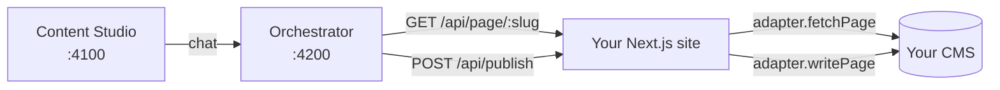

Avocado Studio doesn't ship its own content database. Pages live in your CMS (or a JSON file, or git); the orchestrator holds draft / edit state in SQLite and asks your site for the published content via a small adapter.

That means you keep your existing CMS, your existing content model, your existing publishing workflow — Avocado adds an AI-native editing surface on top. Switching CMSes is a swap of one adapter file, not a migration.

## What an adapter does

Every Next.js site that uses Avocado implements two thin functions:

1. **Read published pages** — given a slug, return a `PageDoc` (the Avocado page shape: id, slug, blocks, meta).
2. **Write on publish** — given a `PageDoc`, persist it back to the CMS so the next page render reflects the change.

That's the whole contract. The Site SDK at `@ai-site-editor/site-sdk` provides the route handlers; your adapter file maps your CMS's shape to/from `PageDoc`.



## Bundled examples

Five working examples live under [`examples/`](https://github.com/avocadostudio-ai/avocado/tree/main/examples) in the repo. Each one is a complete Next.js 15 site you can boot in two minutes:

| Example | CMS | Pattern | Port |
|---|---|---|---|
| [`sample-site`](https://github.com/avocadostudio-ai/avocado/tree/main/examples/sample-site) | Local JSON file | Zero-config starter | 3002 |
| [`contentful-site`](https://github.com/avocadostudio-ai/avocado/tree/main/examples/contentful-site) | Contentful | Headless SaaS CMS | 3003 |
| [`contentful-marketing-site`](https://github.com/avocadostudio-ai/avocado/tree/main/examples/contentful-marketing-site) | Contentful | Marketing-site flavor | 3006 |
| [`sanity-site`](https://github.com/avocadostudio-ai/avocado/tree/main/examples/sanity-site) | Sanity | Headless + embedded Studio | 3004 |
| [`strapi-site`](https://github.com/avocadostudio-ai/avocado/tree/main/examples/strapi-site) | Strapi v5 | Self-hosted open-source CMS | 3005 |

All five share the same **split-route pattern**: a fully static published path (`/[slug]`) plus a dynamic `/preview-draft/[slug]` path that handles editor and draft mode. That gives you static-site performance in production while keeping live preview during editing.

## Contentful

Free Community plan is enough for the example. The setup script creates the full content model (20 block types + `page` + `siteConfig`) in your space.

**Env vars:**

```bash
CONTENTFUL_SPACE_ID=<from app.contentful.com → Settings → General>
CONTENTFUL_DELIVERY_TOKEN=<from API keys → Content delivery tokens>
CONTENTFUL_MANAGEMENT_TOKEN=<from API keys → Content management tokens>
CONTENTFUL_ENVIRONMENT=master
```

**Bootstrap:**

```bash
pnpm --filter contentful-site contentful:setup     # idempotent
pnpm --filter contentful-site dev                  # http://localhost:3003
```

**Bring your own schema** — skip the setup script and write your own `lib/contentful.ts` that maps your existing types into `PageDoc` / `BlockInstance`. The script is a starter kit, not a hard dependency.

Full walkthrough: [`examples/contentful-site/README.md`](https://github.com/avocadostudio-ai/avocado/blob/main/examples/contentful-site/README.md).

## Sanity

The example ships with an **embedded Sanity Studio at `/studio`** alongside the Avocado editor, so content teams can use either UI against the same dataset.

**Env vars:**

```bash
NEXT_PUBLIC_SANITY_PROJECT_ID=<from sanity.io/manage>
NEXT_PUBLIC_SANITY_DATASET=production
SANITY_API_TOKEN=<from API → Tokens (Editor permissions)>
```

**Bootstrap:**

```bash
# Schemas are pre-generated; regenerate only after upgrading block fields:
pnpm --filter sanity-site sanity:schema-gen
pnpm --filter sanity-site dev                      # http://localhost:3004
```

You also need to add `http://localhost:3004` as a CORS origin in the Sanity project settings (with credentials allowed) so the embedded Studio can authenticate.

Full walkthrough: [`examples/sanity-site/README.md`](https://github.com/avocadostudio-ai/avocado/blob/main/examples/sanity-site/README.md).

## Strapi

Self-hosted, open-source. The setup script generates Strapi v5 schema files from the Avocado block registry: 20 block components + a `page` collection with a Dynamic Zone + a `site-config` single type.

**Bootstrap:**

```bash
# In a separate directory, create a Strapi project:
npx create-strapi@latest strapi-backend --quickstart --skip-cloud --no-run

# Generate Avocado-shaped schemas into it:
STRAPI_PROJECT=/absolute/path/to/strapi-backend pnpm --filter strapi-site strapi:setup

# Start Strapi:
cd /absolute/path/to/strapi-backend && npm run develop    # http://localhost:1337/admin

# In another terminal, start the Next.js site:
pnpm --filter strapi-site dev                              # http://localhost:3005
```

Generate an API token from the Strapi admin (**Settings → API Tokens**) with read+write permissions for the `page` and `site-config` types.

Full walkthrough: [`examples/strapi-site/README.md`](https://github.com/avocadostudio-ai/avocado/blob/main/examples/strapi-site/README.md).

## Local JSON (no CMS)

The simplest possible adapter — pages live in a JSON file on disk. Great for prototypes, brochure sites, or as a starting point before you decide which CMS you want.

```bash
pnpm --filter sample-site dev                      # http://localhost:3002
```

Pages are stored under `examples/sample-site/lib/published-content.json`. The publish handler rewrites the file in place; commit it for "git as your CMS."

## Writing your own adapter

If none of the above match your stack, an adapter is ~150 lines of code. The contract is small enough to summarize here:

```ts
// lib/your-cms.ts
import type { PageDoc } from "@avocadostudio-ai/shared"

export async function fetchPage(slug: string): Promise<PageDoc | null> {
  const raw = await yourCms.getPage(slug)
  if (!raw) return null
  return mapYourCmsToPageDoc(raw)
}

export async function writePage(doc: PageDoc): Promise<void> {
  await yourCms.upsertPage(mapPageDocToYourCms(doc))
}
```

Then wire those into the SDK's route handlers in `app/api/page/[slug]/route.ts` and `app/api/publish/route.ts`. The bundled examples are the cleanest reference — copy whichever one is closest to your CMS's shape and replace the bodies of `fetchPage` / `writePage`.

<Note>
A formal `CmsAdapter` interface is on the roadmap. Today the contract is "two functions named whatever you like that fetch and persist a `PageDoc`." If you build a non-trivial adapter (Storyblok, Hygraph, Payload, Directus, etc.) we'd love to merge it into `examples/`.
</Note>

## See also

- [Next.js integration](/integration/nextjs-integration) — the canonical contract between site and orchestrator
- [Block system](/integration/block-system) — how `PageDoc` and `BlockInstance` are shaped
- [Custom blocks](/integration/custom-blocks) — registering your own React components alongside the 20 built-ins
