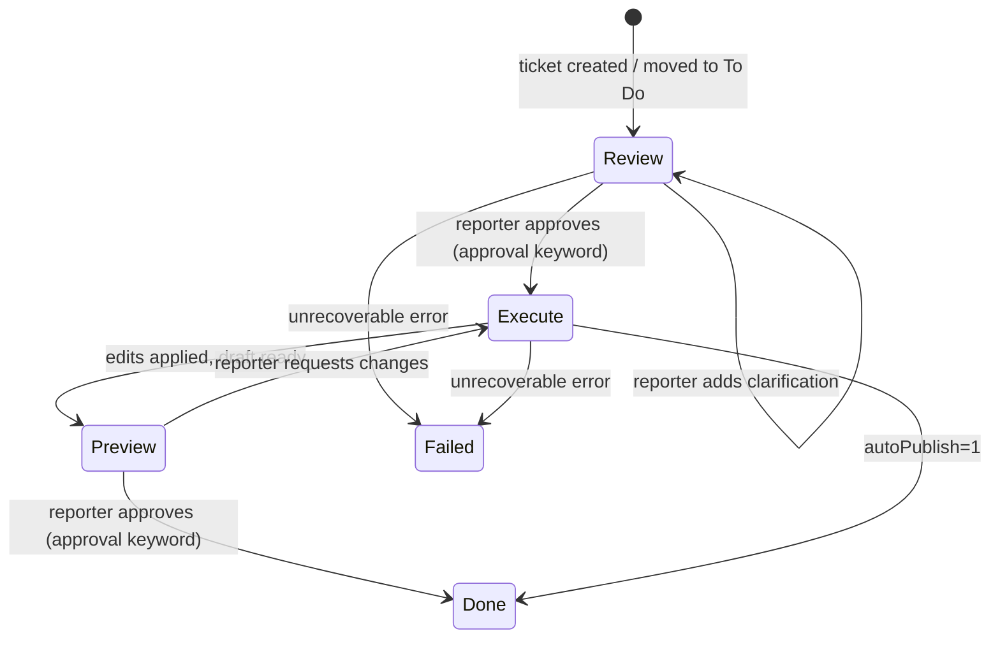

The Jira integration turns the orchestrator into a Jira-driven agent. When a ticket lands in the right status (or mentions the agent), Avocado reviews the request, applies the changes to your site, posts a preview link, and waits for approval before publishing.

<Note>
The `/jira/*` routes are **internal-only**: they don't appear in the public API reference and are hard-blocked when `DEMO_MODE=1` is set.
</Note>

## How it works

The integration runs a three-stage state machine driven by Jira ticket statuses and comment events.



**Review** — The agent reads the full ticket context (summary, description, attachments, complete comment thread) and posts one of two comments:
- A plan: *"Here's what I'll do — let me know when to proceed."*
- Questions: *"I need more info on X before I can start."*

No site changes are made during review. The review prompt explicitly lists what the execute pass is capable of (Unsplash search, photo-page URL resolution, AI image generation) so the agent doesn't fabricate limitations or ask for things it already has.

**Execute** — The ticket is immediately transitioned to `JIRA_EXECUTE_STATUS` (`In Progress`) so the board reflects live progress. The agent then runs with full tool access, including the complete comment history so any clarifications posted as replies reach the agent. It reads the current site state, applies ops, posts a comment listing every change with clickable preview links, then parks the ticket at `JIRA_PREVIEW_STATUS`.

**Preview** — The reporter reviews the draft in the editor. An approval comment triggers publish and moves the ticket to Done. Any other comment re-runs execute with the new instruction.

### Approval keywords

The dispatcher uses keyword matching (not LLM inference) to detect approval. These words trigger a stage transition when they appear as whole tokens in the first 500 characters of a comment:

```
proceed · go · go ahead · yes · ok · okay · approved · approve
lgtm · ship it · looks good · confirm · confirmed · continue · publish
```

Examples that work: *"lgtm"*, *"ok, ship it"*, *"looks good, go ahead"*
Examples that don't: *"going through the feedback"* (`go` only matches as a whole token)

### Self-loop prevention

The agent detects its own comments using **both** the author account ID and the comment body. A comment is only treated as agent-authored when the Jira `accountId` matches `JIRA_AGENT_ACCOUNT_ID` AND the comment body starts with a known agent headline (e.g. "Draft updated. Ready for your review." or "Review complete — ready to proceed."). The dual check prevents false positives on solo / dev Jira tenants where the operator and agent share the same account — reporter replies from that account are still treated as reporter input, not self-loops.

---

## Prerequisites

- A Jira Cloud or Jira Server / Data Center instance
- An API token (Cloud) or Personal Access Token (Server/DC)
- `ANTHROPIC_API_KEY` or `OPENAI_API_KEY` in the orchestrator environment — the Jira processor uses the same AI backend as the chat pipeline; without at least one key it will refuse every ticket with an error
- Orchestrator reachable from Jira's webhook delivery (for webhook mode) or able to reach Jira (for polling mode)

### Cloud vs Server/DC auth

| | JIRA Cloud | JIRA Server / Data Center |
|---|---|---|
| `JIRA_USER_EMAIL` | Required — your Atlassian account email | Leave blank |
| `JIRA_API_TOKEN` | API token from [id.atlassian.com](https://id.atlassian.com/manage-profile/security/api-tokens) | Personal Access Token |
| HTTP auth scheme | Basic (`email:token` → base64) | Bearer token |

The client detects which to use based on whether `JIRA_USER_EMAIL` is set.

---

## Configuration

Set these variables in your `.env` (or deployment environment). Only `JIRA_BASE_URL` and `JIRA_API_TOKEN` are required; everything else has a sensible default.

### Required

| Variable | Description |
|---|---|
| `JIRA_BASE_URL` | Your Jira instance URL, e.g. `https://mycompany.atlassian.net` |
| `JIRA_API_TOKEN` | API token (Cloud) or PAT (Server/DC) |

### Auth

| Variable | Default | Description |
|---|---|---|
| `JIRA_USER_EMAIL` | — | Email for Cloud Basic auth. Leave unset for Server/DC Bearer auth. |
| `JIRA_WEBHOOK_SECRET` | — | Shared secret validated on every incoming webhook. Omit to accept all requests (not recommended in production). |
| `JIRA_AGENT_ACCOUNT_ID` | — | The agent's Jira account ID. Used to detect `@mention`s and prevent self-loops. Get it from your Jira profile URL or `GET /rest/api/3/myself`. |

### Workflow statuses

These must exactly match your Jira workflow status names (case-insensitive comparison is used).

| Variable | Default | Stage |
|---|---|---|
| `JIRA_REVIEW_STATUS` | `To Do` | Tickets waiting for agent review / reporter approval |
| `JIRA_EXECUTE_STATUS` | `In Progress` | Agent is applying edits |
| `JIRA_PREVIEW_STATUS` | `In Review` | Draft ready; reporter reviews and approves |
| `JIRA_DONE_STATUS` | `Done` | Terminal — ticket closed after publish |
| `JIRA_FAILED_STATUS` | — | Optional — status to transition to on unrecoverable error |

<Tip>
`JIRA_TRIGGER_STATUS` is a legacy alias for `JIRA_REVIEW_STATUS`. Both are accepted.
</Tip>

### Behaviour

| Variable | Default | Description |
|---|---|---|
| `JIRA_SITE_ID` | `avocado-stories` | Which site to edit. Leave unset to let the agent detect the target site from the ticket text. |
| `JIRA_SESSION` | `jira` | Session name prefix used for in-memory state. |
| `JIRA_AUTO_PUBLISH` | `0` | Set to `1` to skip the preview stage: the agent publishes immediately after execute and closes the ticket. |
| `JIRA_MAX_REVIEW_PASSES` | `3` | Maximum clarification rounds per ticket. After this cap, the agent forces a proceed-or-stop decision. |

### Polling mode

| Variable | Default | Description |
|---|---|---|
| `JIRA_POLL_ENABLED` | `0` | Set to `1` to enable polling (alternative to webhooks). |
| `JIRA_POLL_JQL` | `status in ("To Do", "In Review")` | JQL filter for the poller. Defaults to matching your configured review and preview statuses. |
| `JIRA_POLL_INTERVAL_MS` | `60000` | Polling interval in milliseconds. |

---

## Setting up webhooks

Webhooks are the primary event delivery mechanism. If your orchestrator is not publicly reachable (local dev, firewalled environments), use [polling mode](#polling-mode) instead.

<Steps>
  <Step title="Make the orchestrator reachable">
    The orchestrator must be accessible from Jira's servers. For local development, use a tunnelling tool (e.g. `ngrok http 4200`). For production, deploy to a public URL and set `ORCHESTRATOR_PUBLIC_ORIGIN` accordingly.
  </Step>

  <Step title="Create the webhook in Jira">
    In your Jira project:
    1. Go to **Project Settings → Automation** (Cloud) or **System → WebHooks** (Server/DC).
    2. Create a new webhook pointing to:
       ```
       POST https://<your-orchestrator>/jira/webhook
       ```
    3. Subscribe to these event types:
       - **Issue created** (`jira:issue_created`)
       - **Issue updated** (`jira:issue_updated`) — covers status changes
       - **Comment created** (`comment_created`)
       - **Comment updated** (`comment_updated`)
  </Step>

  <Step title="Configure the secret">
    Set a shared secret in Jira's webhook configuration. The orchestrator reads it from the `x-jira-webhook-secret` request header (or a `secret` query parameter).

    Add the same value to your `.env`:
    ```bash
    JIRA_WEBHOOK_SECRET=your-shared-secret
    ```

    The orchestrator validates secrets with a timing-safe comparison. Without a configured secret, all requests are accepted — fine for local dev, not for production.
  </Step>

  <Step title="Verify delivery">
    Move a test ticket to your `JIRA_REVIEW_STATUS`. You should see an HTTP 202 response in Jira's webhook delivery log and a new comment from the agent on the ticket within seconds.

    If the webhook times out or returns 503, the integration isn't configured — check that `JIRA_BASE_URL` and `JIRA_API_TOKEN` are set and the orchestrator has restarted.
  </Step>
</Steps>

---

## Polling mode

Use polling when webhooks aren't available (firewall, local dev without ngrok).

```bash
JIRA_POLL_ENABLED=1
JIRA_POLL_INTERVAL_MS=60000   # check every 60s
# Optional: narrow the query to your project
JIRA_POLL_JQL=project = SITE AND status in ("To Do", "In Review")
```

The poller queries Jira on the configured interval and applies the same routing logic as the webhook dispatcher. It deduplicates using a fingerprint of `issueKey:status:commentCount` so it only re-processes a ticket when its state actually changes. The dedup cache is cleared every 24 hours.

<Warning>
Polling and webhook modes can run simultaneously, but this risks duplicate processing. Enable one or the other.
</Warning>

---

## Webhook routing logic

The table below summarises how the dispatcher maps incoming events to processing modes.

| Event | Current status | Comment content | Action |
|---|---|---|---|
| Comment created/updated | `JIRA_REVIEW_STATUS` | Approval keyword | **execute** |
| Comment created/updated | `JIRA_REVIEW_STATUS` | Anything else | **review** (re-review with new info) |
| Comment created/updated | `JIRA_PREVIEW_STATUS` | Approval keyword | **publish** |
| Comment created/updated | `JIRA_PREVIEW_STATUS` | Anything else | **execute** (apply follow-up edits) |
| Comment (any status) | Any | `@site-editor`, `@website-agent`, `@avocado-agent`, `@ai-editor` mention | **review** |
| Status changed (by human) | → `JIRA_REVIEW_STATUS` | — | **review** |
| Status changed (by human) | → `JIRA_EXECUTE_STATUS` | — | **execute** |
| Status changed (by human) | → anything else | — | skip |
| Issue created | `JIRA_REVIEW_STATUS` or assigned to agent | — | **review** |
| Any event | Any | Authored by agent account | skip (self-loop guard) |

---

## Attachment handling

Attachments on the ticket are downloaded and injected into the agent's context:

| Type | Handling |
|---|---|
| Images (png, jpg, jpeg, webp, svg, gif) | Saved to disk, URL passed to the agent as a reference image |
| Text documents (txt, md) | Content extracted and included inline |
| PDFs | Basic text extraction (regex-based); embedded in context |
| Other | Ignored |

Maximum attachment size: **25 MB**.

### Unsplash image URLs

When a reporter pastes an Unsplash photo-page URL (`https://unsplash.com/photos/<id>`), the execute agent uses the built-in `unsplash_get_by_id` tool to resolve it to a direct `images.unsplash.com` asset URL instead of searching for a substitute. The same tool accepts a bare photo ID. If the URL can't be resolved, the agent asks rather than silently falling back to a keyword search.

---

## What reporters see

Every agent action posts a comment to the ticket. Here's what each one looks like and what to reply.

### Review comment (waiting for approval)

```
Review complete — ready to proceed.

Plan:
- Update the Hero heading to "Grow Your Business"
- Add a CTA block linking to /contact

Reply `go` (or `proceed`, `lgtm`, `approved`, etc.)
or move the ticket to In Progress and I'll apply the edits.
```

Or, if information is missing:

```
Review — I need a bit more info before I make changes.

What I think you want:
- Update the Hero section

Questions:
- Which page should this change apply to?

Reply with the answers and I'll re-review.
```

### Execution complete (waiting for publish approval)

```
Draft updated. Ready for your review.

Changes made:
- Updated Hero heading to "Grow Your Business"
- Added CTA block linking to /contact

Preview:
- Open preview → /home  (clickable link)

Next step: Reply `approved` / `publish` / `lgtm` to publish,
or send a follow-up instruction for more changes.

AI Model: claude-sonnet-4-5 | Duration: 12.3s | Tool calls: 8
```

### After publish

```
Published. Changes are live.

Live pages:
- Open live → /home  (clickable link)
```

### Session isolation

Each Jira ticket gets its own isolated editing session named `{JIRA_SESSION}-{issue-key-lowercase}` (e.g. `jira-site-42`). Changes made while handling one ticket cannot affect another ticket's draft.

---

## Endpoints

All three endpoints require the `x-jira-webhook-secret` header (or `?secret=` query parameter) if `JIRA_WEBHOOK_SECRET` is configured.

### `POST /jira/webhook`

Receives Jira webhook events. Returns `202 Accepted` immediately; processing runs asynchronously.

**Response (queued):**
```json
{ "ok": true, "issueKey": "SITE-42", "mode": "review", "queued": true }
```

**Response (skipped):**
```json
{ "ok": true, "skipped": true, "reason": "comment is from agent (self-loop guard)" }
```

### `POST /jira/process`

Manually trigger processing for a ticket — useful for retries and testing.

**Request body:**
```json
{ "issueKey": "SITE-42", "mode": "review" }
```
`mode` is one of `review`, `execute`, or `publish`. Defaults to `review`.

Unlike `/jira/webhook`, this call **blocks** until processing completes and returns the full result.

### `GET /jira/status`

Returns the current state of the processing queue, recent results, and poller status.

```json
{
  "configured": true,
  "reviewStatus": "To Do",
  "executeStatus": "In Progress",
  "previewStatus": "In Review",
  "doneStatus": "Done",
  "autoPublish": false,
  "agentAccountId": "5b10a...",
  "poller": { "running": true, "processedCount": 4, "isPolling": false },
  "queue": [],
  "recent": [...]
}
```

---

## Telemetry

Every ticket run appends a line to `~/.data/telemetry/jira-telemetry.jsonl` (NDJSON). Each entry contains:

| Field | Description |
|---|---|
| `timestamp` | ISO timestamp of the run |
| `issueKey` | Jira issue key (e.g. `SITE-42`) |
| `mode` | `review`, `execute`, or `publish` |
| `siteId` / `session` | Target site and session name |
| `status` | `success` or `error` |
| `durationMs` | Wall-clock time for the run |
| `model` / `provider` | LLM used (execute mode only) |
| `instruction` | Full instruction text sent to the agent |
| `reviewDecision` | `{ decision, plan, questions }` (review mode only) |
| `toolCalls` | Per-tool trace: name, redacted input, duration, result excerpt, error flag |
| `toolCallCount` | Total tool calls made |
| `summary` / `changes` | Agent's output summary and list of changes |
| `touchedSlugs` | Page slugs modified |
| `published` | Whether the draft was published in this run |
| `transitions` | Jira status transitions performed |
| `error` | Error message if `status = "error"` |

The orchestrator also logs a structured `JIRA: agent tool call` line to stdout for each tool invocation during live runs.

---

## Troubleshooting

**503 from `/jira/webhook`**
`JIRA_BASE_URL` or `JIRA_API_TOKEN` is missing. Check your `.env` and restart the orchestrator.

**Ticket errors with "No AI API key configured"**
Neither `ANTHROPIC_API_KEY` nor `OPENAI_API_KEY` is set in the orchestrator environment. Add one and restart the orchestrator. The Anthropic key is preferred when both are present.

**401 from `/jira/webhook`**
`JIRA_WEBHOOK_SECRET` is set but the request didn't include the right value in `x-jira-webhook-secret`. Confirm Jira is sending the secret in the webhook header.

**Agent posts questions but never edits**
The reporter's approval reply didn't match any keyword. Copy-paste one of the [approval keywords](#approval-keywords) above as a standalone comment.

**Agent keeps re-reviewing after approval**
`JIRA_AGENT_ACCOUNT_ID` is not set or is wrong. The dispatcher can't detect which comments are from the agent, so it treats them as reporter comments and triggers re-review. Find your account ID via `GET /rest/api/3/myself` and set the env var.

**Ticket stays in Execute status**
The agent failed to apply edits or transition the ticket. Check `GET /jira/status` for the `recent` array — the `error` field shows the root cause.

**Poller processes the same ticket repeatedly**
The fingerprint (`issueKey:status:commentCount`) didn't change between polls. This happens if the agent's comment failed to post (so comment count didn't increment). Check orchestrator logs for Jira API errors.

**Edits go to the wrong site**
`JIRA_SITE_ID` defaults to `avocado-stories`. Set it to your site's ID, or leave it unset and include the site name clearly in the ticket description so the agent can detect it.

**Agent ignores or replaces an Unsplash URL I pasted**
Paste the full photo-page URL (`https://unsplash.com/photos/<id>`) or just the bare photo ID. The agent resolves it via `unsplash_get_by_id` and uses it directly. If `UNSPLASH_ACCESS_KEY` is missing from the orchestrator environment, resolution will fail and the agent will ask for a direct image URL instead.
