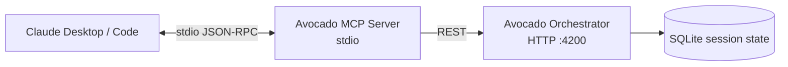

The **Avocado Studio MCP Server** exposes pages, blocks, and block discovery as Model Context Protocol tools. Plug it into Claude Desktop (or any MCP host) and Claude can read and edit your site with the same operations the web editor uses.

<Info>
  Current status: **Phases 1, 2, 3a shipped** — 40 tools, both **stdio** and **streamable HTTP** transports. One site per install. Claude connector directory listing + OAuth land in Phase 3b.
</Info>

## What you get



The MCP server is a thin wrapper: every mutation goes through `POST /ops` on the orchestrator, so Zod validation, undo history, version log, and demo-mode gating all still apply.

## Tool catalog

### Discovery

| Tool | What it does |
|------|--------------|
| `avocado-list-block-types` | Lists every block type the site can render (Hero, CTA, FAQAccordion, …). |
| `avocado-get-block-schema` | Returns the JSON schema + field metadata for a block type — call before writing props. |

### Pages

| Tool | What it does |
|------|--------------|
| `avocado-get-page` | Fetches a page's full draft document. |
| `avocado-list-pages` | Lists every page slug in the draft. |
| `avocado-create-page` | Creates a new page with an initial blocks array. |
| `avocado-rename-page` | Changes slug and/or title. Internal links rewrite automatically. |
| `avocado-duplicate-page` | Clones a page, optionally under a new slug. |
| `avocado-remove-page` | Deletes a page. Undo-able. |
| `avocado-update-page-meta` | Patches SEO fields (title, description, ogImage). |

### Blocks

| Tool | What it does |
|------|--------------|
| `avocado-add-block` | Inserts a new block into a page. |
| `avocado-update-block-props` | Patches one or more props on an existing block. |
| `avocado-remove-block` | Deletes a block. |
| `avocado-move-block` | Reorders a block within a page. |
| `avocado-duplicate-block` | Clones a block, optionally to another page. |
| `avocado-add-list-item` | Appends/inserts an item into a block's list field (features, cards, faqs…). |
| `avocado-update-list-item` | Patches fields on a single list item by index. |
| `avocado-remove-list-item` | Removes a list item by index. |
| `avocado-move-list-item` | Reorders a list item. |

### Sites

| Tool | What it does |
|------|--------------|
| `avocado-register-site` | Register/update the site entry (preview URL, name, port, purpose, secret). |
| `avocado-list-sites` | List every site registered under the current session. |
| `avocado-get-site-config` | Fetch the site's config (name, logo, tone, purpose, nav labels/groups). |
| `avocado-update-site-config` | Patch the site config (name, logo, navLabels, navGroups). Undo-able. |

### Media

| Tool | What it does |
|------|--------------|
| `avocado-upload-image` | Upload an image (base64) to the orchestrator; returns a URL usable as a block prop. |
| `avocado-generate-image` | Generate an image from a prompt via OpenAI or Gemini. |
| `avocado-search-unsplash` | Search Unsplash for stock photos. |
| `avocado-transcribe-audio` | Transcribe a base64 audio clip via OpenAI Whisper. |
| `avocado-interpret-image` | Vision analysis: image → one-sentence summary (useful for alt text or screenshot-to-intent). |

### Publishing

| Tool | What it does |
|------|--------------|
| `avocado-compute-publish-diff` | Diff between the current draft and the last published snapshot. |
| `avocado-publish-content` | Publish the draft to the live site. Requires `AVOCADO_PUBLISH_TOKEN`. |
| `avocado-get-publish-status` | Publish tracker: target type, state, last deployment, URLs. |
| `avocado-list-snapshots` | List published snapshots (commits) available for restore. |
| `avocado-restore-snapshot` | Rewind the draft to a published snapshot by commit sha. |

### History

| Tool | What it does |
|------|--------------|
| `avocado-undo-edit` | Undo the last change on a page. |
| `avocado-redo-edit` | Redo the last undone change. |
| `avocado-restore-version` | Jump to a specific version from the history log (doesn't consume undo/redo). |

### Planner

| Tool | What it does |
|------|--------------|
| `avocado-chat-plan` | Send a natural-language instruction to the planner; orchestrator figures out which ops to apply and runs them. May return a `pendingPlanId` if the plan needs approval. |
| `avocado-preview-plan` | Run the planner in plan-only mode — returns the would-apply ops without mutating state. Ideal for review-before-approve flows. |
| `avocado-approve-pending-plan` | Apply the pending plan waiting for approval. Pass `pendingPlanId` from the prior chat response to protect against race conditions. |
| `avocado-discard-pending-plan` | Reject/discard the pending plan. |

### Preview

| Tool | What it does |
|------|--------------|
| `avocado-screenshot-page` | Captures a full-page screenshot of the draft (via Playwright) and returns it as an inline JPEG. Required for visual feedback in chat-only hosts like Claude Desktop that can't render the live preview iframe. Site must have a `previewUrl` registered. |

## Install

### Claude Desktop

Open `~/Library/Application Support/Claude/claude_desktop_config.json` and add:

```json
{
  "mcpServers": {
    "avocado-studio": {
      "command": "npx",
      "args": ["tsx", "/absolute/path/to/apps/mcp-server/src/index.ts"],
      "env": {
        "ORCHESTRATOR_URL": "http://localhost:4200",
        "AVOCADO_SESSION": "dev",
        "AVOCADO_SITE_ID": "avocado-stories"
      }
    }
  }
}
```

Restart Claude Desktop. Open **Settings → Connectors → avocado-studio** to set per-tool permissions (**Always allow / Ask / Never allow**). The discovery and `get` tools are safe to auto-allow; keep mutations on **Ask**.

### Claude Code

```bash
claude mcp add avocado \
  --env ORCHESTRATOR_URL=http://localhost:4200 \
  --env AVOCADO_SESSION=dev \
  --env AVOCADO_SITE_ID=avocado-stories \
  -- npx tsx /absolute/path/to/apps/mcp-server/src/index.ts
```

### HTTP transport (remote / custom connector)

Start the HTTP server:

```bash
AVOCADO_SITE_ID=avocado-stories \
AVOCADO_MCP_BEARER_TOKEN=$(openssl rand -hex 32) \
pnpm --filter @ai-site-editor/mcp-server start:http
```

Output: `avocado-studio MCP server listening on http://localhost:4300/mcp`

In Claude Desktop → **Settings → Connectors → Add custom connector**:

- **URL:** `http://localhost:4300/mcp`
- **Auth:** Bearer token — the value you passed as `AVOCADO_MCP_BEARER_TOKEN`

Stateless mode — each POST is a self-contained JSON-RPC call. Health probe at `GET /healthz` (no auth) for load balancers.

### Environment variables

| Var | Required | Default | Notes |
|-----|----------|---------|-------|
| `AVOCADO_SITE_ID` | yes | — | Which site this install edits. |
| `ORCHESTRATOR_URL` | no | `http://localhost:4200` | Points at the orchestrator. |
| `AVOCADO_SESSION` | no | `dev` | Session key that scopes draft state. |
| `AVOCADO_PUBLISH_TOKEN` | no | — | Only needed to enable `avocado-publish-content`. Must match the orchestrator's `DRAFT_MODE_SECRET`. |
| `AVOCADO_MCP_BEARER_TOKEN` | yes (HTTP mode) | — | Bearer token clients must present. Only read by `src/http.ts`. |
| `AVOCADO_MCP_PORT` | no | `4300` | Port for HTTP mode. |

## How agents should use it

1. **Discover first.** Call `avocado-list-block-types` once, then `avocado-get-block-schema` for any type you're about to add or edit. The schema tells you which props are required and which enum values are valid.
2. **Read before mutate.** Call `avocado-get-page` to get block ids before `avocado-update-block-props` — block ids are stable and opaque.
3. **Prefer structural ops over full rewrites.** `avocado-update-list-item` with an index + patch is cheaper and safer than replacing the whole list via `avocado-update-block-props`.

## Roadmap

- **Phase 1 + 2 + 3a — shipped.** 39 tools across 8 groups. Stdio transport (local install) and streamable HTTP transport (custom connectors, remote deploy) both work with the same tool registry. Approve/reject plan loop supported.
- **Phase 3b** — Hosted deployment (Render) + OAuth in front of `/mcp` (replaces shared-secret bearer with proper login flow, same UX as "AEM Content MCP Service"). Submit to Claude's connector directory. Add per-tool read-only annotations and audit logging.
- **Phase 4** — MCP resources (pin a page as context), MCP prompts (slash-command templates), typed client generated from the orchestrator OpenAPI.
