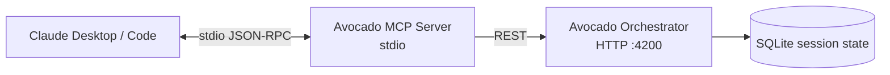

The **Avocado Studio MCP Server** exposes pages, blocks, and block discovery as Model Context Protocol tools. Plug it into Claude Desktop (or any MCP host) and Claude can read and edit your site with the same operations the web editor uses.

<Info>
  This is **Phase 1** — stdio transport, local install, one site per install. Remote HTTP transport + Claude connector directory listing land in a later phase (see [Roadmap](#roadmap)).
</Info>

## What you get



The MCP server is a thin wrapper: every mutation goes through `POST /ops` on the orchestrator, so Zod validation, undo history, version log, and demo-mode gating all still apply.

## Tool catalog (Phase 1)

### Discovery

| Tool | What it does |
|------|--------------|
| `avocado-list-block-types` | Lists every block type the site can render (Hero, CTA, FAQAccordion, …). |
| `avocado-get-block-schema` | Returns the JSON schema + field metadata for a block type — call before writing props. |

### Pages

| Tool | What it does |
|------|--------------|
| `avocado-get-page` | Fetches a page's full draft document. |
| `avocado-list-pages` | Lists every page slug in the draft. |
| `avocado-create-page` | Creates a new page with an initial blocks array. |
| `avocado-rename-page` | Changes slug and/or title. Internal links rewrite automatically. |
| `avocado-duplicate-page` | Clones a page, optionally under a new slug. |
| `avocado-remove-page` | Deletes a page. Undo-able. |
| `avocado-update-page-meta` | Patches SEO fields (title, description, ogImage). |

### Blocks

| Tool | What it does |
|------|--------------|
| `avocado-add-block` | Inserts a new block into a page. |
| `avocado-update-block-props` | Patches one or more props on an existing block. |
| `avocado-remove-block` | Deletes a block. |
| `avocado-move-block` | Reorders a block within a page. |
| `avocado-duplicate-block` | Clones a block, optionally to another page. |
| `avocado-add-list-item` | Appends/inserts an item into a block's list field (features, cards, faqs…). |
| `avocado-update-list-item` | Patches fields on a single list item by index. |
| `avocado-remove-list-item` | Removes a list item by index. |
| `avocado-move-list-item` | Reorders a list item. |

## Install

### Claude Desktop

Open `~/Library/Application Support/Claude/claude_desktop_config.json` and add:

```json
{
  "mcpServers": {
    "avocado-studio": {
      "command": "npx",
      "args": ["tsx", "/absolute/path/to/apps/mcp-server/src/index.ts"],
      "env": {
        "ORCHESTRATOR_URL": "http://localhost:4200",
        "AVOCADO_SESSION": "dev",
        "AVOCADO_SITE_ID": "avocado-stories"
      }
    }
  }
}
```

Restart Claude Desktop. Open **Settings → Connectors → avocado-studio** to set per-tool permissions (**Always allow / Ask / Never allow**). The discovery and `get` tools are safe to auto-allow; keep mutations on **Ask**.

### Claude Code

```bash
claude mcp add avocado \
  --env ORCHESTRATOR_URL=http://localhost:4200 \
  --env AVOCADO_SESSION=dev \
  --env AVOCADO_SITE_ID=avocado-stories \
  -- npx tsx /absolute/path/to/apps/mcp-server/src/index.ts
```

### Environment variables

| Var | Required | Default |
|-----|----------|---------|
| `AVOCADO_SITE_ID` | yes | — |
| `ORCHESTRATOR_URL` | no | `http://localhost:4200` |
| `AVOCADO_SESSION` | no | `dev` |

## How agents should use it

1. **Discover first.** Call `avocado-list-block-types` once, then `avocado-get-block-schema` for any type you're about to add or edit. The schema tells you which props are required and which enum values are valid.
2. **Read before mutate.** Call `avocado-get-page` to get block ids before `avocado-update-block-props` — block ids are stable and opaque.
3. **Prefer structural ops over full rewrites.** `avocado-update-list-item` with an index + patch is cheaper and safer than replacing the whole list via `avocado-update-block-props`.

## Roadmap

- **Phase 2** — Sites, Media, Publishing, History tool groups + a single `avocado-chat-plan` shortcut that takes natural language and runs the full planner.
- **Phase 3** — Hosted **Claude connector**: remote HTTP+SSE transport, OAuth login (the same UX AEM ships with "AEM Content MCP Service"), listing in Claude's connector directory.
- **Phase 4** — MCP resources (pin a page as context), MCP prompts (slash-command templates for common flows), typed client generated from the orchestrator OpenAPI.
