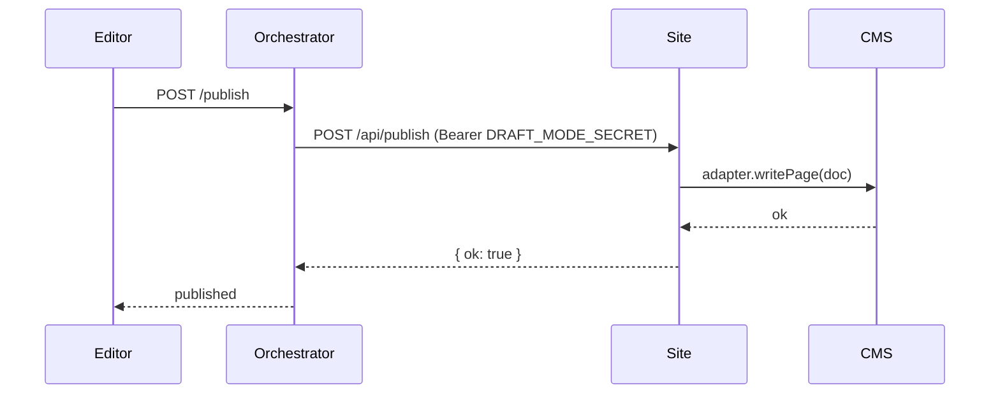

When a user clicks **Publish** in the Content Studio, the orchestrator takes the in-memory draft and hands it to a **publish target** — a plugin that writes the content to wherever you actually serve from.

The product ships three built-in targets and a registry for plugging in your own. The same `POST /publish` endpoint dispatches to whichever target wins selection.

## The three built-in targets

| Target | Name | When it's used |
|---|---|---|
| **Site contract** | `site-contract` | The default. Posts the draft pages to your Next.js site's `/api/publish` route. Your site's adapter then persists to your CMS. |
| **Git** | `git` | Writes a JSON snapshot to disk and (optionally) commits + pushes it. Good for "git as your CMS" setups or local dev. |
| **Deploy hook** | `deploy-hook` | Calls a Vercel/Netlify deploy hook URL. Use when content is committed externally and you just need to trigger a redeploy. |

### Selection order

Every publish call runs through the registry in this order:

1. If `PUBLISH_TARGET=<name>` env var is set and that target is registered → use it verbatim.
2. Otherwise iterate registered targets in registration order; pick the first whose `canHandle(ctx)` returns `true`.
3. Fall back to the legacy `PUBLISH_MODE` env: `git` (default) or `deploy_hook` → `deploy-hook`.

Targets self-select based on what's in the request context — e.g. the `site-contract` target claims any request that came from a registered site with a valid origin; the `git` target claims local-only deployments.

## Site contract (the default)

Most production deployments use this. Avocado posts the draft to your site's `/api/publish` route, your site validates the bearer token, and your adapter writes to the CMS.



Your site's `/api/publish` handler is wired by the [Site SDK](/integration/nextjs-integration). It validates the shared secret, then calls your CMS adapter's write path. The orchestrator never talks to your CMS directly — your site is always in the middle, which means your existing CMS auth, hooks, and validation all still run.

**Env vars:**

```bash
DRAFT_MODE_SECRET=<shared secret>     # same value on orchestrator + site
```

## Git target

Writes the draft pages as a JSON snapshot under your site's content directory. Optionally `git commit && git push` the change so Vercel / Netlify pick it up.

Good for:

- Local development without a CMS
- "Git as your CMS" setups where content is checked into the repo
- Static sites where publishing means triggering a rebuild

**Env vars:**

```bash
PUBLISH_TARGET=git
PUBLISH_GIT_REPO_PATH=/absolute/path/to/your/site/repo
PUBLISH_GIT_CONTENT_PATH=lib/published-content.json
PUBLISH_GIT_AUTO_COMMIT=1             # commit + push automatically (optional)
```

Each publish writes the snapshot, and (if `PUBLISH_GIT_AUTO_COMMIT=1` is set) commits with a generated message and pushes to `origin`. If the push fails (auth, conflicts, etc.) the publish call returns 502 and the tracker records the error.

## Deploy hook target

Calls a Vercel or Netlify deploy hook URL. Useful when content is already in place — committed to the repo, or written to a CMS by some other process — and "publish" just means "redeploy."

**Env vars:**

```bash
PUBLISH_TARGET=deploy-hook
PUBLISH_DEPLOY_HOOK_URL=https://api.vercel.com/v1/integrations/deploy/...
```

The orchestrator POSTs to the URL, captures the deployment id, and the Content Studio polls `/publish/status` to surface "building / ready / failed" in real time.

## Building a custom target

`PublishTarget` is a two-method interface:

```ts
import type { PublishContext, PublishOutcome, PublishTarget } from "./publish-target.js"

export class S3PublishTarget implements PublishTarget {
  readonly name = "s3"

  canHandle(ctx: PublishContext): boolean {
    return process.env.PUBLISH_TARGET === "s3"
  }

  async publish(ctx: PublishContext): Promise<PublishOutcome> {
    const key = `sites/${ctx.siteId}/content.json`
    await s3.putObject({ Bucket: BUCKET, Key: key, Body: JSON.stringify(ctx.pages) })
    return {
      ok: true,
      httpStatus: 200,
      tracker: { status: "ready", lastDeployedAt: new Date().toISOString() },
      response: { ok: true, slugs: ctx.slugs, bucket: BUCKET, key },
    }
  }
}
```

Register before the server boots:

```ts
import { registerPublishTarget } from "./publish/publish-target-registry.js"
registerPublishTarget(new S3PublishTarget())
```

The orchestrator's route handler does nothing target-specific — it builds the `PublishContext` (session, scoped session, draft pages, slugs, site config, image dir, logger), calls `target.publish(ctx)`, saves the returned tracker, and replies with `outcome.response` at `outcome.httpStatus`. Your target controls every byte of the wire response.

## Publish status

`GET /publish/status?session=<id>&siteId=<slug>` returns the latest tracker:

```json
{
  "status": "triggered" | "failed" | "ready",
  "deploymentId": "dpl_abc123",
  "vercelState": "BUILDING",
  "inspectUrl": "https://vercel.com/...",
  "lastCheckError": null
}
```

The Content Studio polls this endpoint after a publish to show build progress inline. Targets that don't have async deployments (git, S3, etc.) return `status: "ready"` immediately.

## Snapshots and rollback

Every publish writes a snapshot to the version log. From the MCP server (or the editor's history panel) you can:

- `avocado-list-snapshots` — list published snapshots with commit shas + timestamps
- `avocado-restore-snapshot` — rewind the draft to a specific snapshot (doesn't trigger a republish; you publish again to push the rolled-back version live)
- `avocado-compute-publish-diff` — diff the current draft against the last published snapshot before publishing

The number of snapshots kept is bounded by `VERSION_LOG_CAP` (default 100). Older snapshots are evicted FIFO.

## See also

- [CMS adapters](/integration/cms-adapters) — the site-side hooks the site-contract target calls into
- [Architecture](/architecture) — where publishing fits in the orchestrator pipeline
- [MCP server — Publishing tools](/integration/mcp-server#publishing) — drive publishes from Claude Desktop
