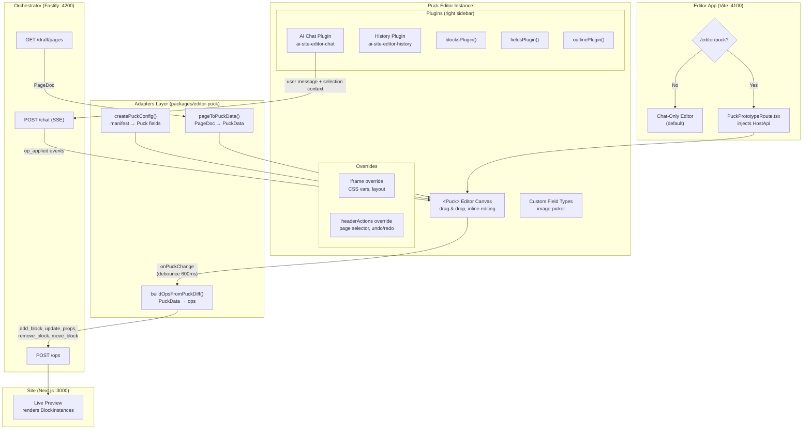

## Overview

Puck mode is an alternative editing experience that replaces the default chat-driven editor with a visual drag-and-drop canvas powered by [Puck](https://github.com/measuredco/puck). AI chat remains available as a sidebar plugin, so users get the best of both worlds: direct manipulation **and** natural-language editing.

### Zero extra integration

<Info>
  Puck mode requires **no additional integration work** from the site developer. If your site is already integrated with Avocado Studio, Puck mode works automatically.
</Info>

Your site talks to the orchestrator — not to the editor UI. Whether the user edits via chat or via the Puck canvas, the orchestrator receives the same operations through the same endpoints (`/ops`, `/draft/pages`, `/chat`). The site never knows which editor produced the changes.

This is possible because Puck mode runs entirely inside the editor app, with an **adapter layer** that translates between Puck's data model and ours:

```
Chat Editor ──────────────→ ops ──→ Orchestrator ──→ Site
Puck Editor ──→ adapter ──→ ops ──→ Orchestrator ──→ Site
```

| Adapter function | What it does |
|------------------|--------------|
| `pageToPuckData()` | Converts PageDoc → PuckData so the Puck canvas can render it |
| `buildOpsFromPuckDiff()` | Converts Puck state changes back into standard operations |
| `createPuckConfig()` | Converts the block manifest into Puck field definitions |

This means you integrate once with Avocado Studio and get both editing experiences — chat-driven AI editing and visual drag-and-drop — without any extra work on your site.

## Enabling per site

Puck mode is controlled per-site via the site settings panel.

<Steps>
  <Step title="Open the Sites page">
    Navigate to `/sites` in the editor.
  </Step>
  <Step title="Open site settings">
    Click the gear icon on the site tile you want to configure.
  </Step>
  <Step title="Enable Puck">
    In the **General** tab, check **"Use visual editor (Puck)"**.
  </Step>
  <Step title="Open the editor">
    Click **"Open Editor"** — the site opens at `/editor/puck?siteId=<id>` instead of the chat editor.
  </Step>
</Steps>

Sites without the flag continue to open the default chat editor at `/editor`.

## How it works

### Block registration

When Puck mode loads, it fetches the block manifest from your site's `/api/editor/blocks` endpoint — the same manifest the chat editor uses. `createPuckConfig()` converts each block definition into a Puck-compatible component with appropriate field controls:

| Block field type | Puck field control |
|------------------|--------------------|
| `number` | Number input |
| `enum` | Select dropdown |
| `headingLevel` | Select (h1–h6) |
| `richtext` | Textarea |
| `image` | Custom image picker |
| default | Text input |

Blocks render using the same `SharedBlockRenderer` from `@avocadostudio-ai/blocks`, so what you see in Puck matches what renders on the live site.

### AI chat integration

Chat is registered as a Puck **plugin panel** in the right sidebar. It uses the same chat engine, endpoints, and AI planning as the main editor:

- `/chat` for standard planning and ops
- `/agent/start` + `/agent/stream` for agent mode (when enabled)
- Selection context is passed automatically — the AI knows which block is selected

### Auto-save

Edits are persisted automatically with a 600ms debounce:

1. User drags, reorders, or edits a field in the Puck canvas
2. The system diffs the previous and current state
3. Operations (`add_block`, `remove_block`, `update_props`, `move_block`) are generated
4. Ops are sent to `POST /ops` on the orchestrator

### Agent mode

If `AGENT_API_KEY` is set in the orchestrator `.env`, the editor detects agent mode availability from `GET /status/planner`. When enabled, the chat sidebar can run multi-step autonomous editing via the agent loop.

## Comparison with chat editor

| Aspect | Chat Editor | Puck Mode |
|--------|-------------|-----------|
| Primary interaction | Natural language | Drag-and-drop |
| Preview | Iframe + postMessage bridge | In-canvas rendering |
| Chat location | Left sidebar | Right sidebar (plugin) |
| Block editing | Custom property panel | Puck's native field sidebar |
| Drag-and-drop | Custom handler | Puck's native DnD |
| Publishing | Full publish flow | Full publish flow |

## Publishing

Puck's built-in "Publish" button triggers the full publish workflow:

1. Pending draft edits are flushed immediately
2. `POST /publish` is called on the orchestrator (same endpoint as the chat editor)
3. The Puck button shows a loading state while the publish is in progress
4. A **"View deploy"** link appears in the header after a successful deployment

Publishing uses the same `usePublish` hook as the main editor — it supports Git-based deploy, Vercel deploy hooks, and site contract publishing.

## Architecture



## Current limitations

<Warning>
  Puck mode is experimental. The following features are not yet available:
</Warning>

- **No live site preview** — blocks render in the Puck canvas, not inside the Next.js site iframe
- **No nested zones** — only flat `content` arrays; nested layout zones are not yet supported
- **Image upload** — basic URL picker only, no upload progress or validation
