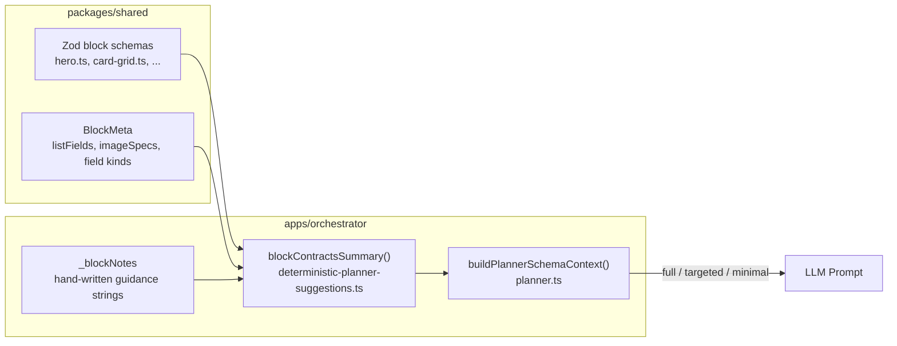

## Overview

The AI planner needs to know what blocks exist and what props they accept. Rather than sending raw Zod schemas or JSON Schema to the LLM, we compile block definitions into a **contract** format optimized for LLM comprehension and token efficiency.

## Contract Pipeline



### Layer 1: Zod Block Schemas

Each block type is defined in `packages/shared/src/blocks/*.ts` with a Zod schema and metadata:

```typescript
// packages/shared/src/blocks/hero.ts
z.object({
  heading: z.string().min(1),
  subheading: z.string().min(1),
  ctaText: z.string().min(1),
  ctaHref: z.string().min(1),
  imageUrl: z.string().min(1),
  imageAlt: z.string().min(1),
  imagePosition: z.enum(["left", "right", "full"]).default("right"),
  textAlign: z.enum(["left", "center"]).default("left"),
  eyebrow: z.string().optional(),
  secondaryCtaText: z.string().optional(),
  secondaryCtaHref: z.string().optional(),
})
```

Metadata includes `listFields` (array item shapes), `imageSpecs` (aspect ratios, dimensions), and field `kind` markers (e.g. `richtext`).

### Layer 2: Hand-Written Notes

`_blockNotes` in `apps/orchestrator/src/nlp/deterministic-planner-suggestions.ts` provides behavioral guidance that Zod schemas cannot express:

```typescript
_blockNotes = {
  Hero: "imagePosition controls layout and must be 'left', 'right', or 'full' (default 'right')... use 'center' textAlign with 'full' imagePosition for centered hero layouts...",
  CardGrid: "cardVariant applies to ALL cards, not per-card. full-bleed REQUIRES imageUrl on each card...",
  FAQAccordion: "answers support richtext: **bold**, *italic*, [link](url), paragraph breaks (\\n\\n)...",
  Footer: "links field: one 'Label|URL' per line separated by \\n...",
  // ~11 block types total, ~4 KB
}
```

### Layer 3: Contract Assembly

`blockContractsSummary()` walks each registered block's Zod schema and produces:

```json
{
  "Hero": {
    "allowedProps": ["heading", "subheading", "ctaText", "ctaHref", "imageUrl", "imageAlt", "imagePosition", "textAlign", "eyebrow", "secondaryCtaText", "secondaryCtaHref"],
    "required": ["heading", "subheading", "ctaText", "ctaHref", "imageUrl", "imageAlt"],
    "optional": ["imagePosition", "textAlign", "eyebrow", "secondaryCtaText", "secondaryCtaHref"],
    "notes": "imagePosition controls layout and must be 'left', 'right', or 'full'..."
  }
}
```

When `_blockNotes` has no entry for a block type, the builder auto-derives notes from metadata (array item shapes, image specs, field kinds).

### Layer 4: Adaptive Budgeting

`buildPlannerSchemaContext()` in `apps/orchestrator/src/chat/planner.ts` selects which contracts to include based on intent:

| Mode | When | Payload |
|------|------|---------|
| **full** | Generation, batch ops, page-wide translation | All ~20 block types (~10.7 KB) |
| **targeted** | Single-block edits (default) | Only mentioned block types (~1-2 KB) |
| **minimal** | Remove, move, delete, rename | No contracts, just knownBlockTypes list (~176 bytes) |

Budget is capped at `CHAT_SCHEMA_BUDGET_BYTES` (default 9000). If the preferred mode exceeds the budget, it falls back: `full → targeted → minimal`.

## Comparison with Puck AI's Approach

Puck AI uses **field-level JSON Schema** co-located with each field's UI config:

```javascript
// Puck AI
fields: {
  title: {
    type: "text",
    ai: {
      schema: { type: "string" },
      instructions: "Always use caps",
      stream: true,
      required: true,
    }
  }
}
```

Side-by-side:

| Aspect | Our System | Puck AI |
|--------|-----------|---------|
| Schema format | Prop lists + natural language notes | JSON Schema per field |
| Schema source | Auto-derived from Zod | Manual `ai.schema` (auto-inferred for standard types) |
| Guidance | `notes` string in contract | `instructions` string per field/component |
| Token optimization | Adaptive budgeting (full/targeted/minimal) | Puck Cloud manages internally |
| LLM hosting | Self-hosted, full prompt control | Puck Cloud (opaque) |
| Complex types | Zod → `z.toJSONSchema()` for external blocks | `z.toJSONSchema()` for custom fields |

## Why Not JSON Schema

We evaluated switching from prop-list contracts to auto-generated JSON Schema (via `z.toJSONSchema()` from our Zod definitions). The analysis identified several downsides:

### 1. Behavioral notes cannot be expressed in JSON Schema

The most valuable part of our contracts is the hand-written guidance. JSON Schema has no equivalent for:

| What notes capture | JSON Schema equivalent |
|---|---|
| "use `center` textAlign with `full` imagePosition" | None (cross-field semantics) |
| "full-bleed variant REQUIRES imageUrl" | Partial (`if/then`, but LLMs handle poorly) |
| FAQ answers use `\n\n` for paragraphs, `- item` for lists | None (format conventions) |
| "omit secondaryCtaText or set empty to hide" | None (toggle behavior) |
| Footer links: `Label\|URL` per line with `\n` | `pattern` regex (opaque to LLM) |
| "do NOT mention specific image source in summary" | None (output behavior) |

Switching means either losing this guidance (more hallucination) or keeping notes alongside JSON Schema (duplicating info, higher token cost).

### 2. JSON Schema is more verbose

Hero contract today: ~1,124 bytes. Equivalent JSON Schema with `properties`, `type`, `enum`, `items`, `required`: ~1,400-1,600 bytes (25-40% larger for structure alone, before behavioral guidance).

At 20 blocks, the full payload grows from ~10.7 KB to ~14+ KB — well past the 9 KB budget. The adaptive fallback triggers more aggressively, degrading more requests to "targeted" or "minimal" mode.

### 3. JSON Schema expressiveness doesn't help LLMs

Features like `minItems`, `pattern`, `exclusiveMaximum`, `if/then` are designed for machine validators, not LLM comprehension. LLMs respond better to natural language ("columns must be '2', '3', or '4'") than to `{"enum": ["2","3","4"]}`.

### 4. Structured outputs don't need per-field JSON Schema

OpenAI structured outputs (`response_format`) need JSON Schema for the **response shape** (EditPlan), not for block prop schemas. We already support this via `CHAT_STRICT_JSON_RESPONSE`. Block prop values are freeform `Record<string, unknown>` — constraining them via `response_format` would require a discriminated union of all block types, which is fragile and explodes schema size.

### 5. Auto-derivation already handles simple cases

`blockContractsSummary()` auto-derives notes from Zod metadata when `_blockNotes` has no entry. Hand-written notes exist precisely for cases where auto-derivation isn't enough.

### 6. External blocks already use JSON Schema

For manifest-only blocks from external sites (no Zod schemas), the contract builder already derives contracts from JSON Schema. So we get JSON Schema benefits where they matter without paying the cost for our own blocks.

## Where JSON Schema Would Help

The main opportunity is adding more **auto-derived note patterns** to reduce the hand-written surface:

- Auto-generate richtext convention docs from field `kind: "richtext"`
- Auto-generate enum default guidance from `z.enum().default()`
- Auto-generate cross-field dependency hints from related optional fields

This would keep the current format while reducing manual maintenance — better than replacing the format entirely.
