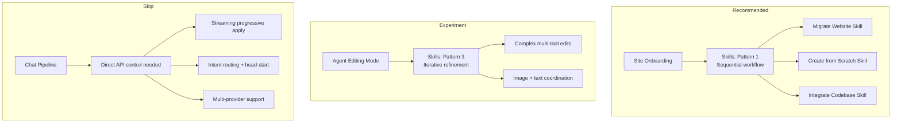

# Claude Skills API — Fit Analysis

_Last updated: 2026-04-13_

## 1) What are Claude Skills?

Claude Skills are versioned, declarative workflow definitions that tell Claude how to orchestrate MCP tool calls. They are not static prompt bundles — they are **MCP workflow orchestrators** with:

- Explicit step ordering and dependencies between steps
- Validation at each stage
- Rollback instructions for failures
- Multi-MCP server coordination
- Iterative refinement loops

### Key capabilities

- `/v1/skills` endpoint for listing and managing skills
- `container.skills` parameter on Messages API requests
- Version control and management through Claude Console
- Works with the Claude Agent SDK for building custom agents

### Documented patterns

| Pattern | Description | Use when |
|---------|-------------|----------|
| **Pattern 1: Sequential workflow** | Step-by-step MCP tool orchestration with dependencies and validation | Multi-step processes in a specific order |
| **Pattern 2: Multi-MCP coordination** | Workflows spanning multiple MCP servers with data passing between phases | Workflows span multiple services |
| **Pattern 3: Iterative refinement** | Draft → validate → refine loop until quality threshold met | Output quality improves with iteration |

## 2) Current Architecture (what we already have)

Avocado has a mature, purpose-built tool/capability system that functions as a domain-specific "skills" layer:

| Layer | Current implementation | Claude Skills equivalent |
|-------|----------------------|-------------------------|
| Tool definitions | `AgentTool[]` in `agent-tools.ts` (30+ tools) | `container.skills` tool bundles |
| Prompt expertise | `role.md`, `editing-guidelines.md`, `prompts.ts` | Skill prompt templates |
| Capability registry | `ToolRegistry` + `ToolManifest` in `tools/` | `/v1/skills` management |
| Execution policy | `ToolExecutionPolicy` (read/write gating) | Skill-level permissions |
| Versioning | Git (prompt files checked into repo) | Claude Console version control |

### Onboarding (sites-agent)

The sites-agent is ~1400 lines of TypeScript using Claude Agent SDK with MCP tools:

```
scrape_url → extract_design_tokens → create_site
→ download_remote_image(s) → bootstrap_pages
```

- Phase tracking: manual `TOOL_PHASE_MAP` + SSE events
- Ordering: relies on system prompt + Claude's judgment
- Rollback: per-tool try/catch, no cross-step rollback
- Three modes: "create", "migrate", "integrate" — each with separate system prompts

Key files:
- `apps/orchestrator/src/agent/sites-agent-tools.ts` — MCP tool definitions
- `apps/orchestrator/src/routes/sites-agent.ts` — SSE streaming + phase tracking
- `apps/orchestrator/src/agent/sites-agent-context.ts` — system prompt builder

### Editing (chat pipeline)

Two distinct editing modes:

**Fast path (chat pipeline):** Intent detection → deterministic/LLM planner → streaming progressive apply. Latency-optimized with:
- Sub-200ms intent routing with head-start racing (`CHAT_ROUTER_HEAD_START_MS`)
- Progressive op application at 800ms intervals during LLM streaming
- Dynamic context packs assembled per-request
- Multi-provider support (OpenAI / Anthropic / Gemini)

**Agent mode (complex edits):** Multi-turn tool-use loop via `agent-loop.ts`:
- Claude calls `get_page` → plans changes → calls `edit_page` → verifies
- Max 20 tool calls per session
- Supports extended thinking

Key files:
- `apps/orchestrator/src/chat/chat-pipeline.ts` — main orchestration (3400 LOC)
- `apps/orchestrator/src/agent/agent-loop.ts` — multi-turn agent loop
- `apps/orchestrator/src/agent/agent-tools.ts` — 30+ tool definitions
- `apps/orchestrator/src/ops/ops-engine.ts` — atomic operation engine

## 3) Analysis: Site Onboarding

**Verdict: Strong fit. Recommended.**

The sites-agent maps almost 1:1 to Pattern 1 (sequential workflow orchestration).

### How a Skill would replace the current flow

```
## Workflow: Migrate Website

### Step 1: Discover Structure
Call MCP tool: discover_site_structure
Parameters: url (from user)

### Step 2: Scrape & Analyze
Call MCP tool: scrape_url
Wait for: screenshot + sections extracted

### Step 3: Extract Tokens
Call MCP tool: extract_design_tokens
Parameters: css (from Step 2)

### Step 4: Create Project
Call MCP tool: create_site
Parameters: name, siteId, purpose (from analysis)

### Step 5: Download Images
Call MCP tool: download_remote_image (loop)
Rollback: skip failed images, continue

### Step 6: Bootstrap Pages
Call MCP tool: bootstrap_pages
Parameters: pages (from Step 2 sections), tokens (from Step 3)
```

Separate Skills for each mode variant:
- **"Migrate Website" Skill** — scrape → analyze → scaffold → populate
- **"Create from Scratch" Skill** — gather requirements → scaffold → seed content
- **"Integrate Existing Codebase" Skill** — clone → analyze → install → integrate → verify

### What we'd gain

| Benefit | Today (code) | With Skill |
|---------|-------------|------------|
| Workflow reliability | Claude decides ordering from system prompt — sometimes skips steps or reorders | Explicit step sequence enforced by Skill definition |
| Phase tracking | 30+ lines of `TOOL_PHASE_MAP` + manual SSE wiring | Steps map naturally to phases — less custom code |
| Versioning | Redeploy orchestrator to change workflow | Update Skill in Console, test before rollout |
| Mode variants | Separate system prompts for "create" vs "migrate" vs "integrate" | Separate Skills per mode, each with tailored steps |
| Rollback | Per-tool try/catch only | Skill-level rollback instructions between steps |

### What we'd keep

- **MCP tool handlers** (`createSitesAgentMcpServer`) — Skills orchestrate tools, they don't replace them
- **SSE streaming layer** for real-time UI updates (see open question below)
- **Session state mutations** inside tool handlers (`setPage`, `bumpVersion`, etc.)

### Open question (blocking)

**Do Skills emit step-transition events we can hook into for SSE streaming?**

The phase progress UI (`analyzing → creating → images → pages`) is a core onboarding UX. If Skills run opaquely with no step callbacks, we'd regress the user experience. This is the make-or-break question.

**Recommended next step:** Build a proof-of-concept Skill for the "migrate" workflow with existing MCP tools. Test whether step progression gives enough observability for the UI.

## 4) Analysis: Site Editing

### Chat pipeline (fast path) — Does not fit

The streaming progressive-apply pipeline requires direct API control that Skills would constrain:

| Requirement | Why Skills can't help |
|-------------|----------------------|
| Sub-200ms intent routing | `CHAT_LLM_INTENT_ROUTER` races a fast router against the full planner — needs direct Messages API access |
| Progressive op application | `CHAT_STREAMED_OP_APPLY` validates and applies ops as they stream from the LLM at ~800ms intervals |
| Dynamic context packs | Block schemas, page state, site config assembled per-request in `buildPlannerSystemPrompt()` |
| Multi-provider support | OpenAI, Anthropic, Gemini planners — Skills are Anthropic-only |
| Adaptive schema sizing | `CHAT_ADAPTIVE_SCHEMA_CONTEXT` dynamically selects which block contracts to include based on message content |

**Verdict: Skip. The chat pipeline's latency optimizations require direct control.**

### Agent mode (complex edits) — Partial fit, worth experimenting

The agent loop already follows Pattern 3 (iterative refinement) implicitly through multi-turn tool use. A Skill could make it explicit:

```
## Iterative Page Edit

### Read Current State
Call MCP tool: get_page
Validate: page exists, blocks loaded

### Plan Changes
Generate operations based on user request
Validate: ops match block schemas

### Apply Atomically
Call MCP tool: edit_page
If error: re-read page, adjust ops, retry (max 2)

### Verify & Suggest
Call MCP tool: get_page (confirm changes applied)
Generate suggested_next_actions
```

This would standardize how Claude approaches complex edits, reducing cases where it:
- Skips the "read first" step
- Applies operations without checking the result
- Doesn't retry after a schema validation error

Also relevant: **Pattern 2 (Multi-MCP coordination)** for edits involving multiple tools:

```
Phase 1: Edit text content (ops engine MCP)
Phase 2: Generate matching images (DALL-E / Unsplash MCP)
Phase 3: Update SEO metadata (page meta MCP)
Phase 4: Verify all changes (read back)
```

Today this is handled by the deferred image resolution system (`CHAT_DEFER_IMAGE_RESOLUTION`). A Skill could formalize the multi-tool coordination.

**Verdict: Experiment. Build a Skill for agent-mode complex edits and compare reliability vs the current implicit multi-turn approach.**

## 5) Summary



| Use case | Verdict | Pattern | Rationale |
|----------|---------|---------|-----------|
| **Site onboarding** | Adopt | Pattern 1 (sequential) | Replaces ~1400 LOC of imperative workflow orchestration with declarative Skill definitions + MCP handlers |
| **Editing (chat pipeline)** | Skip | — | Latency-sensitive streaming path needs direct API control, multi-provider support |
| **Editing (agent mode)** | Experiment | Pattern 3 (iterative) | Could improve reliability of complex multi-tool edits; worth a proof-of-concept |
| **Future: user capabilities** | Revisit | Pattern 2 (multi-MCP) | If users can install "SEO skill" or "brand voice skill", Skills' versioning + management API is a natural backend |

## 6) Prerequisites before adoption

1. **Verify SSE observability.** Confirm Skills emit step-transition events that can power the onboarding phase progress UI.
2. **Proof-of-concept.** Build a "Migrate Website" Skill using existing MCP tools. Compare workflow reliability vs current system prompt approach.
3. **Evaluate Console workflow.** Determine if managing Skills in Claude Console vs git-tracked prompt files is acceptable for the team's development workflow.
4. **Measure latency.** Confirm Skills don't add latency overhead that would degrade the onboarding experience (current flow: ~30-60s for full migration).
5. **Plan the MCP tool boundary.** Skills orchestrate MCP tools — the tool handlers (`scrape_url`, `create_site`, `bootstrap_pages`) stay in our codebase. Decide if tool handler code needs refactoring to work cleanly as a standalone MCP server.
