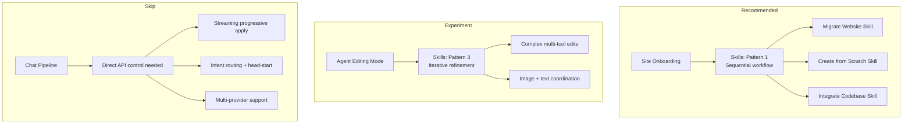
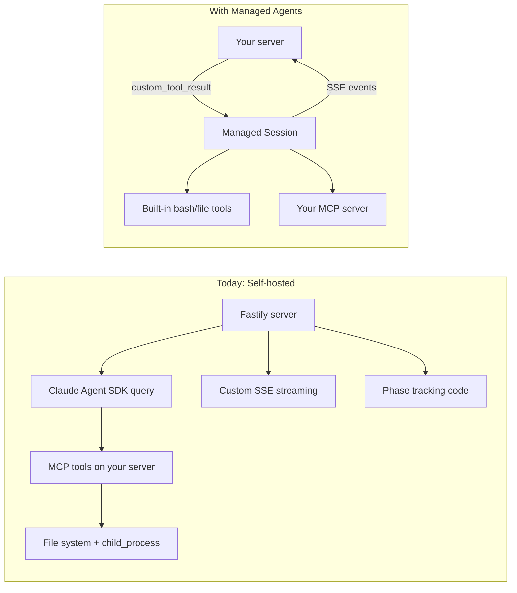
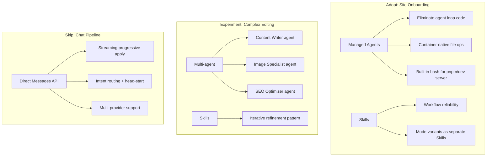

# Claude Skills & Managed Agents — Fit Analysis

_Last updated: 2026-04-13_

## 1) What are Claude Skills?

Claude Skills are versioned, declarative workflow definitions that tell Claude how to orchestrate MCP tool calls. They are not static prompt bundles — they are **MCP workflow orchestrators** with:

- Explicit step ordering and dependencies between steps
- Validation at each stage
- Rollback instructions for failures
- Multi-MCP server coordination
- Iterative refinement loops

### Key capabilities

- `/v1/skills` endpoint for listing and managing skills
- `container.skills` parameter on Messages API requests
- Version control and management through Claude Console
- Works with the Claude Agent SDK for building custom agents

### Documented patterns

| Pattern | Description | Use when |
|---------|-------------|----------|
| **Pattern 1: Sequential workflow** | Step-by-step MCP tool orchestration with dependencies and validation | Multi-step processes in a specific order |
| **Pattern 2: Multi-MCP coordination** | Workflows spanning multiple MCP servers with data passing between phases | Workflows span multiple services |
| **Pattern 3: Iterative refinement** | Draft → validate → refine loop until quality threshold met | Output quality improves with iteration |

## 2) Current Architecture (what we already have)

Avocado has a mature, purpose-built tool/capability system that functions as a domain-specific "skills" layer:

| Layer | Current implementation | Claude Skills equivalent |
|-------|----------------------|-------------------------|
| Tool definitions | `AgentTool[]` in `agent-tools.ts` (30+ tools) | `container.skills` tool bundles |
| Prompt expertise | `role.md`, `editing-guidelines.md`, `prompts.ts` | Skill prompt templates |
| Capability registry | `ToolRegistry` + `ToolManifest` in `tools/` | `/v1/skills` management |
| Execution policy | `ToolExecutionPolicy` (read/write gating) | Skill-level permissions |
| Versioning | Git (prompt files checked into repo) | Claude Console version control |

### Onboarding (sites-agent)

The sites-agent is ~1400 lines of TypeScript using Claude Agent SDK with MCP tools:

```
scrape_url → extract_design_tokens → create_site
→ download_remote_image(s) → bootstrap_pages
```

- Phase tracking: manual `TOOL_PHASE_MAP` + SSE events
- Ordering: relies on system prompt + Claude's judgment
- Rollback: per-tool try/catch, no cross-step rollback
- Three modes: "create", "migrate", "integrate" — each with separate system prompts

Key files:
- `apps/orchestrator/src/agent/sites-agent-tools.ts` — MCP tool definitions
- `apps/orchestrator/src/routes/sites-agent.ts` — SSE streaming + phase tracking
- `apps/orchestrator/src/agent/sites-agent-context.ts` — system prompt builder

### Editing (chat pipeline)

Two distinct editing modes:

**Fast path (chat pipeline):** Intent detection → deterministic/LLM planner → streaming progressive apply. Latency-optimized with:
- Sub-200ms intent routing with head-start racing (`CHAT_ROUTER_HEAD_START_MS`)
- Progressive op application at 800ms intervals during LLM streaming
- Dynamic context packs assembled per-request
- Multi-provider support (OpenAI / Anthropic / Gemini)

**Agent mode (complex edits):** Multi-turn tool-use loop via `agent-loop.ts`:
- Claude calls `get_page` → plans changes → calls `edit_page` → verifies
- Max 20 tool calls per session
- Supports extended thinking

Key files:
- `apps/orchestrator/src/chat/chat-pipeline.ts` — main orchestration (3400 LOC)
- `apps/orchestrator/src/agent/agent-loop.ts` — multi-turn agent loop
- `apps/orchestrator/src/agent/agent-tools.ts` — 30+ tool definitions
- `apps/orchestrator/src/ops/ops-engine.ts` — atomic operation engine

## 3) Analysis: Site Onboarding

**Verdict: Strong fit. Recommended.**

The sites-agent maps almost 1:1 to Pattern 1 (sequential workflow orchestration).

### How a Skill would replace the current flow

```
## Workflow: Migrate Website

### Step 1: Discover Structure
Call MCP tool: discover_site_structure
Parameters: url (from user)

### Step 2: Scrape & Analyze
Call MCP tool: scrape_url
Wait for: screenshot + sections extracted

### Step 3: Extract Tokens
Call MCP tool: extract_design_tokens
Parameters: css (from Step 2)

### Step 4: Create Project
Call MCP tool: create_site
Parameters: name, siteId, purpose (from analysis)

### Step 5: Download Images
Call MCP tool: download_remote_image (loop)
Rollback: skip failed images, continue

### Step 6: Bootstrap Pages
Call MCP tool: bootstrap_pages
Parameters: pages (from Step 2 sections), tokens (from Step 3)
```

Separate Skills for each mode variant:
- **"Migrate Website" Skill** — scrape → analyze → scaffold → populate
- **"Create from Scratch" Skill** — gather requirements → scaffold → seed content
- **"Integrate Existing Codebase" Skill** — clone → analyze → install → integrate → verify

### What we'd gain

| Benefit | Today (code) | With Skill |
|---------|-------------|------------|
| Workflow reliability | Claude decides ordering from system prompt — sometimes skips steps or reorders | Explicit step sequence enforced by Skill definition |
| Phase tracking | 30+ lines of `TOOL_PHASE_MAP` + manual SSE wiring | Steps map naturally to phases — less custom code |
| Versioning | Redeploy orchestrator to change workflow | Update Skill in Console, test before rollout |
| Mode variants | Separate system prompts for "create" vs "migrate" vs "integrate" | Separate Skills per mode, each with tailored steps |
| Rollback | Per-tool try/catch only | Skill-level rollback instructions between steps |

### What we'd keep

- **MCP tool handlers** (`createSitesAgentMcpServer`) — Skills orchestrate tools, they don't replace them
- **SSE streaming layer** for real-time UI updates (see open question below)
- **Session state mutations** inside tool handlers (`setPage`, `bumpVersion`, etc.)

### Open question (blocking)

**Do Skills emit step-transition events we can hook into for SSE streaming?**

The phase progress UI (`analyzing → creating → images → pages`) is a core onboarding UX. If Skills run opaquely with no step callbacks, we'd regress the user experience. This is the make-or-break question.

**Recommended next step:** Build a proof-of-concept Skill for the "migrate" workflow with existing MCP tools. Test whether step progression gives enough observability for the UI.

## 4) Analysis: Site Editing

### Chat pipeline (fast path) — Does not fit

The streaming progressive-apply pipeline requires direct API control that Skills would constrain:

| Requirement | Why Skills can't help |
|-------------|----------------------|
| Sub-200ms intent routing | `CHAT_LLM_INTENT_ROUTER` races a fast router against the full planner — needs direct Messages API access |
| Progressive op application | `CHAT_STREAMED_OP_APPLY` validates and applies ops as they stream from the LLM at ~800ms intervals |
| Dynamic context packs | Block schemas, page state, site config assembled per-request in `buildPlannerSystemPrompt()` |
| Multi-provider support | OpenAI, Anthropic, Gemini planners — Skills are Anthropic-only |
| Adaptive schema sizing | `CHAT_ADAPTIVE_SCHEMA_CONTEXT` dynamically selects which block contracts to include based on message content |

**Verdict: Skip. The chat pipeline's latency optimizations require direct control.**

### Agent mode (complex edits) — Partial fit, worth experimenting

The agent loop already follows Pattern 3 (iterative refinement) implicitly through multi-turn tool use. A Skill could make it explicit:

```
## Iterative Page Edit

### Read Current State
Call MCP tool: get_page
Validate: page exists, blocks loaded

### Plan Changes
Generate operations based on user request
Validate: ops match block schemas

### Apply Atomically
Call MCP tool: edit_page
If error: re-read page, adjust ops, retry (max 2)

### Verify & Suggest
Call MCP tool: get_page (confirm changes applied)
Generate suggested_next_actions
```

This would standardize how Claude approaches complex edits, reducing cases where it:
- Skips the "read first" step
- Applies operations without checking the result
- Doesn't retry after a schema validation error

Also relevant: **Pattern 2 (Multi-MCP coordination)** for edits involving multiple tools:

```
Phase 1: Edit text content (ops engine MCP)
Phase 2: Generate matching images (DALL-E / Unsplash MCP)
Phase 3: Update SEO metadata (page meta MCP)
Phase 4: Verify all changes (read back)
```

Today this is handled by the deferred image resolution system (`CHAT_DEFER_IMAGE_RESOLUTION`). A Skill could formalize the multi-tool coordination.

**Verdict: Experiment. Build a Skill for agent-mode complex edits and compare reliability vs the current implicit multi-turn approach.**

## 5) Summary



| Use case | Verdict | Pattern | Rationale |
|----------|---------|---------|-----------|
| **Site onboarding** | Adopt | Pattern 1 (sequential) | Replaces ~1400 LOC of imperative workflow orchestration with declarative Skill definitions + MCP handlers |
| **Editing (chat pipeline)** | Skip | — | Latency-sensitive streaming path needs direct API control, multi-provider support |
| **Editing (agent mode)** | Experiment | Pattern 3 (iterative) | Could improve reliability of complex multi-tool edits; worth a proof-of-concept |
| **Future: user capabilities** | Revisit | Pattern 2 (multi-MCP) | If users can install "SEO skill" or "brand voice skill", Skills' versioning + management API is a natural backend |

## 6) Prerequisites before adoption

1. **Verify SSE observability.** Confirm Skills emit step-transition events that can power the onboarding phase progress UI.
2. **Proof-of-concept.** Build a "Migrate Website" Skill using existing MCP tools. Compare workflow reliability vs current system prompt approach.
3. **Evaluate Console workflow.** Determine if managing Skills in Claude Console vs git-tracked prompt files is acceptable for the team's development workflow.
4. **Measure latency.** Confirm Skills don't add latency overhead that would degrade the onboarding experience (current flow: ~30-60s for full migration).
5. **Plan the MCP tool boundary.** Skills orchestrate MCP tools — the tool handlers (`scrape_url`, `create_site`, `bootstrap_pages`) stay in our codebase. Decide if tool handler code needs refactoring to work cleanly as a standalone MCP server.

---

## 7) Claude Managed Agents

Managed Agents is a separate, complementary offering from Anthropic: a **pre-built agent harness running in managed cloud infrastructure**. Instead of building your own agent loop, tool execution, and container runtime, you get a fully managed environment where Claude can read files, run commands, browse the web, and execute code.

### Core concepts

| Concept | Description |
|---------|-------------|
| **Agent** | Reusable config: model, system prompt, tools, MCP servers, skills. Created once, referenced by ID. |
| **Environment** | Cloud container template: pre-installed packages (Node.js, Python, etc.), networking rules. |
| **Session** | A running agent instance in an environment. Persistent filesystem, conversation history. |
| **Events** | SSE-based communication: `user.message` in, `agent.tool_use` / `agent.message` / `session.status_idle` out. |

### Built-in tools

Managed sessions include: `bash`, `read`, `write`, `edit`, `glob`, `grep`, `web_fetch`, `web_search`. All enabled by default, individually toggleable.

### Custom tools

You define a tool schema on the agent; Claude emits structured `agent.custom_tool_use` events; your application executes the tool and sends `user.custom_tool_result` back. Claude never executes custom tools directly — your server handles the logic.

### Multi-agent (research preview)

A coordinator agent can delegate to specialized sub-agents via `callable_agents`. Each runs in its own thread with isolated context but shares the container filesystem. One level of delegation only. Event types: `session.thread_created`, `session.thread_idle`, `agent.thread_message_sent/received`.

### Environments

- Pre-install packages via `apt`, `pip`, `npm`, `cargo`, `gem`, `go`
- Networking: `unrestricted` (default) or `limited` with `allowed_hosts`
- Each session gets an isolated container; environments are reusable templates
- Persistent filesystem within a session; no sharing between sessions

### Event observability

Rich SSE event stream with:
- `agent.tool_use` / `agent.tool_result` — see every tool call and result
- `agent.mcp_tool_use` / `agent.mcp_tool_result` — MCP tool observability
- `span.model_request_start/end` — timing and token usage per inference call
- `session.status_running/idle/terminated` — lifecycle tracking
- `user.interrupt` — stop the agent mid-execution and redirect

## 8) Managed Agents — Fit Analysis

### a) Site Onboarding — Strong fit

The sites-agent is the most compelling candidate. Here's why:

**What Managed Agents replaces:**



**Concrete mapping:**

| Current component | Managed Agents equivalent |
|-------------------|--------------------------|
| `agent-loop.ts` (custom Anthropic agent loop) | Eliminated — harness runs the loop |
| `sites-agent-tools.ts` MCP server | Same MCP server, connected to managed session |
| `child_process` calls (`pnpm install`, dev server) | Built-in `bash` tool runs in the container |
| Phase tracking (`TOOL_PHASE_MAP`) | `agent.tool_use` / `agent.mcp_tool_use` events map to phases |
| SSE streaming in `routes/sites-agent.ts` | Forward managed session SSE events to client |
| Prompt caching logic | Built-in — harness handles caching and compaction |
| Context window management | Built-in `agent.thread_context_compacted` event |

**Key benefits for onboarding:**

1. **Eliminate the agent loop.** The ~200 LOC agent loop (`agent-loop.ts` + `agent-loop-openai.ts`) and all its edge cases (token limits, tool call caps, error recovery, streaming) are handled by the harness. Built-in prompt caching and compaction are included.

2. **Container-native file operations.** The sites-agent currently runs `pnpm install`, starts dev servers, and writes files via `child_process` in tool handlers. In a managed container, the agent can use the built-in `bash` and `write` tools directly — no child_process wrapper needed. The scaffolding code in `sites-agent-shared.ts` (template strings for `package.json`, `next.config.ts`, etc.) could become files in the container rather than inline JavaScript strings.

3. **Rich event observability.** The `agent.tool_use`, `agent.mcp_tool_use`, and `span.model_request_start/end` events give you tool-level observability for free. Your current `TOOL_PHASE_MAP` + manual SSE wiring (~30 LOC) gets replaced by event filtering:

    ```typescript
    // Map managed agent events to onboarding phases
    if (event.type === "agent.mcp_tool_use") {
      const phase = TOOL_PHASE_MAP[event.name]
      if (phase) emitPhaseToClient(phase)
    }
    ```

4. **Interrupt and steer.** If a migration is going wrong (e.g., wrong site structure detected), you can send `user.interrupt` and redirect with a new `user.message`. Today this requires aborting the agent SDK query and starting over.

5. **Long-running resilience.** Migrations can take 30-60s. Today, if your Fastify server restarts mid-migration, the session is lost. Managed sessions persist server-side — you can reconnect to the SSE stream and resume.

**Architecture for onboarding with Managed Agents:**

```
1. Create "Site Migration" agent (once):
   - model: claude-sonnet-4-6
   - system: migration system prompt
   - tools: agent_toolset_20260401 (bash, file ops)
   - custom tools: scrape_url, bootstrap_pages (call back to your server)
   - MCP servers: sites-agent MCP server (on your orchestrator)

2. Create "migration-env" environment (once):
   - packages: { npm: ["sharp", "playwright"] }
   - networking: limited, allowed_hosts: [your-orchestrator-url]

3. Per user request:
   - POST /v1/sessions → session_id
   - Send user.message: "Migrate https://example.com"
   - Stream events → map to phase UI
   - On agent.custom_tool_use: execute against your orchestrator, return result
   - On session.status_idle: migration complete
```

**What stays on your server:**
- State mutations (`setPage`, `bumpVersion`, `setSiteConfig`) — exposed as custom tools or via your MCP server
- The editor client SSE connection — you relay managed session events to the browser
- Site registration and session scoping logic

### b) Site Editing — Two-layer analysis

**Chat pipeline (fast path) — Does not fit**

Same conclusion as Skills analysis. The managed harness adds latency (network hops to/from Anthropic's container), and you need direct Messages API control for streaming progressive apply, intent routing, and multi-provider support.

**Agent editing mode — Interesting fit, especially multi-agent**

Multi-agent is where Managed Agents offers something you can't easily build yourself:

```
Coordinator: "Website Editor"
├── callable_agent: "Content Writer"
│   tools: get_page, edit_page, batch_update_props
│   system: "You write and refine website copy..."
│
├── callable_agent: "Image Specialist"
│   tools: unsplash_search, image_generate, batch_update_props
│   system: "You find and generate images..."
│
└── callable_agent: "SEO Optimizer"
    tools: get_page, update_page_meta, list_pages
    system: "You optimize SEO metadata..."
```

**Why this is compelling:**

1. **Parallel execution.** When a user says "Redesign the homepage with new copy, images, and SEO", the coordinator can delegate to all three agents concurrently. Today this is sequential in the agent loop.

2. **Specialized context.** Each sub-agent has a focused system prompt and tool set. The Content Writer doesn't see image tools; the SEO Optimizer doesn't see content editing tools. This reduces tool selection ambiguity and improves output quality.

3. **Shared filesystem.** All agents share the container filesystem, so the Content Writer's changes are visible to the SEO Optimizer without explicit data passing.

4. **Isolated conversation history.** Each agent maintains its own context. A complex image generation conversation doesn't pollute the content writer's context window.

**But there are real constraints:**

| Constraint | Impact |
|------------|--------|
| Latency | Network round-trips to Anthropic's container add ~100-500ms per tool call. Fine for complex edits (already 10-30s), problematic if used for quick edits. |
| State sync | Your in-memory `draftPages` / `siteConfigs` are on your Fastify server. Custom tools need to call back to your server for every state mutation. |
| Anthropic-only | No OpenAI/Gemini provider support. The managed harness only runs Claude. |
| Research preview | Multi-agent is not GA yet. Not production-ready. |
| Cost | Managed Agents pricing may differ from raw Messages API. Multiple sub-agents multiply token usage. |

### c) Combined approach — Skills + Managed Agents

Skills and Managed Agents are composable. An agent definition accepts `skills` alongside `tools`:

```json
{
  "name": "Site Migration Agent",
  "model": "claude-sonnet-4-6",
  "tools": [{"type": "agent_toolset_20260401"}],
  "skills": ["skill_migration_workflow_v2"],
  "callable_agents": [...]
}
```

This means you could:
- Define **Skills** for workflow expertise (migration steps, editing patterns)
- Run them inside **Managed Agents** for infrastructure (containers, file ops, bash)
- Use **custom tools** to bridge back to your orchestrator state

## 9) Updated Summary



| Use case | Technology | Verdict | Key benefit |
|----------|-----------|---------|-------------|
| **Site onboarding** | Managed Agents + Skills | **Adopt** | Eliminates agent loop, gets container-native bash/file ops, rich event observability, session persistence |
| **Editing (chat pipeline)** | Direct Messages API | **Skip** | Latency-sensitive; needs streaming control and multi-provider |
| **Editing (agent mode)** | Managed Agents (multi-agent) | **Experiment** | Parallel specialized agents for content/image/SEO; research preview |
| **Future: user capabilities** | Skills | **Revisit** | Versioned capability marketplace |

## 10) Updated Prerequisites

1. **Verify custom tool round-trip latency.** Your orchestrator state (`draftPages`, `siteConfigs`) lives on your Fastify server. Custom tools in Managed Agents call back to your server. Measure the round-trip overhead for `setPage`, `bumpVersion`, etc.
2. **Build a migration PoC.** Create a "Site Migration" agent + environment. Expose `scrape_url` and `bootstrap_pages` as custom tools. Compare reliability and latency vs current `query()` approach.
3. **Test event-to-phase mapping.** Confirm `agent.mcp_tool_use` events arrive with enough detail to map to onboarding phase UI labels.
4. **Evaluate multi-agent for editing.** Request research preview access. Build coordinator + Content Writer + Image Specialist. Benchmark quality and latency vs single-agent loop.
5. **Plan the state bridge.** Decide between custom tools (your server executes, returns result) vs MCP server (your orchestrator exposes MCP endpoint). Custom tools are simpler; MCP is more standard.
6. **Cost modeling.** Compare Managed Agents pricing vs self-hosted agent loop. Multi-agent multiplies token usage — model whether the quality/speed gains justify the cost for complex edits.
7. **Fallback strategy.** Keep the current `agent-loop.ts` path as fallback for when Managed Agents has issues (beta reliability, rate limits). Feature-flag the switch.
