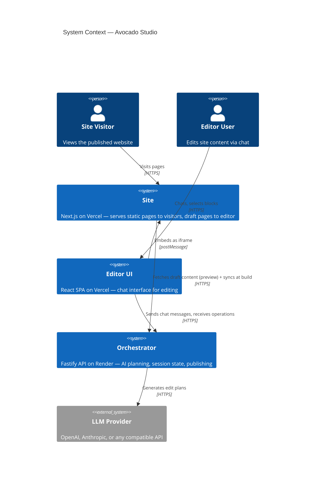
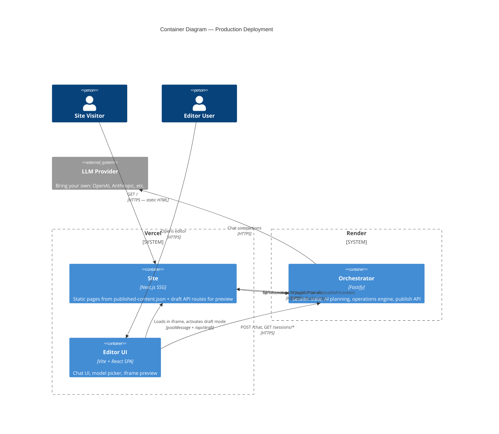
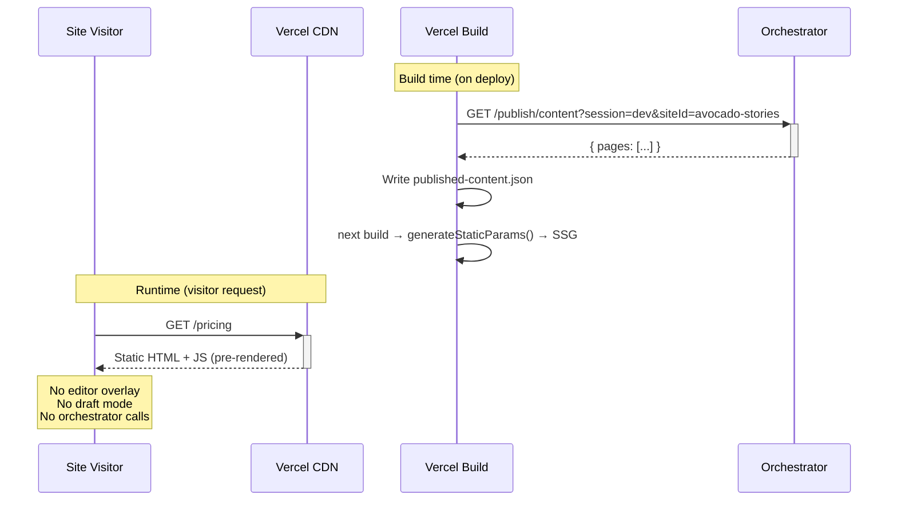
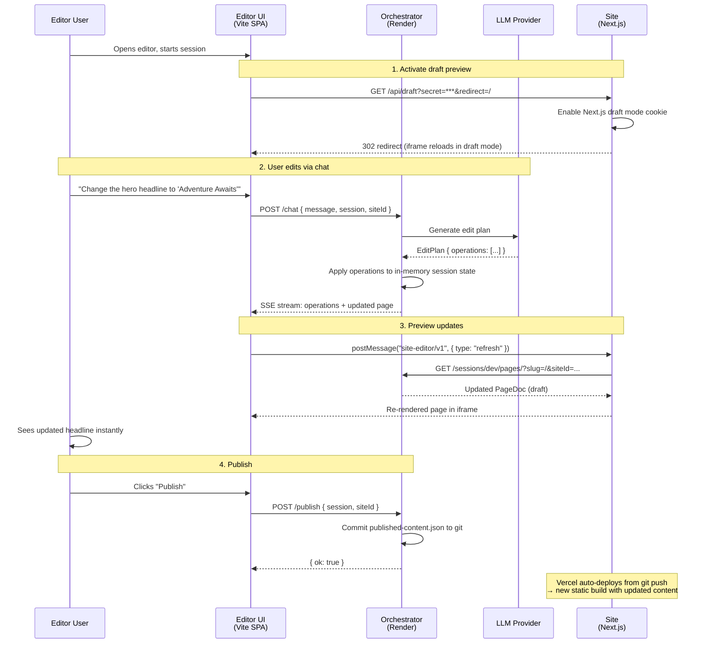

# System Architecture — C4 Diagrams

## Level 1: System Context

Who uses what, and how the systems connect.



## Level 2: Container Diagram

What runs where, and the two modes of operation.



## Flow 1: Production — Static Site Visitor

No orchestrator involved at runtime. Pure static HTML.



## Flow 2: Editor — Draft Preview (Live Editing)

Editor user sees real-time changes in the iframe preview.



## Flow 3: What Each Env Var Controls

```
┌─────────────────────────────────┬──────────────────────────────────────────────┐
│ Env Var                         │ Effect in Production                         │
├─────────────────────────────────┼──────────────────────────────────────────────┤
│ ORCHESTRATOR_URL (set)          │ Build: sync script fetches latest content    │
│                                 │ Runtime: draft mode can reach orchestrator   │
├─────────────────────────────────┼──────────────────────────────────────────────┤
│ DRAFT_MODE_SECRET (set)         │ /api/draft route works → editor can          │
│                                 │ activate draft preview in iframe             │
├─────────────────────────────────┼──────────────────────────────────────────────┤
│ NEXT_PUBLIC_ENABLE_EDITOR (off) │ EDITOR_ENABLED = false → no preview bridge, │
│                                 │ no editor overlay, no selectable blocks      │
├─────────────────────────────────┼──────────────────────────────────────────────┤
│ NEXT_PUBLIC_EDITOR_ORIGIN (off) │ Not needed — editor communicates via         │
│                                 │ postMessage with origin passed in URL params │
└─────────────────────────────────┴──────────────────────────────────────────────┘
```
