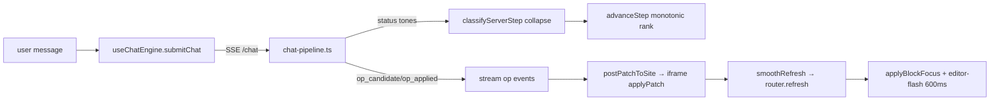

# Editing Experience Improvements

Remaining items from a frame-by-frame UX review of the chat-driven editing
flow (2026-04-11). The original review identified 13 issues (A-M); 7 were
shipped in the same session, 3 were dropped as incorrect, and 3 remain below.

## Already shipped

| Issue | Commit | Summary |
|-------|--------|---------|
| B2 (content flicker) | `b477616` | Live-draft commit flag — discard DOM originals on op_applied instead of restoring |
| A (noisy status stream) | `6ba680e` | Client-side `classifyServerStep` collapses 10 tones to 4 phases |
| C (narration lag) | `c26d1c2` | Monotonic phase rank rejects backwards transitions in advanceStep |
| B (weak flash pulse) | `d8838df` | 600ms box-shadow glow + wave opacity bump + will-change |
| H (stop button contrast) | `3f8da59` | Red background on `.composer-send-btn.is-stop` |
| K (permanent welcome) | `ce06c3c` | Collapsed `
` after first user turn |
| D (duplicate suggestions) | `ce06c3c` | Suppress welcome suggestions when fieldAiContext is present |
| /simplify pass | `c6d746b` | Unified classifier, fixed setStreamStatus race, will-change, dropped wrapper |

Dropped as incorrect: **F** (Undo label — was `(/)` misread as `0`),
**G** (Home badge — `slugLabel("/")` returns `Home (/)`).

## Remaining: P2

### E. Refinement-aware follow-up suggestions

After a text rewrite the suggested next actions jump to unrelated fields
("Rewrite the subheading", "Change the hero image") instead of offering
refinements of the just-edited field ("Shorter", "Try a different tone",
"Revert to previous").

**Fix:** in `apps/orchestrator/src/chat/prompts.ts` (around line 190),
extend the `suggested_next_actions` instruction: "If the plan contains
exactly one `update_props` op on a text field, the first 1-2 suggestions
MUST be refinements of that same field. Remaining suggestions can target
neighboring fields." No client change needed.

**Open question:** drive from the planner prompt (server, context-aware) or
hard-code per block-type/field-kind on the client (predictable, testable)?
Current impl is server-driven.

### J. Block-type label on selection outline

`applyBlockFocus` (`packages/preview-adapter/src/bridge-functions.ts`)
builds a `.editor-block-toolbar` with move/add/delete buttons but no text
label. A small `` showing the block type
("Hero", "CTA") anchored top-left of the highlight would help users
identify which block is selected at a glance.

**Fix:** after creating the toolbar, create a label element with
`textContent` from `data-block-type`. Style in
`packages/preview-adapter/src/styles.css` next to `.editor-block-toolbar`.

### M. Publish review modal

`usePublish.publishSite` (`apps/editor/src/hooks/usePublish.ts`) POSTs to
`/publish` with zero confirmation. The header button calls it directly.

**Fix:** add a `PublishReviewDialog` modal (same `dialog.tsx` primitive as
`SettingsModal`). On click, open the modal pre-populated from
`publishStatus.slugs` (which pages deploy) and the accumulated
`change_log` entries for the session. Confirm button calls
`publishSite()`.

**Open question:** should the modal block publish until confirmed, or is a
"soft confirm" banner enough?

## Remaining: P3

### L. Viewport/device toggle

No mobile/tablet/desktop switcher exists. The preview iframe renders at the
natural width of its grid column.

**Fix:** add a three-button toggle in the header next to the page selector
(`apps/editor/src/App.tsx`), stored as local state. Apply a fixed max-width
(1280 / 834 / 390 px) to the iframe container. No postMessage change needed.

### I. Latency instrumentation then tune

End-to-end latency for a one-field rewrite is ~3s (observed via frame
extraction). The orchestrator already logs `firstPlanningTokenMs`,
`planningDurationMs`, `applyDurationMs`, `totalDurationMs`
(`apps/orchestrator/src/chat/chat-pipeline.ts`). Before touching pipeline
flags, surface these in a debug panel or a console log keyed off
`CHAT_DEBUG=1`. Once we can see whether the fast intent router is winning
vs. the full planner, we know where to tune
(`CHAT_ROUTER_HEAD_START_MS`, router intent taxonomy, or the streamed-apply
pacing at `CHAT_STREAM_APPLY_MIN_STEP_MS`).

## Reference: flow shape

