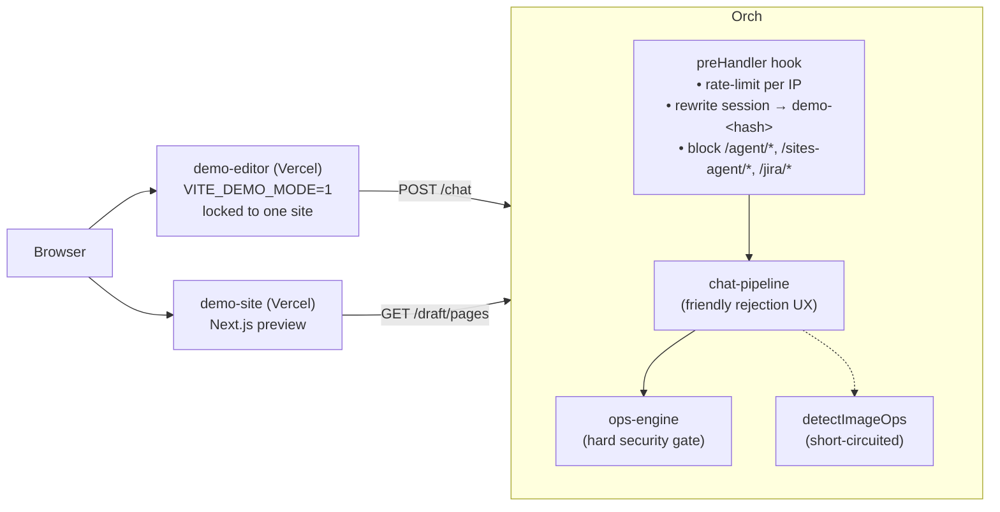

# Demo Mode — Limited Public Playground

> **TL;DR** — Set `DEMO_MODE=1` on the orchestrator to turn any deployment
> into a "try before you sign up" playground that runs on your shared API
> key but only permits `update_props` on `Hero` blocks. Everything else
> (other op types, other block types, agent routes, image generation) is
> server-blocked, and each visitor gets an isolated ephemeral session
> keyed by a hash of their IP.

## Why demo mode exists

The product's core moment is *"I typed a sentence and my website changed."*
That's the value proposition we need first-time visitors to feel within
ten seconds of landing on the page, before they're asked to sign up,
connect GitHub, or even understand what the orchestrator is. Demo mode is
the route we took to reduce perceived effort to near-zero while still
proving a single dimension of value: **edit the hero section by chatting.**

The design brief was intentionally narrow:

- **One operation only.** Editing the Hero block. That's it.
- **Server-enforced.** Client-sent `siteCapabilities` can't bypass the
  gate — a `curl` request against `/ops` is treated identically to a
  chat message.
- **Zero setup for the visitor.** No signup, no session ID, no site ID.
- **Bounded cost.** Per-IP rate limiting so a single visitor (or a bot)
  can't drain the shared OpenAI key.
- **Graceful rejections.** Out-of-scope requests come back as friendly
  `needs_clarification` responses with example prompts, not 500s.

## Architecture



### Request lifecycle

1. Visitor loads `demo-editor.vercel.app`. It sends `session=dev` and
   `siteId=anything` (baked into the Vite bundle).
2. `POST /chat` hits Render. The `preHandler` hook runs first:
   - Consumes one token from that IP's hourly bucket. If empty, returns
     `429` with a `retry-after` header.
   - Blocks outright if the URL starts with `/agent`, `/sites-agent`, or
     `/jira` — those endpoints bypass the op gate.
   - Rewrites `body.session` to `demo-<sha1(ip).slice(0,10)>` and
     `body.siteId` to `avocado-stories`. Because the resulting key
     contains no `::`, `getSessionDraft()` routes it through the legacy
     auto-seed path in `session-state.ts`, which fills the session from
     `demoPublishedPages()` on first access.
3. The chat pipeline runs normally (LLM plans ops) but checks the
   `splitDemoOps` helper before touching `applyOpsAtomically`. If any op
   in the plan is out of scope, it short-circuits with a
   `needs_clarification` payload containing three example prompts. The
   user sees "This demo only supports editing the Hero section — try
   'change the hero headline to …'" instead of a generic failure.
4. For belt-and-suspenders, `applyOpsAtomically` calls `enforceDemoOps`
   inside its atomic block. If anything slipped past step 3 (direct
   `/ops` call, race condition, new code path), the engine throws an
   `OperationError` with category `planner_refusal`. This is the
   security boundary.
5. `detectImageOps` is short-circuited when demo mode is active, so no
   DALL-E / Unsplash calls can be triggered regardless of what the LLM
   produced.
6. State is in-memory only. `ORCHESTRATOR_STATE_FILE` must be left empty
   in demo deployments; on server restart all demo state evaporates.

## Configuration reference

All env vars below apply to the orchestrator process. See
`apps/orchestrator/src/demo-mode.ts` for the read logic.

| Env var | Default | Purpose |
|---------|---------|---------|
| `DEMO_MODE` | `0` | Master switch. `1` enables every gate below. |
| `DEMO_ALLOWED_OPS` | `update_props` | Comma-separated op type allow-list. Extend cautiously — each entry widens the attack surface. |
| `DEMO_ALLOWED_BLOCK_TYPES` | `Hero` | Comma-separated block type allow-list for the block-type check inside `splitDemoOps`. |
| `DEMO_RATE_LIMIT_PER_IP_PER_HOUR` | `20` | Shared bucket across `/chat*` and `/ops` requests. Bucket is in-memory — resets on restart. |
| `DEMO_DISABLE_IMAGE_GEN` | `1` | `1` to short-circuit `detectImageOps`. Leave this on unless you specifically want to pay for image gen from demo users. |

## Deployment — Render (orchestrator) + Vercel (editor + site)

### Render orchestrator env vars

```
DEMO_MODE=1
DEMO_ALLOWED_OPS=update_props
DEMO_ALLOWED_BLOCK_TYPES=Hero
DEMO_RATE_LIMIT_PER_IP_PER_HOUR=20
DEMO_DISABLE_IMAGE_GEN=1
OPENAI_API_KEY=<your shared key>
# or: ANTHROPIC_API_KEY=<your shared key>
ORCHESTRATOR_CORS_ORIGINS=https://<demo-editor>.vercel.app,https://<demo-site>.vercel.app
ORCHESTRATOR_STATE_FILE=     # leave empty — must be ephemeral
```

**Important:** the gate is a process-wide switch. Turning it on makes
the same service demo-only for everyone. If you want to keep serving
prod traffic from the same backend, either spin up a second Render
service with its own env or refactor the preHandler to detect demo
mode by host header.

### Vercel `demo-editor` project

`VITE_*` vars are baked at build time, so the demo editor has to be a
**separate Vercel project** from the prod editor.

```
VITE_DEMO_MODE=1
VITE_ORCHESTRATOR_URL=https://<your-orchestrator>.onrender.com
VITE_SITE_ORIGIN=https://<demo-site>.vercel.app
VITE_LOCK_SITE_ID=1
```

With `VITE_DEMO_MODE=1`:
- `apps/editor/src/App.tsx` renders the amber demo banner above the
  chat thread with three click-to-submit example prompts.
- `apps/editor/src/components/claude-style-chat-input.tsx` swaps the
  placeholder to a demo-specific hint.
- `apps/editor/src/lib/site-presets.ts` locks the site switcher.

### Vercel `demo-site` project

```
ORCHESTRATOR_URL=https://<your-orchestrator>.onrender.com
NEXT_PUBLIC_EDITOR_ORIGIN=https://<demo-editor>.vercel.app
DRAFT_DEFAULT_SESSION=dev
NEXT_PUBLIC_DEFAULT_SITE_ID=avocado-stories
NEXT_PUBLIC_ENABLE_EDITOR=1
```

The site always sends `session=dev` — the orchestrator's preHandler
rewrites it to `demo-<hash>` before handlers run, so clients never need
to know their own demo session key.

## Implementation map

| Concern | File | Notes |
|---------|------|-------|
| Config + gate helpers | `apps/orchestrator/src/demo-mode.ts` | `isDemoModeEnabled`, `splitDemoOps`, `enforceDemoOps`, `demoSessionKeyForIp`, `consumeDemoRateToken`. |
| Hard security gate | `apps/orchestrator/src/ops/ops-engine.ts` | `enforceDemoOps` called inside `_applyOpsAtomicallyUnsafe` after duplicate-id check. Covers `/chat` + `/ops`. |
| Friendly UX gate | `apps/orchestrator/src/chat/chat-pipeline.ts` | Runs next to the existing `allowStructuralEdits` check. Returns `needs_clarification` with example prompts so users see guidance, not errors. |
| Rate limit + session rewrite | `apps/orchestrator/src/index.ts` | Fastify `preHandler` hook registered after route plugins. No-op unless `DEMO_MODE=1`. |
| Image-gen kill switch | `apps/orchestrator/src/chat/chat-pipeline-image.ts` | `detectImageOps` returns `[]` when demo mode is on. |
| Planner status badge | `apps/orchestrator/src/index.ts` `/status/planner` | Returns `plannerSource: "demo"` when `DEMO_MODE=1` so the editor badge lights up even though real providers are wired. |
| Editor banner + examples | `apps/editor/src/App.tsx` | Rendered above `<ChatThreadCore>` when `VITE_DEMO_MODE=1`. |
| Editor placeholder | `apps/editor/src/components/claude-style-chat-input.tsx` | Swaps `chatInput.placeholder` → `demo.placeholder`. |
| Editor strings | `apps/editor/src/i18n/en.ts`, `apps/editor/src/i18n/de.ts` | `demo.bannerTitle`, `demo.bannerBody`, `demo.tryExample{1,2,3}`, `demo.placeholder`. |
| Banner styling | `apps/editor/src/styles.css` | `.demo-banner`, `.demo-banner-example` etc. |
| Unit tests | `apps/orchestrator/src/demo-mode.test.ts` | 18 tests covering allow/deny, mixed plans, per-IP isolation, rate limiter, env flag. |

## Widening the allow-list

The gate reads its allow-list at request time, so you can widen demo
scope without a code deploy — just change the Render env vars and
restart.

Examples:

```
# Allow CTA edits too
DEMO_ALLOWED_BLOCK_TYPES=Hero,CTA

# Allow editing nested list items (e.g. feature grid items)
DEMO_ALLOWED_OPS=update_props,update_item

# Loosen rate limit
DEMO_RATE_LIMIT_PER_IP_PER_HOUR=60
```

Each entry added to `DEMO_ALLOWED_OPS` is an escalation — `update_props`
is safe because it can't add or delete blocks, but most other op types
can. Add new entries only after thinking through the abuse case.

## What's not in scope for this feature

These were intentionally left out of the first demo cut:

- **Image generation inside the demo.** A failing 10-second DALL-E call
  during a first-time visitor's first interaction is the worst possible
  UX, so `DEMO_DISABLE_IMAGE_GEN=1` is the default.
- **Persistent demo sessions.** State resets on restart. Long-running
  demo interactions aren't the goal — the goal is the *"I just edited a
  real site"* moment.
- **Multi-site demo.** The editor is locked to a single preset site id
  (`avocado-stories`). Adding a site switcher to the demo undermines
  the "zero effort" framing.
- **Per-provider routing.** Demo uses whichever key (`OPENAI_API_KEY` or
  `ANTHROPIC_API_KEY`) is set on the Render service. A visitor can't
  pick a provider.
- **Agent / sites-agent / Jira flows.** Hard-blocked with `403` in the
  preHandler because they bypass the op-level gate entirely.

## Gotchas / things to watch

1. **Process-wide switch.** `DEMO_MODE=1` affects every session on that
   Render process, not just visitors from the demo URL. If you share a
   backend between prod and demo, move to a dedicated Render service.
2. **`x-forwarded-for` trust.** Per-IP session isolation depends on
   Render forwarding the real client IP. Render does this by default,
   but if you put Cloudflare (or any other proxy) in front, verify that
   `request.headers["x-forwarded-for"]` still holds the client IP. If
   it doesn't, every visitor will collapse onto a single shared session
   keyed by Cloudflare's edge IP and stomp each other's hero edits.
3. **In-memory rate limiter.** The bucket resets on every restart. If
   you restart frequently (auto-deploy, cold start), you effectively
   reset quotas for everyone. Acceptable for a demo, bad for anything
   revenue-adjacent.
4. **CORS whitelist must include both Vercel origins.** If the demo
   site's iframe can't reach `/draft/pages`, the preview goes blank.
5. **`ORCHESTRATOR_STATE_FILE` must be empty.** Otherwise demo state
   gets written to disk and accumulates across visitors.

## Verifying a deploy

Quick sanity checks after setting env vars and restarting:

```bash
# 1. Badge shows up
curl https://<orchestrator>.onrender.com/status/planner | jq .plannerSource
# → "demo"

# 2. Hero edit works
curl -X POST https://<orchestrator>.onrender.com/chat \
  -H 'content-type: application/json' \
  -d '{"session":"dev","siteId":"avocado-stories","slug":"/","message":"change the hero headline to Welcome"}'
# → status "ok" with one update_props op applied

# 3. Non-hero edit is rejected with guidance
curl -X POST https://<orchestrator>.onrender.com/chat \
  -H 'content-type: application/json' \
  -d '{"session":"dev","siteId":"avocado-stories","slug":"/","message":"add a testimonials section"}'
# → status "needs_clarification" with three example prompts

# 4. Agent route is hard-blocked
curl -X POST https://<orchestrator>.onrender.com/agent/start -d '{}'
# → 403 "This endpoint is disabled in demo mode."

# 5. Rate limit kicks in
for i in $(seq 1 25); do
  curl -s -o /dev/null -w "%{http_code}\n" -X POST https://<orchestrator>.onrender.com/chat \
    -H 'content-type: application/json' \
    -d '{"session":"dev","message":"hi"}'
done
# → first ~20 return 200, rest return 429
```
